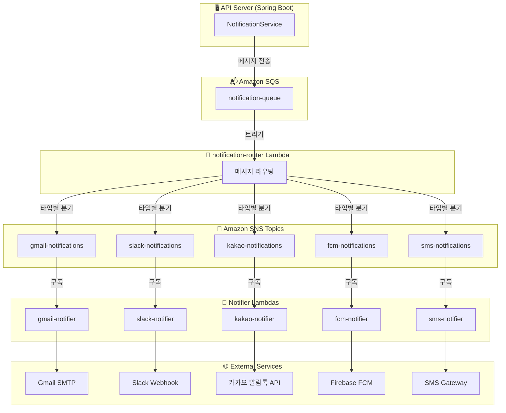

## 시리즈 소개

이 시리즈는 **이메일, Slack, 카카오톡, FCM 푸시**를 모두 지원하는 멀티채널 알림 시스템을 구축한 경험을 정리한 글이에요.

| Part | 주제 |
|------|------|
| **Part 1** | 아키텍처 설계 (현재 글) |
| [Part 2](/posts/notification-system-part2-router) | notification-router 구현 |
| [Part 3](/posts/notification-system-part3-notifiers) | Notifier Lambda 구현 |
| [Part 4](/posts/notification-system-part4-localstack) | LocalStack으로 로컬 테스트 |
| [Part 5](/posts/notification-system-part5-deployment) | 배포 및 트러블슈팅 |

---

## 요구사항

우리 서비스에서 필요한 알림 기능은 이랬어요:

- **이메일**: 초대 메일, 비밀번호 재설정
- **Slack**: 팀 채널 알림
- **카카오톡**: 알림톡 발송
- **FCM 푸시**: 모바일 앱 푸시 알림
- **SMS**: 문자 메시지 (향후 추가 예정)

그리고 중요한 조건이 하나 있었어요. **같은 알림을 여러 채널로 동시에 보낼 수 있어야 한다**는 거였죠. 예를 들어 "작업 일정이 배정되었습니다"라는 알림을 이메일과 FCM 푸시로 동시에 보내는 식이에요.

---

## 첫 번째 시도: 동기 방식

처음엔 단순하게 생각했어요. API 서버에서 직접 알림을 보내면 되지 않을까?

```kotlin
// 이렇게 하면 안 될까?
fun createSchedule(request: CreateScheduleRequest) {
    val schedule = scheduleRepository.save(request.toEntity())

    // 알림 발송
    emailService.send(user.email, "일정이 배정되었습니다")
    fcmService.send(user.fcmToken, "일정이 배정되었습니다")

    return schedule
}
```

근데 금방 문제가 보이더라고요:

1. **응답 지연**: 이메일 발송에 2-3초 걸리면, API 응답도 그만큼 늦어져요
2. **부분 실패 처리**: FCM은 성공했는데 이메일만 실패하면? 전체를 롤백해야 할까요?
3. **확장성**: 새로운 채널(SMS, 카카오톡)이 추가될 때마다 이 코드를 수정해야 해요

---

## 비동기 메시지 기반 아키텍처

그래서 **메시지 큐**를 도입하기로 했어요. API 서버는 "알림 보내줘"라는 메시지만 큐에 던지고, 실제 발송은 별도 워커가 처리하는 구조예요.

### 최종 아키텍처



### 핵심 컴포넌트

| 컴포넌트 | 역할 |
|---------|------|
| **SQS Queue** | API에서 보낸 메시지를 버퍼링 |
| **notification-router** | 메시지 타입을 보고 해당 SNS Topic으로 분기 |
| **SNS Topics** | 채널별 토픽 (gmail, slack, kakao, fcm, sms) |
| **Notifier Lambdas** | 실제 외부 서비스 호출하여 알림 발송 |

---

## 왜 SQS + SNS 조합인가?

### SQS만 쓰면 안 되나요?

가능해요. 채널별로 SQS를 만들어서 직접 라우팅할 수도 있죠. 근데 그러면 **router Lambda에서 각 SQS로 직접 메시지를 보내야** 해요.

```typescript
// SQS만 쓰는 경우
await sqsClient.send(new SendMessageCommand({ QueueUrl: gmailQueueUrl, ... }));
await sqsClient.send(new SendMessageCommand({ QueueUrl: slackQueueUrl, ... }));
await sqsClient.send(new SendMessageCommand({ QueueUrl: fcmQueueUrl, ... }));
```

SNS를 쓰면 **한 번만 publish하면 구독자들이 알아서 받아가요**:

```typescript
// SNS를 쓰는 경우
await snsClient.send(new PublishCommand({ TopicArn: gmailTopicArn, ... }));
// 끝! SNS가 구독자(Lambda)에게 전달해줌
```

### SNS만 쓰면 안 되나요?

SNS는 **재시도 정책이 제한적**이에요. 실패하면 바로 버려지거나, DLQ로 가거나 둘 중 하나예요.

SQS를 앞에 두면:
- 메시지가 **버퍼링**돼서 Lambda 동시 실행 수를 조절할 수 있어요
- **재시도 횟수**와 **지연 시간**을 세밀하게 설정할 수 있어요
- 실패한 메시지를 **DLQ에서 다시 처리**하기 쉬워요

> 💡 **SQS vs SNS, 언제 뭘 쓸까?**
>
> 이번에 구현하면서 정리한 기준이에요:
> - **SQS**: 1:1 전달, 재시도가 중요할 때, 처리 순서가 중요할 때 (FIFO)
> - **SNS**: 1:N 브로드캐스트, 여러 구독자에게 동시 전달할 때
>
> 우리 시스템은 **SQS(버퍼) → SNS(분기) → Lambda(처리)** 조합이에요. SQS로 안정성을 확보하고, SNS로 채널별 분기를 쉽게 처리하는 거죠.

---

## 메시지 구조 설계

API에서 보내는 메시지는 이렇게 생겼어요:

```json
{
  "types": ["EMAIL", "FCM"],
  "recipients": {
    "email": "user@example.com",
    "fcmTokens": ["token1", "token2"]
  },
  "message": {
    "title": "작업 일정 배정",
    "body": "2025년 1월 10일 오전 9시에 현장 A 작업이 배정되었습니다."
  },
  "timestamp": "2025-01-08T10:30:00Z",
  "metadata": {
    "scheduleId": 12345,
    "workspaceId": 1
  }
}
```

### 왜 types를 배열로?

처음엔 `type: "EMAIL"` 이렇게 단일 값으로 했어요. 근데 "이메일이랑 푸시 둘 다 보내고 싶어요"라는 요구사항이 생기면서 배열로 바꿨죠.

```kotlin
// API 서버에서 호출
notificationService.sendMultiNotification(
    types = listOf(NotificationType.EMAIL, NotificationType.FCM),
    recipients = NotificationRecipients(
        email = user.email,
        fcmTokens = user.fcmTokens
    ),
    message = NotificationMessageContent(
        title = "작업 일정 배정",
        body = "..."
    )
)
```

notification-router는 `types` 배열을 보고 해당하는 SNS Topic들에 **각각 publish**해요. EMAIL이면 gmail-notifications 토픽으로, FCM이면 fcm-notifications 토픽으로요.

> 💡 **하나의 알림이 여러 채널로 갈 때, 일부만 실패하면?**
>
> 이게 고민이었어요. Gmail은 성공했는데 FCM만 실패하면 어떻게 할까?
>
> 처음엔 router에서 한 번에 처리하려고 했는데, 그러면 **하나라도 실패하면 전체 재시도**가 돼요.
> 그래서 SNS Topic을 채널별로 분리하고, 각 notifier가 **독립적으로 실패/재시도**하게 했어요.
> FCM이 실패해도 Gmail은 이미 발송된 상태로 유지되는 거죠.

---

## API 서버 코드

Spring Boot에서는 이렇게 SQS로 메시지를 보내요:

```kotlin
@Service
class NotificationService(
    private val sqsTemplate: SqsTemplate,
    @Value("\${aws.sqs.notification-queue-name}")
    private val queueName: String
) {
    fun sendMultiNotification(
        types: List<NotificationType>,
        recipients: NotificationRecipients,
        message: NotificationMessageContent,
        metadata: Map<String, Any>? = null
    ) {
        val notification = MultiNotificationMessage(
            types = types,
            recipients = recipients,
            message = message,
            metadata = metadata
        )

        // SQS로 전송하고 끝! 실제 발송은 Lambda가 처리
        sqsTemplate.send(queueName, notification)
    }
}
```

API 서버 입장에서는 **SQS에 던지면 끝**이에요. 응답 시간에 영향을 주지 않죠.

---

## 이 구조의 장단점

### 장점

1. **느슨한 결합**: 새 채널 추가 = SNS Topic + Lambda 추가. 기존 코드 수정 없음
2. **독립적 스케일링**: FCM 부하가 높으면 fcm-notifier만 동시 실행 수 늘리면 됨
3. **장애 격리**: slack-notifier가 죽어도 gmail-notifier는 정상 동작
4. **재시도 용이**: SQS의 재시도 정책 + DLQ로 실패 메시지 관리

### 단점

1. **복잡성 증가**: 컴포넌트가 많아져서 디버깅이 어려워요
2. **지연 시간**: 동기 방식보다 알림 도착이 몇 초 느릴 수 있어요
3. **비용**: Lambda 호출 수, SQS/SNS 메시지 수에 따라 비용 발생

> 💡 **Lambda 콜드 스타트, 실제로 얼마나 걸릴까?**
>
> 처음엔 "Lambda가 콜드 스타트 때문에 느리지 않을까?" 걱정했어요.
>
> 실제로 측정해보니:
> - **Node.js Lambda (256MB)**: 콜드 스타트 ~200-300ms
> - **웜 상태**: ~10-50ms
>
> 알림은 실시간성이 조금 떨어져도 괜찮아서, 콜드 스타트는 큰 문제가 아니었어요.
> 정말 빠른 응답이 필요하면 **Provisioned Concurrency**를 쓰면 되고요. (비용은 올라가지만)

---

## 폴더 구조

```
apps/
├── api/                          # Spring Boot API 서버
│   └── src/.../notification/
│       ├── service/
│       │   └── NotificationService.kt
│       └── dto/
│           ├── NotificationMessage.kt
│           └── MultiNotificationRequest.kt
│
└── lambdas/
    ├── notification-router/      # SQS → SNS 라우팅
    ├── gmail-notifier/           # 이메일 발송
    ├── slack-notifier/           # Slack 메시지
    ├── kakao-notifier/           # 카카오 알림톡
    ├── fcm-notifier/             # FCM 푸시
    └── sqs-log-subscriber/       # 로그 기록 (디버깅용)
```

---

## 다음 글 예고

다음 글에서는 **notification-router** 구현을 다룰 거예요.

- SQS 트리거 Lambda 설정
- 타입별 SNS Topic 분기 로직
- 에러 처리와 부분 실패 대응

---

## 시리즈 링크

- **Part 1: 아키텍처 설계** (현재 글)
- [Part 2: notification-router 구현](/posts/notification-system-part2-router)
- [Part 3: Notifier Lambda 구현](/posts/notification-system-part3-notifiers)
- [Part 4: LocalStack으로 로컬 테스트](/posts/notification-system-part4-localstack)
- [Part 5: 배포 및 트러블슈팅](/posts/notification-system-part5-deployment)
