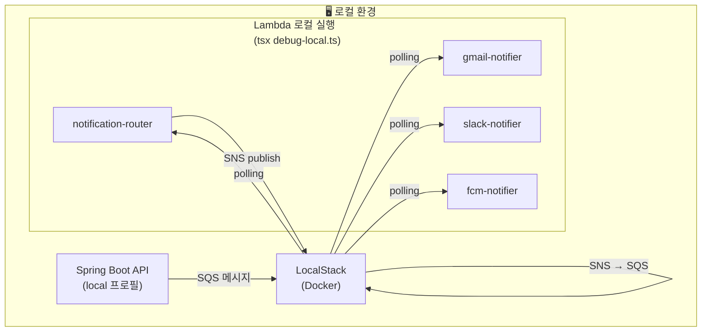

## 시리즈

| Part | 주제 |
|------|------|
| [Part 1](/posts/notification-system-part1-architecture) | 아키텍처 설계 |
| [Part 2](/posts/notification-system-part2-router) | notification-router 구현 |
| [Part 3](/posts/notification-system-part3-notifiers) | Notifier Lambda 구현 |
| **Part 4** | LocalStack으로 로컬 테스트 (현재 글) |
| Part 5 | 배포 및 트러블슈팅 |

---

## 왜 LocalStack인가?

AWS 서비스(SQS, SNS)를 사용하는 시스템을 개발할 때 고민이 있었어요.

- **실제 AWS에서 테스트?** → 비용 발생 + 실수로 프로덕션 데이터 건드릴 수 있음
- **Mocking?** → 실제 동작과 다를 수 있음
- **LocalStack?** → 로컬에서 AWS를 흉내 → 무료 + 안전!

LocalStack은 **AWS 서비스를 로컬에서 에뮬레이션**해주는 도구예요. SQS, SNS, Lambda, S3 등 주요 서비스를 내 컴퓨터에서 돌릴 수 있어요.

---

## Docker Compose 설정

### docker-compose.yml

```yaml
version: '3.8'

services:
  localstack:
    image: localstack/localstack:latest
    container_name: localstack-spation
    ports:
      - "4566:4566"  # 모든 AWS 서비스 엔드포인트
    environment:
      - SERVICES=sqs,sns,lambda,logs,iam
      - DEBUG=1
      - AWS_DEFAULT_REGION=ap-northeast-2
      - AWS_ACCESS_KEY_ID=test
      - AWS_SECRET_ACCESS_KEY=test
      - PERSISTENCE=1  # 재시작해도 데이터 유지
      - INIT_SCRIPTS_PATH=/etc/localstack/init/ready.d
    volumes:
      - "./data:/var/lib/localstack"
      - "../apps/lambdas:/tmp/lambdas"
      - "./init:/etc/localstack/init/ready.d"
    networks:
      - spation-local

networks:
  spation-local:
    driver: bridge
```

주요 설정:
- **SERVICES**: 사용할 AWS 서비스 목록
- **PERSISTENCE=1**: 재시작해도 SQS, SNS 리소스 유지
- **init 폴더 마운트**: 시작 시 자동으로 리소스 생성

### 폴더 구조

```
localstack/
├── docker-compose.yml
├── data/                 # LocalStack 데이터 (git ignore)
├── init/
│   └── init-aws.sh       # 시작 시 자동 실행
└── README.md
```

---

## 자동 초기화 스크립트

### init-aws.sh

```bash
#!/bin/bash

echo "🚀 Initializing LocalStack AWS resources..."

# 메인 SQS Queue 생성 (API → router)
awslocal sqs create-queue \
  --queue-name ksd-notification-spation-workspace-sqs-local

# SNS Topics 생성 (채널별)
awslocal sns create-topic --name gmail-notifications-sns-local
awslocal sns create-topic --name slack-notifications-sns-local
awslocal sns create-topic --name kakao-notifications-sns-local
awslocal sns create-topic --name sms-notifications-sns-local
awslocal sns create-topic --name fcm-notifications-sns-local

# SNS → SQS 구독 설정
TOPICS=("gmail" "slack" "kakao" "sms" "fcm")

for TOPIC in "${TOPICS[@]}"; do
  TOPIC_NAME="${TOPIC}-notifications-sns-local"
  QUEUE_NAME="${TOPIC_NAME}-queue"

  # 구독용 SQS Queue 생성
  awslocal sqs create-queue --queue-name $QUEUE_NAME

  # SNS Topic에 SQS 구독 추가
  awslocal sns subscribe \
    --topic-arn arn:aws:sns:ap-northeast-2:000000000000:${TOPIC_NAME} \
    --protocol sqs \
    --notification-endpoint arn:aws:sqs:ap-northeast-2:000000000000:${QUEUE_NAME}

  echo "  ✅ Subscribed $QUEUE_NAME to $TOPIC_NAME"
done

echo "✅ LocalStack initialization completed!"
```

이 스크립트가 **LocalStack 시작 시 자동 실행**돼서, 필요한 리소스가 미리 만들어져요.

> 💡 **awslocal이 뭐예요?**
>
> `awslocal`은 LocalStack이 제공하는 CLI 래퍼예요.
> `aws --endpoint-url=http://localhost:4566`를 자동으로 붙여주는 거라고 생각하면 돼요.
>
> ```bash
> # 이 두 명령어는 같아요
> awslocal sqs list-queues
> aws --endpoint-url=http://localhost:4566 sqs list-queues
> ```

---

## 로컬 아키텍처

LocalStack 위에서 동작하는 전체 구조예요:



Lambda는 AWS에서 실행되는 게 아니라, **로컬 Node.js로 직접 실행**해요. SQS 폴링을 직접 구현해서 LocalStack과 통신하는 거죠.

---

## Lambda 로컬 디버깅

### debug-local.ts 구조

각 Lambda 폴더에 `debug-local.ts`가 있어요:

```typescript
// apps/lambdas/notification-router/debug-local.ts

import { SQSClient, ReceiveMessageCommand, DeleteMessageCommand } from '@aws-sdk/client-sqs';

const config = {
  endpoint: 'http://localhost:4566',
  queueName: 'ksd-notification-spation-workspace-sqs-local',
  region: 'ap-northeast-2',
};

// 환경변수 설정 (중요: handler import 전에!)
process.env.LOCALSTACK_ENDPOINT = config.endpoint;
process.env.SNS_TOPIC_EMAIL = `arn:aws:sns:${config.region}:000000000000:gmail-notifications-sns-local`;
// ... 나머지 환경변수

// 동적 import로 handler 가져오기
async function getHandler() {
  const module = await import('./src/index');
  return module.handler;
}

async function main() {
  const handler = await getHandler();

  // 폴링 루프
  while (true) {
    // SQS에서 메시지 받기
    const messages = await sqsClient.send(new ReceiveMessageCommand({...}));

    for (const message of messages) {
      // Lambda 핸들러 호출
      await handler(event, context);

      // 처리 완료된 메시지 삭제
      await sqsClient.send(new DeleteMessageCommand({...}));
    }

    await sleep(100);
  }
}
```

> 💡 **왜 동적 import를 써요?**
>
> TypeScript/ES Modules에서 `import` 문은 **파일 맨 위에서 실행**돼요.
> 그러면 환경변수 설정보다 먼저 `SNSClient`가 초기화되어서 LocalStack 설정이 안 먹어요.
>
> ```typescript
> // ❌ 이렇게 하면 안 됨
> import { handler } from './src/index';  // 이 시점에 SNSClient 생성됨
> process.env.LOCALSTACK_ENDPOINT = 'http://localhost:4566';  // 너무 늦음!
>
> // ✅ 이렇게 해야 함
> process.env.LOCALSTACK_ENDPOINT = 'http://localhost:4566';  // 먼저 설정
> const { handler } = await import('./src/index');  // 나중에 import
> ```
>
> 이거 때문에 한참 삽질했어요. 😅

### 실행 방법

```bash
# 1. LocalStack 시작
cd localstack && docker-compose up -d

# 2. Lambda 로컬 실행
cd apps/lambdas/notification-router
pnpm run local
```

실행하면 이런 로그가 나와요:

```
📧 Notification Router Lambda 로컬 디버깅 시작
📍 LocalStack 엔드포인트: http://localhost:4566
📬 Main SQS Queue: ksd-notification-spation-workspace-sqs-local

대기 중... (Ctrl+C로 종료)
```

---

## 브레이크포인트 디버깅 (IntelliJ)

터미널에서 실행하면 `console.log`만 볼 수 있어요. **브레이크포인트**를 찍고 싶으면 IDE에서 실행해야 해요.

### IntelliJ 설정

1. `debug-local.ts` 파일 열기
2. 원하는 라인에 브레이크포인트 클릭
3. 파일 우클릭 → **Debug 'debug-local.ts'**


_IntelliJ에서 Lambda 디버깅_

### VS Code 설정

`.vscode/launch.json`:

```json
{
  "version": "0.2.0",
  "configurations": [
    {
      "type": "node",
      "request": "launch",
      "name": "Debug notification-router",
      "runtimeExecutable": "npx",
      "runtimeArgs": ["tsx", "debug-local.ts"],
      "cwd": "${workspaceFolder}/apps/lambdas/notification-router",
      "console": "integratedTerminal"
    }
  ]
}
```

> 💡 **tsx가 뭐예요?**
>
> `tsx`는 TypeScript를 **컴파일 없이 바로 실행**해주는 도구예요.
> `ts-node`보다 빠르고, ESM도 잘 지원해요.
>
> ```bash
> # 이렇게 바로 실행 가능
> npx tsx debug-local.ts
> ```
>
> package.json의 `local` 스크립트도 `tsx`를 사용해요:
> ```json
> "local": "tsx debug-local.ts"
> ```

---

## Spring Boot 연동

### application-local.yml

```yaml
# local 프로필 설정
aws:
  sqs:
    notification-queue-name: ksd-notification-spation-workspace-sqs-local
    endpoint: http://localhost:4566
  region: ap-northeast-2

spring:
  cloud:
    aws:
      credentials:
        access-key: test
        secret-key: test
      region:
        static: ap-northeast-2
      sqs:
        endpoint: http://localhost:4566
```

API 서버를 실행하면 자동으로 `local` 프로필이 활성화되고, SQS 메시지가 LocalStack으로 가요.

---

## 테스트 흐름

### 1. LocalStack + Lambda 시작

```bash
# 터미널 1: LocalStack
cd localstack && docker-compose up -d

# 터미널 2: notification-router
cd apps/lambdas/notification-router && pnpm run local

# 터미널 3: gmail-notifier
cd apps/lambdas/gmail-notifier && pnpm run local
```

### 2. API 서버 시작

```bash
cd apps/api && ./gradlew bootRun
```

### 3. 알림 발송 API 호출

```bash
curl -X POST http://localhost:30001/api/test/notification \
  -H "Content-Type: application/json" \
  -d '{
    "types": ["EMAIL"],
    "recipients": { "email": "test@example.com" },
    "message": { "title": "테스트", "body": "로컬 테스트 메시지" }
  }'
```

### 4. 로그 확인

```
# notification-router 터미널
📨 1개 메시지 수신됨
🔧 Lambda 핸들러 실행 중...
📤 Publishing to EMAIL topic
✅ Lambda 핸들러 실행 완료

# gmail-notifier 터미널
📨 1개 메시지 수신됨
🔧 로컬 환경: 이메일 전송 시뮬레이션
{ from: 'noreply@...', to: 'test@example.com', ... }
```

로컬에서는 **실제 이메일을 보내지 않고 로그만** 출력해요. `isLocal` 체크 덕분이죠.

---

## 확인 명령어

```bash
# SQS 큐 목록
AWS_ACCESS_KEY_ID=test AWS_SECRET_ACCESS_KEY=test \
  aws --endpoint-url=http://localhost:4566 sqs list-queues

# SNS 토픽 목록
AWS_ACCESS_KEY_ID=test AWS_SECRET_ACCESS_KEY=test \
  aws --endpoint-url=http://localhost:4566 sns list-topics

# 큐에 쌓인 메시지 수 확인
AWS_ACCESS_KEY_ID=test AWS_SECRET_ACCESS_KEY=test \
  aws --endpoint-url=http://localhost:4566 sqs get-queue-attributes \
  --queue-url http://localhost:4566/000000000000/ksd-notification-spation-workspace-sqs-local \
  --attribute-names ApproximateNumberOfMessages
```

---

## 트러블슈팅

### LocalStack 연결 실패

```
❌ ECONNREFUSED
```

**해결**: Docker가 실행 중인지 확인하고, LocalStack 컨테이너를 재시작해요.

```bash
docker ps | grep localstack
cd localstack && docker-compose down && docker-compose up -d
```

### SNS Publish 실패 (InvalidClientTokenId)

```
InvalidClientTokenId: The security token included in the request is invalid
```

**원인**: `LOCALSTACK_ENDPOINT` 환경변수가 설정 안 됨

**해결**: `debug-local.ts`에서 환경변수를 **handler import 전에** 설정했는지 확인

> 💡 **LocalStack의 한계, 알고 쓰자**
>
> LocalStack은 **완벽한 AWS가 아니에요**. 몇 가지 알아둘 점:
>
> 1. **IAM 검증 안 함**: 로컬에서는 권한 에러가 안 나는데, AWS에서 터질 수 있음
> 2. **VPC 미지원**: 네트워크 설정 관련 테스트 불가
> 3. **일부 API 동작 차이**: 엣지 케이스에서 실제 AWS와 다를 수 있음
>
> 그래서 **비즈니스 로직은 LocalStack에서 테스트**하고,
> **권한/인프라 설정은 dev 환경에서 검증**하는 방식으로 나눴어요.

---

## 다음 글 예고

다음 글에서는 **Serverless Framework로 배포**하는 과정과 **트러블슈팅**을 다룰 거예요.

- 배포 순서와 SNS Topic 에러
- CloudWatch 로그 모니터링
- 실제 운영 시 주의점

---

## 시리즈 링크

- [Part 1: 아키텍처 설계](/posts/notification-system-part1-architecture)
- [Part 2: notification-router 구현](/posts/notification-system-part2-router)
- [Part 3: Notifier Lambda 구현](/posts/notification-system-part3-notifiers)
- **Part 4: LocalStack으로 로컬 테스트** (현재 글)
- [Part 5: 배포 및 트러블슈팅](/posts/notification-system-part5-deployment)
