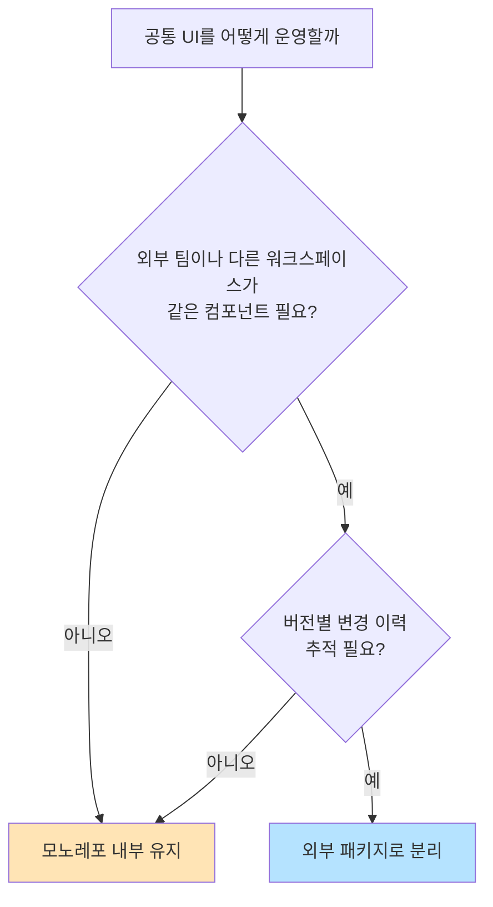
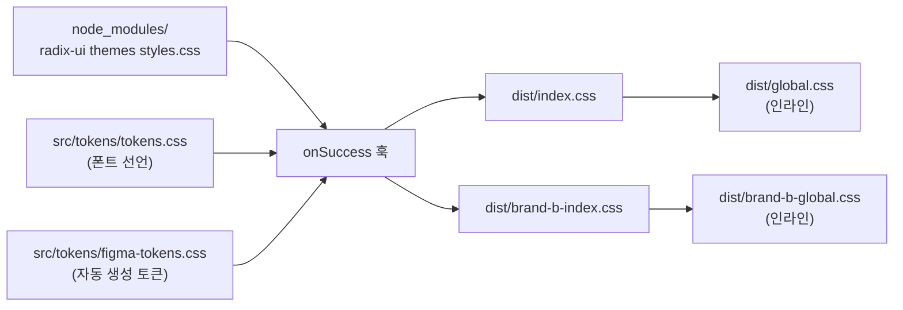
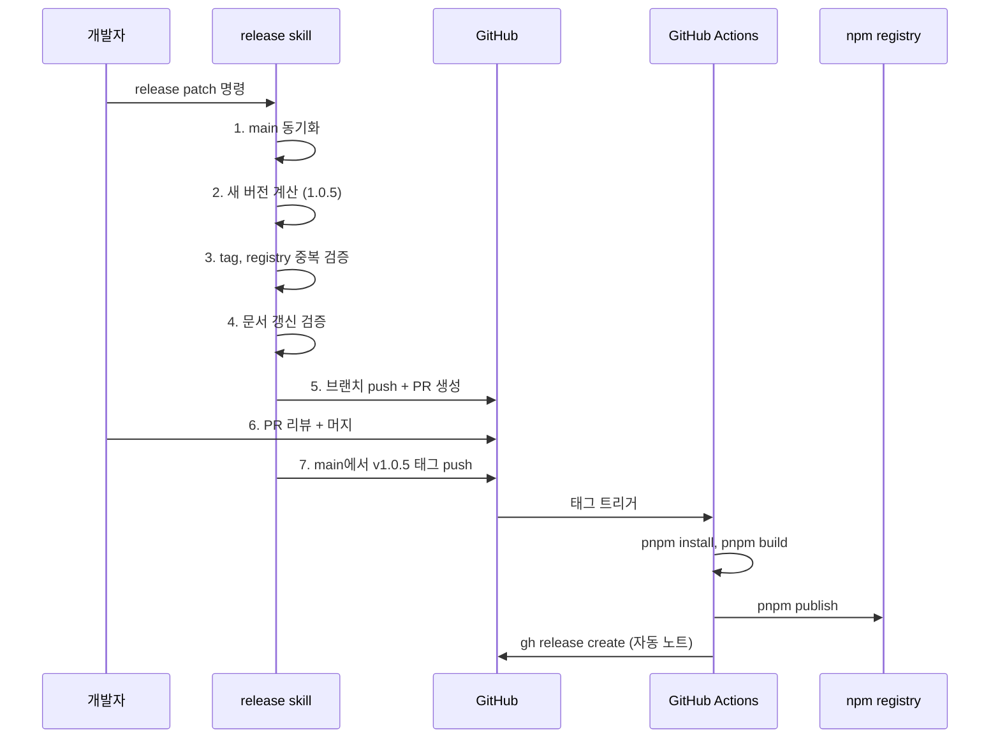

> **시리즈**
> (1) **공통 UI를 독립 npm 패키지로 분리하기** ← 현재 글
> (2) Figma 디자인 토큰을 단일 진실 소스로 만들기
> (3) JSON → CSS Variables → Tailwind v4 변환 스크립트 해부
> (4) 48개 컴포넌트를 CVA + Semantic 토큰으로 통일하기
> (5a) Figma 영역을 코드로 옮기는 실전 자동화
> (5b) 아직 빈 구멍 — 무엇이 부족하고 어떻게 메울 것인가
> (6) AI 에이전트로 패키지 개발 자동화하기
> (7) 소비자 측 검증 — 자체 ESLint 룰 만들기
> (8) 회고: AI 페어로 디자인 시스템 만든 1년

작년까지 모노레포 안 `packages/` 폴더 하나로 잘 굴러가던 공통 UI 라이브러리를, 두 달 전 **외부 npm 패키지**로 떼어냈다. 같은 모노레포 안에서 `import` 경로만 맞추면 되던 시절이 가장 단순했는데, 왜 굳이 빌드 단계와 인증 절차까지 추가해서 분리했을까. 그리고 분리하고 나서 무엇이 달라졌나.

이 글은 그 분리의 이유 · 빌드 파이프라인 · 배포 · 버전 관리 · 그리고 그 모든 걸 한 명령으로 만든 AI 자동화까지 정리한다. 시리즈의 첫 편이라 가장 큰 그림을 그리고, 다음 편부터는 각 조각을 깊게 들어간다.

---

## 1. 들어가며 — 디자인 시스템은 언제 "패키지"가 되어야 하나

디자인 시스템은 컴포넌트 묶음이 아니다. **"디자이너와 개발자가 공유하는 진실 소스를 코드 레벨까지 끌어내린 자동화 시스템"** 이다. 이게 컴포넌트 묶음으로 머무를 때와, 정식 패키지가 될 때의 분기점은 보통 세 가지 신호다.

- 다른 워크스페이스에서 같은 컴포넌트를 쓰고 싶다 — 그런데 path alias로는 못 닿는다.
- 어떤 변경이 다른 화면을 깼는지 추적할 방법이 없다 — 버전이 없으니까.
- 외부 협업이 시작됐다 — 코드 전체를 줄 수 없는 상황에서 "패키지로 가져가세요"라고 말해야 한다.

세 신호가 모이면 그때부터 분리가 자산이 된다.

---

## 2. 분리 전 — 모노레포 안 `packages/` 구조

처음 1년은 모노레포 한 곳에 다 있었다. 같은 워크스페이스 안의 `apps/web`, `apps/admin`, `apps/worker`가 `packages/ui` 폴더를 `workspace:*` 프로토콜로 직참조했다. 빌드 단계가 없으니 소스 변경이 즉시 반영됐고, 빠른 반복엔 최적이었다.

<style>
.before-after { display: grid; grid-template-columns: 1fr 1fr; gap: 20px; max-width: 820px; margin: 2.5rem auto; font-family: inherit; }
.before-after .side { padding: 1.2rem 1.3rem; border-radius: 12px; border: 1px solid; }
.before-after .side-label { font-size: 0.75rem; font-weight: 800; letter-spacing: 0.12em; margin-bottom: 0.4rem; text-transform: uppercase; }
.before-after .side-title { font-size: 1.05rem; font-weight: 700; margin-bottom: 0.9rem; letter-spacing: -0.02em; }
.before-after .nodes { display: flex; flex-direction: column; gap: 6px; }
.before-after .node-row { display: flex; align-items: center; gap: 8px; padding: 0.5rem 0.7rem; border-radius: 6px; font-size: 0.85rem; }
.before-after .arrow { text-align: center; color: #999; font-size: 0.85rem; padding: 4px 0; }
.before-after .pkg-box { padding: 0.7rem 1rem; border-radius: 8px; text-align: center; font-weight: 700; margin: 4px 0; }
.before-after .small-note { font-size: 0.75rem; color: #888; margin-top: 0.5rem; line-height: 1.4; }

/* 분리 전 — 회색 톤 */
.before-after .before { background: rgba(120, 120, 120, 0.05); border-color: rgba(120, 120, 120, 0.25); }
.before-after .before .side-label { color: #888; }
.before-after .before .node-row { background: rgba(120, 120, 120, 0.08); color: #555; }
.before-after .before .pkg-box { background: rgba(245, 158, 11, 0.12); border: 1px solid rgba(245, 158, 11, 0.3); color: #b45309; }

/* 분리 후 — 초록 톤 */
.before-after .after { background: rgba(34, 197, 94, 0.05); border-color: rgba(34, 197, 94, 0.25); }
.before-after .after .side-label { color: #16a34a; }
.before-after .after .node-row { background: rgba(34, 197, 94, 0.08); color: #15803d; }
.before-after .after .pkg-box { background: rgba(34, 197, 94, 0.15); border: 1px solid rgba(34, 197, 94, 0.35); color: #166534; }
.before-after .after .registry { background: rgba(168, 85, 247, 0.12); border: 1px solid rgba(168, 85, 247, 0.3); color: #7e22ce; padding: 0.5rem 0.8rem; border-radius: 6px; text-align: center; font-size: 0.82rem; font-weight: 600; margin: 6px 0; }

html[data-mode="dark"] .before-after .small-note { color: #888; }
html[data-mode="dark"] .before-after .before .node-row { background: rgba(120, 120, 120, 0.15); color: #bbb; }
html[data-mode="dark"] .before-after .before .pkg-box { background: rgba(245, 158, 11, 0.18); border-color: rgba(245, 158, 11, 0.4); color: #fcd34d; }
html[data-mode="dark"] .before-after .after .node-row { background: rgba(34, 197, 94, 0.13); color: #86efac; }
html[data-mode="dark"] .before-after .after .pkg-box { background: rgba(34, 197, 94, 0.18); border-color: rgba(34, 197, 94, 0.4); color: #bbf7d0; }
html[data-mode="dark"] .before-after .after .registry { background: rgba(168, 85, 247, 0.18); border-color: rgba(168, 85, 247, 0.4); color: #d8b4fe; }

@media (max-width: 640px) {
  .before-after { grid-template-columns: 1fr; }
}
</style>

<div class="before-after">
  <div class="side before">
    <div class="side-label">분리 전</div>
    <div class="side-title">모노레포 내부 직참조</div>
    <div class="nodes">
      <div class="node-row">📱 apps/web</div>
      <div class="node-row">🖥 apps/admin</div>
      <div class="node-row">📲 apps/worker</div>
    </div>
    <div class="arrow">↓ workspace:* 프로토콜</div>
    <div class="pkg-box">packages/ui</div>
    <div class="small-note">소스 직참조 · 빌드 불필요 · 버전 없음<br/>다른 저장소에서 사용 불가</div>
  </div>

  <div class="side after">
    <div class="side-label">분리 후</div>
    <div class="side-title">독립 npm 패키지</div>
    <div class="pkg-box">@org/ui-package · v1.0.5</div>
    <div class="registry">⬇ GitHub Packages registry</div>
    <div class="nodes">
      <div class="node-row">📱 apps/web (^1.0.4)</div>
      <div class="node-row">🖥 apps/admin (^1.0.4)</div>
      <div class="node-row">📲 apps/worker (^1.0.4)</div>
      <div class="node-row">🌐 다른 저장소 · 외부 팀</div>
    </div>
    <div class="small-note">tsup 빌드 · semver 관리 · 외부 공급 가능<br/>변경 즉시 반영은 불가 (publish 필요)</div>
  </div>
</div>

문제는 셋이었다.

1. **다른 모노레포는 못 쓴다.** 비슷한 사이즈의 다른 사내 프로덕트가 같은 토큰을 쓰고 싶다고 했을 때 줄 방법이 없었다.
2. **버전이 없다.** 어제 잘 되던 `Button`이 오늘 깨졌을 때 "어느 시점부터 이상한가"를 추적할 단위 자체가 없다. 모든 변경이 main에 직접 반영되니까.
3. **외부 협업 단위가 안 된다.** 외부 팀에 "이 폴더만 빼서 쓰세요"라고 하려면 결국 그 폴더를 npm 패키지처럼 포장해야 했다.

분리는 결국 시간 문제였다.

> **Q.** 모노레포 안에서도 `packages/`마다 독립 빌드와 버전 줄 수 있지 않나? 저장소를 굳이 분리해야 하나?
>
> 가능하다. pnpm workspace + changesets 조합으로 같은 저장소 안에서 패키지마다 semver 굴리는 케이스 많이 봤다. 결정적이었던 건 *누가 소비자인가*. 같은 모노레포 안 앱만 쓰면 monorepo-internal-package로 충분한데, 다른 저장소나 다른 팀이 소비자가 되는 순간 npm registry로 나가는 게 답이다. `workspace:*` 프로토콜은 모노레포 바깥에서 무의미하니까.
{: .prompt-info }

---

## 3. 분리 결정의 분기점

분리는 비용이 든다. 빌드 단계 + 인증 + 버전 관리 + 소비자 측 install 흐름이 추가된다. 그래서 결정 전에 트레이드오프 표를 정리했다.

| 항목 | 모노레포 내부 | 외부 npm 패키지 |
|---|---|---|
| 빌드 필요 | ❌ 소스 직참조 | ✅ tsup으로 dist 생성 |
| 버전 관리 | ❌ git commit이 곧 변경 | ✅ semver |
| 외부 사용 | ❌ 불가능 | ✅ install 한 줄 |
| 변경 즉시 반영 | ✅ HMR | ❌ publish 필요 |
| 인증 | 불필요 | NPM_TOKEN 관리 |
| 다른 프로덕트 공유 | 불가 | 가능 |

마지막 두 줄(다른 프로덕트 공유, 외부 사용)이 결정적이었다. 즉시 반영이라는 장점은 watch 모드와 `predev` 훅으로 어느 정도 보완할 수 있다고 봤다.



2026년 3월 말, 분리 작업을 시작했다.

---

## 4. 분리 후의 구조 — 패키지 해부

분리 후 패키지는 `internal-ui-package`라는 별도 저장소로 옮겼다. 같은 저장소 안의 다른 폴더(예: storybook 데모 앱)는 함께 두되, 실제 배포되는 부분은 `packages/` 안에 격리했다.

### 4-1. 디렉토리 레이아웃

```
internal-ui-package/
├── .claude/                         ← AI 자동화 인프라
│   ├── skills/
│   │   ├── ui-preview/              ← 격리 worktree 테스트
│   │   ├── release/                 ← 버전 bump + 배포 자동화
│   │   └── chrome-cdp/
│   ├── agents/
│   │   └── ui-qa.md
│   └── settings.json
│
├── packages/                        ← 실제 배포되는 라이브러리
│   ├── src/
│   │   ├── components/              ← 48개 React 컴포넌트
│   │   ├── scripts/
│   │   │   └── generate-figma-tokens.js   ← 1,265줄 변환 스크립트
│   │   ├── tokens/
│   │   │   ├── figma/               ← Figma export JSON (9개)
│   │   │   ├── figma-tokens.css     ← 자동 생성 (수정 금지)
│   │   │   └── tokens.css           ← 폰트 선언
│   │   ├── types/
│   │   ├── contexts/
│   │   └── assets/
│   ├── figma/metadata/              ← 컴포넌트 메타 캐시 (27개)
│   ├── figma-map.json               ← nodeId ↔ 컴포넌트 매핑
│   ├── global.css                   ← 라이브러리 진입점
│   ├── brand-b-global.css          ← 브랜드 변형 진입점
│   ├── tsup.config.ts               ← 빌드 설정
│   ├── tailwind.config.js           ← IDE 호환용 stub
│   └── package.json
│
├── apps/storybook/                  ← 컴포넌트 쇼케이스
│
├── .github/workflows/
│   └── publish-ui-resources.yml     ← 태그 push → npm publish
│
└── packages/CLAUDE.md               ← AI 행동 규약 (디자인 시스템 룰)
```

핵심은 `packages/`만 npm으로 배포되고, 나머지(`apps/storybook`, `.claude/`, `docs/`)는 개발용이라는 점. `package.json`의 `files` 필드로 명시한다.

### 4-2. `package.json` — 다중 진입점 설계

가장 신경 쓴 건 `exports` 필드다. 소비자가 무엇을 어떻게 가져갈 수 있는지를 결정한다.

```json
{
  "name": "@org/ui-package",
  "version": "1.0.5",
  "exports": {
    ".": {
      "types": "./dist/index.d.ts",
      "import": "./dist/index.mjs",
      "require": "./dist/index.js"
    },
    "./style.css": "./dist/index.css",
    "./brand-b-style.css": "./dist/brand-b-index.css",
    "./global.css": "./dist/global.css",
    "./brand-b-global.css": "./dist/brand-b-global.css",
    "./tailwind-config": {
      "import": "./tailwind.config.js"
    },
    "./figma-map": "./figma-map.json"
  },
  "files": [
    "dist", "src", "global.css", "brand-b-global.css",
    "tailwind.config.js", "tailwind-config.d.ts",
    "figma-map.json", "README.md", "CLAUDE.md"
  ],
  "publishConfig": {
    "registry": "https://npm.pkg.github.com",
    "access": "restricted"
  }
}
```

`packages/package.json`

진입점이 여러 개인 이유는 사용 시나리오가 다르기 때문이다.

| 진입점 | 무엇에 쓰나 |
|---|---|
| `.` (기본) | `import { Button } from '@org/ui-package'` |
| `./global.css` | `@import '@org/ui-package/global.css'` — 토큰 + Radix 베이스 |
| `./brand-b-global.css` | 브랜드 변형. 같은 컴포넌트, 다른 색 팔레트 |
| `./figma-map` | Figma 노드 ID 매핑 JSON. AI 에이전트가 컴포넌트를 식별할 때 사용 |

`files`는 화이트리스트다. `dist/`, 필요한 설정 파일, 그리고 `CLAUDE.md`를 포함했다. 소비자가 패키지를 설치하면 AI 행동 규약까지 함께 받아간다. 다음 편에서 다룰 토큰 룰이 소비자 측 AI에게도 즉시 적용되는 효과를 노렸다.

### 4-3. peer dependencies — 왜 따로 떼는가

React와 Tailwind 같은 코어 라이브러리는 **peer**로 선언했다.

```json
{
  "peerDependencies": {
    "react": "^19.0.0",
    "tailwindcss": "^4.0.0",
    "@radix-ui/react-popover": "^1.1.15",
    "@phosphor-icons/react": "^2.1.10",
    "clsx": "^2.1.1",
    "date-fns": "^4.0.0",
    "tailwind-merge": "^3.3.1"
  }
}
```

이유는 명확하다. **이중 인스턴스 방지.** React가 패키지 안에 한 번, 소비자 앱에 한 번 들어가면 hooks이 깨진다. Tailwind도 마찬가지로 두 번 처리되면 `@theme` 블록이 충돌한다.

peer는 "소비자가 알아서 설치하라"는 선언이다. 우리 패키지는 이걸 쓸 거니까, 같은 메이저 버전을 깔아두라는 계약.

> **Q.** dependencies, devDependencies, peerDependencies 셋이 헷갈렸다.
>
> 한참 헤맸다. 내 기준은 이렇게 정리됐다.
>
> `dependencies`는 우리가 직접 import하면서 런타임에도 필요하고, 소비자에게 그대로 따라가야 하는 것. `class-variance-authority`, `clsx` 같은 것들.
>
> `devDependencies`는 빌드·테스트에서만 쓰고 소비자에겐 안 따라가는 것. `tsup`, `typescript`.
>
> `peerDependencies`는 우리가 import는 하지만 *소비자가 이미 가지고 있어야 하는* 것. React, Tailwind. 이중 인스턴스 막으려는 목적.
>
> 헷갈렸던 후속 케이스 — 같은 React가 peer + dev 양쪽에 들어있는 이유. peer는 소비자와의 계약, dev는 내 저장소에서 빌드·테스트할 때 실제로 React가 깔려 있어야 하니까 둘 다 필요했다. 소비자가 install할 땐 peer만 해석되고 dev는 무시된다.
{: .prompt-info }

---

## 5. tsup 빌드 파이프라인 — 그냥 번들링이 아니다

### 5-1. `tsup.config.ts` 핵심

```typescript
import { defineConfig } from "tsup";
import { copyFileSync, readFileSync, writeFileSync } from "fs";

export default defineConfig({
  entry: ["src/index.ts"],
  format: ["cjs", "esm"],
  dts: true,
  clean: true,
  esbuildOptions(options) {
    options.loader = {
      ...options.loader,
      ".css": "empty",  // CSS는 esbuild가 건드리지 않음
    };
  },
  onSuccess: async () => {
    /* CSS 번들링 — 5-2에서 다룸 */
  },
});
```

`packages/tsup.config.ts`

`".css": "empty"`가 묘수였다. tsup 기본은 CSS도 esbuild가 처리해 `@theme`, `@source` 같은 Tailwind v4 디렉티브를 깨버린다. esbuild를 빼고 `onSuccess`에서 직접 합치는 쪽이 안전했다.

> **Q.** 빌드 도구가 CSS를 "처리"한다는 게 정확히 뭘 한다는 건지 모호했다. 그게 왜 문제가 되나?
>
> 직접 부딪혀보고 나서야 이해됐다. esbuild나 PostCSS가 CSS를 처리할 때 (1) 파싱해서 AST로 바꾸고 (2) minify·autoprefixer·모듈 hash 같은 변환을 적용한 뒤 (3) 다시 문자열로 직렬화한다. 문제는 이 파서가 *표준 CSS만 안다*는 점.
>
> Tailwind v4의 `@theme`, `@source`, `@utility`는 표준이 아니라 Tailwind 자체 확장 문법이다. 일반 CSS 파서는 이걸 "모르는 at-rule"로 보고 제거하거나 잘못 직렬화한다. 처음에 멋모르고 esbuild에 통과시켰다가 `@theme` 블록이 사라진 dist를 보고서야 깨달았다.
>
> 결국 esbuild에 "CSS는 건드리지 마라"(`empty` 로더) 지시하고, 원본 그대로 `onSuccess`에서 복사·합치기만 한다. Tailwind 디렉티브 해석은 소비자 측 Tailwind 빌드에 위임하는 셈.
{: .prompt-info }

### 5-2. onSuccess — CSS 번들링의 핵심

이 훅이 빌드의 절반이다. dist 디렉토리에 만들어야 할 CSS는 네 가지였다.

1. `dist/index.css` — Radix UI Themes + 폰트 토큰 + Figma 디자인 토큰을 한 파일로
2. `dist/brand-b-index.css` — 같은 베이스에 브랜드 변형 토큰
3. `dist/global.css` — `index.css`를 `@import`가 아니라 **인라인**으로 박은 진입점
4. `dist/brand-b-global.css` — 브랜드 변형의 인라인 진입점

핵심 로직은 이렇게 생겼다.

```typescript
onSuccess: async () => {
  let combinedCSS = "";

  // 1. Radix UI Themes 베이스
  const radixCSS = readFileSync(
    "node_modules/@radix-ui/themes/styles.css", "utf-8"
  );
  combinedCSS += "/* Radix UI Themes */\n" + radixCSS + "\n\n";

  // 2. 폰트 토큰
  const tokensCSS = readFileSync("src/tokens/tokens.css", "utf-8");
  combinedCSS += "/* Custom Tokens */\n" + tokensCSS + "\n\n";

  // 3. Figma 디자인 토큰 (자동 생성된 것)
  const figmaCSS = readFileSync("src/tokens/figma-tokens.css", "utf-8");
  combinedCSS += "/* Figma Design Tokens */\n" + figmaCSS;

  writeFileSync("dist/index.css", combinedCSS);
};
```

소비자가 `@import '@org/ui-package/global.css'` 한 줄만 쓰면 28,000줄짜리 합쳐진 CSS가 들어오는 구조다.



추가로 `@import './dist/...'` 같은 상대 경로를 빌드 시점에 인라인 내용으로 치환해서, 소비자가 다시 한 번 import를 풀지 않아도 되게 만들었다. `@config`, `@source` 같은 디렉티브의 상대 경로도 dist 기준으로 보정한다.

### 5-3. 산출물 — `dist/` 구조

```
packages/dist/
├── index.css               ← 28,000줄 (Radix + tokens + figma)
├── brand-b-index.css      ← 브랜드 변형
├── global.css              ← index.css 인라인 진입점
├── brand-b-global.css
├── tokens.css              ← 폰트만 (선택적 사용)
├── index.js                ← CommonJS
├── index.mjs               ← ESM
├── index.d.ts / .d.mts     ← TypeScript 타입
```

`dist/index.css`가 28,000줄까지 부푼 건 Radix Themes 자체가 6,500줄, Figma 토큰이 22,000줄 + 타이포 클래스 수백 개를 합쳤기 때문이다. 다음 편에서 이 22,000줄이 어떻게 만들어지는지 자세히 들어간다.

---

## 6. GitHub Packages로 배포하기

### 6-1. 왜 public npm이 아닌가

사내 패키지였다. 외부 노출을 막으면서 사내 GitHub 권한과 통합하는 게 자연스러웠다. GitHub Packages를 택한 이유는 세 가지다.

- **권한 통합**: GitHub 조직 멤버만 install 가능. 별도 권한 시스템 안 필요
- **CI 통합**: `secrets.GITHUB_TOKEN`이 자동으로 publish 권한 가짐
- **비용**: private 패키지여도 조직 플랜에 포함

대신 인증이 살짝 까다워진다.

### 6-2. 인증 — `NPM_TOKEN=$(gh auth token)`

`.npmrc` 설정:

```
@org:registry=https://npm.pkg.github.com
//npm.pkg.github.com/:_authToken=${NPM_TOKEN}
```

로컬 개발자는 매번 토큰을 환경변수로 넘긴다.

```bash
NPM_TOKEN=$(gh auth token) pnpm install
```

처음엔 매번 치기 귀찮아 보였는데, 한 번 셸 함수로 만들어두면 그 뒤로는 잊고 살 수 있다.

> **Q.** GitHub Packages 말고 public npm + private 패키지, 사내 Verdaccio 같은 옵션도 있는데 왜 굳이?
>
> 정답이 있는 영역이 아니다. 결정타는 *이미 GitHub를 코드 호스팅으로 쓰고 있어서 권한 시스템·인증을 그대로 재사용할 수 있다*는 점이었다.
>
> 검토했던 다른 후보들 — public npm + private 패키지는 가장 보편적이고 도구 호환성도 최강이지만 유료 플랜에 별도 권한 관리를 또 깔아야 했다. Verdaccio 자체 호스팅은 비용 0에 완전한 통제가 매력이었지만 우리 팀 규모엔 인프라 운영이 과잉. AWS CodeArtifact는 AWS 생태계 안에 있을 땐 자연스럽지만 우리는 인증 흐름이 너무 복잡해질 거 같았다.
>
> 결국 가장 적은 비용으로 가장 적은 새 의존성을 더하는 쪽으로 정착했다. 어느 게 *더 좋다*가 아니라 *우리 환경에 뭐가 가장 자연스러운가*의 문제.
{: .prompt-info }

---

## 7. 버전 관리 — 우리 팀의 시맨틱 규칙

### 7-1. 컨벤션

| 단계 | 케이스 |
|---|---|
| **PATCH (1.0.x)** | 색 토큰 미세 조정, variant 조합 버그, 작은 a11y 수정 |
| **MINOR (1.x.0)** | 신규 컴포넌트, 신규 토큰 카테고리, semantic 토큰 추가 |
| **MAJOR (x.0.0)** | 토큰 prefix 변경, 컴포넌트 API breaking, 구조 개편 |

규칙 자체는 평범하다. 중요한 건 **누가 어느 단계인지 판단하는가**다. 우리는 다음 단계로 갔다.

### 7-2. 실제 사례

- **v1.0.4 → v1.0.5 (PATCH)**: shadow 토큰 5개 신규 추가. 처음엔 MINOR로 가야 하나 고민했지만 — 기존 컴포넌트엔 영향 없고, 새 토큰을 안 쓰는 코드는 그대로 동작하므로 PATCH로 분류.
- **v1.0.3 → v2.0.0 (MAJOR, 가정)**: 만약 토큰 prefix를 `bg-blue-70` → `bg-atomic-blue-70`으로 바꾼다면 — 기존 모든 사용처가 깨지므로 명백한 MAJOR.

핵심은 **"기존 코드를 한 줄도 안 바꾸고 패키지를 업그레이드해도 안전한가"**. 안전하면 PATCH/MINOR, 한 줄이라도 깨지면 MAJOR.

---

## 8. AI로 자동화한 릴리스 — 한 명령으로 끝 ⭐

### 8-1. `release` skill의 동작

수동 릴리스는 단계가 많다. 매번 하다 보면 실수가 난다. 그래서 `.claude/skills/release/SKILL.md`에 전체 절차를 박제했다.



개발자 입장에서는 `/release patch "shadow 토큰 추가"` 한 줄이다.

### 8-2. 사전 검증 — 문서 동기화

가장 자주 빠뜨리는 게 README의 import 예시 갱신이었다. release skill이 버전 bump 전에 다음을 검사한다.

- `packages/README.md`에 옛 import 예시가 남아있는지
- `packages/docs/*.md`가 v1.x.x 토큰명을 쓰고 있는지

문제가 보이면 릴리스를 중단한다. 이 검증 덕에 "패키지는 v2.0.0인데 문서는 v1.x.x 예시" 같은 흔한 사고를 막을 수 있었다.

### 8-3. PR 생성 → 머지 대기

자동 생성된 PR 본문 형식:

```markdown
## Summary
- shadow 토큰 5개 추가 (normal, emphasize, strong, heavy, soft)

## 주요 변경사항
- `packages/src/tokens/figma/common-tokens.json`: effectStyle.shadow 추가
- `packages/src/tokens/figma-tokens.css`: 자동 재생성

## Test plan
- [ ] storybook에서 shadow-* 클래스 시각 확인
- [ ] ui-qa 에이전트로 회귀 검증

Bump: 1.0.4 → 1.0.5 (PATCH)
```

머지 전에는 다음 단계로 안 넘어간다. 머지 후 사용자가 "ㄱ" 한 마디 하면 그때 태그 push.

### 8-4. GitHub Actions로 publish

태그가 push되면 `.github/workflows/publish-ui-resources.yml`이 트리거된다.

```yaml
name: Publish @org/ui-package

on:
  push:
    tags:
      - 'v*'

jobs:
  publish:
    runs-on: ubuntu-latest
    permissions:
      contents: write
      packages: write
    steps:
      - uses: actions/checkout@v4
      - uses: pnpm/action-setup@v4
      - uses: actions/setup-node@v4
        with:
          node-version: '22'
          registry-url: 'https://npm.pkg.github.com'

      - run: pnpm install --frozen-lockfile
      - run: pnpm run build
        working-directory: packages

      - name: Publish
        working-directory: packages
        run: pnpm publish --no-git-checks
        env:
          NODE_AUTH_TOKEN: ${{ secrets.GITHUB_TOKEN }}

      - name: Create GitHub Release
        run: |
          TAG="${GITHUB_REF#refs/tags/}"
          gh release create "$TAG" \
            --title "@org/ui-package $TAG" \
            --generate-notes
        env:
          GH_TOKEN: ${{ secrets.GITHUB_TOKEN }}
```

`.github/workflows/publish-ui-resources.yml`

핵심은 `--generate-notes`. 머지된 PR들의 제목을 자동으로 모아서 릴리스 노트를 만든다. 사람이 수동으로 작성한 changelog보다 정확하다.

### 8-5. 시간 단축 효과

| 단계 | 수동 | release skill |
|---|---|---|
| 버전 bump 결정 + package.json 수정 | 1~2분 | 자동 |
| 변경사항 정리 + PR 본문 작성 | 5~10분 | 자동 (PR 머지 히스토리 기반) |
| 태그 push + 워크플로우 트리거 | 1~2분 | 자동 |
| Release 노트 작성 | 3~5분 | 자동 (`--generate-notes`) |
| **합계** | **10~20분 + 실수 가능성** | **3분 + 머지 대기 시간** |

진짜 효과는 시간이 아니라 **"실수 가능 지점 제거"**에 있다. 버전 오타, 태그 누락, registry 중복 같은 실수가 0이 됐다.

> **Q.** changesets, release-please 같은 표준 도구 두고 왜 굳이 자체 skill을?
>
> 둘 다 검토는 했다. 결국 안 쓴 이유는 단순했다.
>
> 첫째, 우리는 배포되는 패키지가 *하나뿐*이라 changesets가 오버킬이었다. 이 도구는 모노레포 안 여러 패키지가 서로 의존할 때 진가를 발휘하는데, 우리는 그 시나리오가 없다. changeset 파일 생성·소비 사이클이 부담만 됐다.
>
> 둘째, 우리 릴리스 절차에는 단순 버전 bump 외에 *문서 갱신 검증* 같은 도메인 단계가 있다. README에 옛 import 예시가 남아있는지, docs/가 v1.x.x 토큰명을 쓰고 있는지 같은 것. changesets에 이런 검증을 끼우려면 hook을 또 짜야 했는데, 그냥 처음부터 자체 skill로 다 묶는 게 더 직관적이었다.
>
> 한 번 더 한다면 — 새 프로젝트라면 changesets부터 시작할 거 같다. 표준 도구의 호환성과 미래의 마이그레이션 비용 절감은 무시 못 한다.
{: .prompt-info }

---

## 9. 분리 후 1년 — 회고

### 9-1. 얻은 것

- **다른 프로덕트에 즉시 공급 가능.** 분리 직후 두 번째 프로덕트가 같은 토큰으로 출발했다.
- **버전 다이버전스 추적 가능.** "v1.0.3에서 깨졌다"가 명확해졌다.
- **릴리스 노트가 변경 히스토리 자체.** GitHub Releases가 사실상 changelog가 됐다.
- **AI 자동화 인프라가 패키지에 종속.** `.claude/skills/release`가 패키지 저장소에 함께 있어서 AI 행동도 같이 진화한다. 외부 사용자가 패키지를 fork하면 이 인프라도 함께 간다.

### 9-2. 잃은 것 / 비용

- **변경 즉시 반영이 사라졌다.** 컴포넌트 한 줄 바꿔도 build → publish → install 사이클을 돌아야 한다. 이걸 우회하려고 만든 게 다음 편에서 다룰 `ui-preview` skill (격리 worktree에 tarball install).
- **인증 복잡도.** 새 팀원이 합류하면 `NPM_TOKEN` 설정부터 가르쳐야 한다.
- **빌드 단계 유지보수.** tsup config, GitHub Actions workflow, release skill 셋이 정합성을 유지해야 한다.

> 다시 한다면 무엇을 다르게 할지는 시리즈 마지막 회고편(Part 8)에서 한꺼번에 정리한다.

---

## 10. 다음 편 예고

이 편은 **컨테이너**에 대한 글이었다. 그 컨테이너 안에 든 핵심 — **디자인 토큰** — 이 어떻게 설계되고 어떻게 변환되는지를 다음 편에서 다룬다. Figma의 Styles vs Variables 차이, Atomic ↔ Semantic 2-레이어 설계, 그리고 한 번에 네 가지 브랜드 변형을 지원하는 방법까지.

---

**시리즈 다음 편**: Figma 디자인 토큰을 단일 진실 소스로 만들기 (작성 예정)
