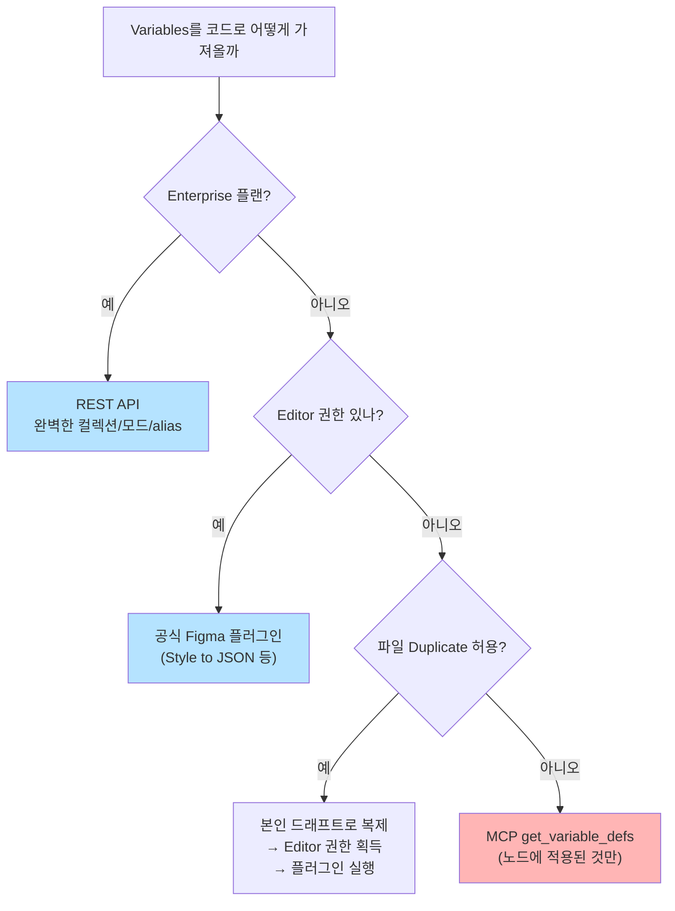
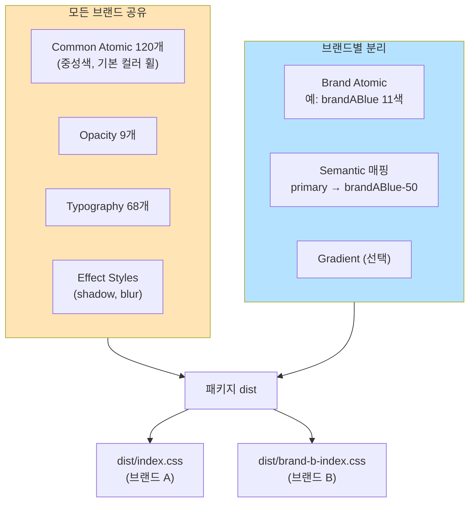
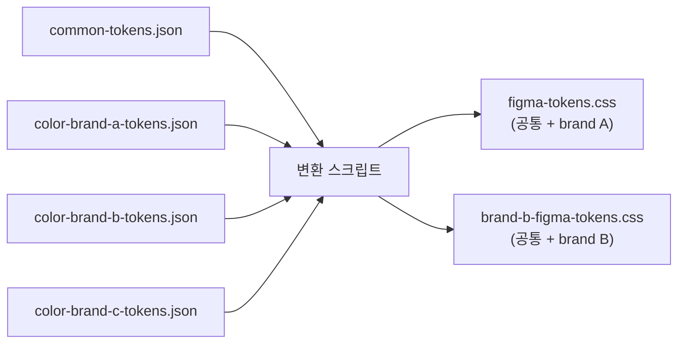

> **시리즈**
> (1) [공통 UI를 독립 npm 패키지로 분리하기](/posts/design-system-part1-package-split/)
> (2) **Figma 디자인 토큰을 단일 진실 소스로 만들기** ← 현재 글
> (3) JSON → CSS Variables → Tailwind v4 변환 스크립트 해부
> (4) 48개 컴포넌트를 CVA + Semantic 토큰으로 통일하기
> (5a) Figma 영역을 코드로 옮기는 실전 자동화
> (5b) 아직 빈 구멍 — 무엇이 부족하고 어떻게 메울 것인가
> (6) AI 에이전트로 패키지 개발 자동화하기
> (7) 소비자 측 검증 — 자체 ESLint 룰 만들기
> (8) 회고: AI 페어로 디자인 시스템 만든 1년

지난 편에서 컨테이너(npm 패키지)를 만들었다면, 이번 편은 그 안에 든 알맹이 — **디자인 토큰** — 이야기다. 토큰은 단순한 "색 이름표"가 아니다. 디자이너의 의도를 코드에 박제하는 약속이고, 한 줄 잘못 짜면 1년이 지나도 못 뜯어내는 부채가 된다.

이 편은 Figma의 Styles와 Variables가 왜 다른지, 어떤 토큰을 Atomic으로 두고 어떤 걸 Semantic으로 올릴지, 그리고 같은 패키지 안에서 네 가지 브랜드 변형을 어떻게 지원하는지를 다룬다.

---

## 1. Figma의 두 기능 — Styles와 Variables는 다른 도구다

Figma에는 비슷해 보이지만 역할이 다른 두 기능이 있다.

| 항목 | **Styles** (2016~) | **Variables** (2023~) |
|---|---|---|
| 저장 가능 타입 | Color, Text, Effect, Grid (복합 속성 묶음) | Color, Number, String, Boolean (원시값) |
| **모드(Mode)** | ❌ 없음 | ✅ Light/Dark, Mobile/Desktop |
| **별칭(Alias)** | ❌ Style → Style 참조 불가 | ✅ Variable → Variable 참조 |
| 적용 대상 | Fill, Stroke, Text, Effect, Grid | Fill, Stroke, **Spacing/Radius/Size/Opacity**, 컴포넌트 prop |
| 코드 추출 정밀도 | 토큰명만 | 토큰명 + 값 + alias 체인 + 모드 |

한 줄로 요약하면: **Variables는 "원시 토큰", Styles는 "여러 속성을 묶은 프리셋"**.

Figma는 둘을 같이 쓰라고 의도했다. 원시 색은 Variable로, 그 색·폰트·간격을 조합한 텍스트 스타일은 Style로. 이걸 모르고 시작하면 토큰이 둘 사이를 오가며 일관성이 깨진다.

> **Q.** 그럼 다 Variables로 통일하면 안 되나? Style이 레거시 아닌가?
>
> 처음에 내가 가졌던 의문이기도 했다. 결론은 *안 된다*.
>
> Variables가 지원하는 타입은 단일 원시값 4종(Color/Number/String/Boolean)뿐이라 *여러 속성의 묶음*을 표현 못 한다. 대표적인 게 텍스트 스타일 — `font-family + font-weight + font-size + line-height + letter-spacing` 5개 묶음이다. 이걸 Variable로 만들려면 5개 Number/String Variable을 따로 만들고 컴포넌트마다 5개씩 연결해야 한다. 실험해보다가 그냥 포기했다.
>
> 그래서 Text Style은 여전히 Style로만 정의된다. Effect Style(그림자), Grid Style도 같은 이유.
>
> 정착된 분리는 — 색·간격·반경 같은 원시값은 Variables로, 타이포·그림자·그리드는 Styles로. 가능하면 Style 내부에서 Variable을 참조하게.
{: .prompt-info }

---

## 2. 무료 플랜의 현실 — Variables 추출 경로 찾기

여기서 현업의 진짜 함정이 등장한다. **Figma REST API의 `/v1/files/:key/variables/local` 엔드포인트는 Enterprise 플랜 전용**이다.



우리는 무료 플랜이었다. 결국 택한 게 **Figma 플러그인 "Style to JSON"**.

이유는 단순하다:
- Plugin은 Variables + Styles **둘 다** 한 번에 export 가능
- 무료 플랜에서도 동작 (Editor 권한만 있으면)
- JSON 포맷이 잘 정돈돼 있어 후처리 스크립트 작성 쉬움

플러그인 실행 결과는 9개 JSON 파일로 나눠 저장한다.

```
packages/src/tokens/figma/
├── common-tokens.json          ← 공통 원시 색 + opacity + shadow
├── color-brand-a-tokens.json   ← 브랜드 A의 색 (brandABlue 11색)
├── color-brand-b-tokens.json  ← 브랜드 B의 색 (brandBMint, brandBBlue)
├── color-brand-c-tokens.json  ← 브랜드 C
├── color-brand-d-tokens.json   ← 브랜드 D
├── color-brand-e-tokens.json     ← 브랜드 E
├── web-textStyles.json         ← 데스크톱 타이포
├── app-textStyles.json         ← 모바일 타이포
└── origin/                     ← 원본 백업
```

> **Q.** 플러그인은 사람이 매번 직접 실행해야 한다. CI로 자동화 못 하나?
>
> 못 한다. Figma 플러그인은 Figma Desktop/Web 앱 안 샌드박스에서만 실행된다. 헤드리스 모드도 없고 CLI도 없다. 그래서 토큰 동기화는 여전히 *"디자이너가 의미 있는 변경 후 플러그인 클릭 → JSON export → PR"* 사이클로 굴린다.
>
> 우회하는 회사가 없진 않다. Tokens Studio는 Figma 플러그인인데 GitHub와 양방향 sync까지 지원한다 — 단 유료. Specify, Supernova 같은 외부 SaaS가 Figma API로 폴링하는 방식도 있다 — 별도 비용. 더 큰 조직에선 자체 Figma 플러그인 + 슬랙 봇 조합으로 디자이너가 슬랙 명령으로 트리거하기도 한다 — 개발 비용 큼.
>
> 우리는 디자이너의 토큰 변경 빈도가 주 1~2회 수준이라, 자동화 도입 비용이 수동 export보다 비싸다고 판단했다.
{: .prompt-info }

---

## 3. 토큰 계층 설계 — 2-레이어 전략

토큰을 한 줄로 평탄화하면 처음엔 편하지만 6개월이 지나면 후회한다. 우리는 **2-레이어 구조**를 택했다.

<style>
.token-flow { display: grid; grid-template-columns: repeat(4, 1fr) ; gap: 6px; align-items: stretch; max-width: 920px; margin: 2.5rem auto; font-family: inherit; }
.token-flow .stage { padding: 1.1rem 1rem; border-radius: 10px; border: 1px solid; display: flex; flex-direction: column; }
.token-flow .stage-label { font-size: 0.7rem; font-weight: 800; letter-spacing: 0.12em; text-transform: uppercase; margin-bottom: 0.5rem; }
.token-flow .stage-title { font-weight: 700; font-size: 0.92rem; margin-bottom: 0.5rem; letter-spacing: -0.02em; }
.token-flow .stage-example { font-family: 'SF Mono', Menlo, monospace; font-size: 0.78rem; padding: 0.5rem 0.65rem; border-radius: 5px; line-height: 1.5; word-break: break-all; }
.token-flow .stage-note { font-size: 0.75rem; color: #777; margin-top: 0.55rem; line-height: 1.4; }
.token-flow .arrow { display: flex; align-items: center; justify-content: center; font-size: 1.2rem; color: #aaa; }

.token-flow .s1 { background: rgba(120, 120, 120, 0.06); border-color: rgba(120, 120, 120, 0.25); }
.token-flow .s1 .stage-label { color: #888; }
.token-flow .s1 .stage-example { background: rgba(120, 120, 120, 0.1); color: #444; }

.token-flow .s2 { background: rgba(245, 158, 11, 0.08); border-color: rgba(245, 158, 11, 0.3); }
.token-flow .s2 .stage-label { color: #d97706; }
.token-flow .s2 .stage-example { background: rgba(245, 158, 11, 0.15); color: #78350f; }

.token-flow .s3 { background: rgba(59, 130, 246, 0.08); border-color: rgba(59, 130, 246, 0.3); }
.token-flow .s3 .stage-label { color: #2563eb; }
.token-flow .s3 .stage-example { background: rgba(59, 130, 246, 0.15); color: #1e3a8a; }

.token-flow .s4 { background: rgba(34, 197, 94, 0.08); border-color: rgba(34, 197, 94, 0.3); }
.token-flow .s4 .stage-label { color: #16a34a; }
.token-flow .s4 .stage-example { background: rgba(34, 197, 94, 0.15); color: #14532d; }

html[data-mode="dark"] .token-flow .stage-note { color: #999; }
html[data-mode="dark"] .token-flow .s1 .stage-example { background: rgba(120, 120, 120, 0.18); color: #ccc; }
html[data-mode="dark"] .token-flow .s2 .stage-example { background: rgba(245, 158, 11, 0.2); color: #fde68a; }
html[data-mode="dark"] .token-flow .s3 .stage-example { background: rgba(59, 130, 246, 0.18); color: #bfdbfe; }
html[data-mode="dark"] .token-flow .s4 .stage-example { background: rgba(34, 197, 94, 0.18); color: #bbf7d0; }

@media (max-width: 800px) {
  .token-flow { grid-template-columns: 1fr; }
  .token-flow .arrow { transform: rotate(90deg); padding: 4px 0; }
}
</style>

<div class="token-flow">
  <div class="stage s1">
    <div class="stage-label">Step 1 · 디자이너</div>
    <div class="stage-title">색 결정 (원시값)</div>
    <div class="stage-example">#3B82F6</div>
    <div class="stage-note">Figma에서 결정. 코드는 아직 모른다.</div>
  </div>

  <div class="stage s2">
    <div class="stage-label">Step 2 · Atomic</div>
    <div class="stage-title">"이게 무슨 색"</div>
    <div class="stage-example">atomic-blue-70<br/>= #3B82F6</div>
    <div class="stage-note">정체성만, 의도 없음. 140개.</div>
  </div>

  <div class="stage s3">
    <div class="stage-label">Step 3 · Semantic</div>
    <div class="stage-title">"어디에 쓰는 색"</div>
    <div class="stage-example">semantic-primary-normal<br/>→ atomic-brandABlue-50</div>
    <div class="stage-note">의도 표현. atomic을 참조. 42개.</div>
  </div>

  <div class="stage s4">
    <div class="stage-label">Step 4 · 컴포넌트</div>
    <div class="stage-title">실제 사용</div>
    <div class="stage-example">&lt;Button bg=<br/>"semantic-primary-normal"&gt;</div>
    <div class="stage-note">8:2 비율로 semantic 우선.</div>
  </div>
</div>

### Atomic — "이게 무슨 색"

Atomic은 색 자체의 정체성이다. 의도는 안 담는다.

```
atomic-blue-70       = #3B82F6
atomic-coolNeutral-50 = #747883
atomic-red-60        = #DC2626
atomic-opacity-16    = 16
```

명명 규칙: `atomic-{색계열}-{명도}`. 명도는 0(검정)~100(흰색) 척도로 통일.

총 140개:
- Common Atomic (120개): common, neutral, coolNeutral, blue, red, redOrange, green, lime, lightBlue, purple, pink
- Opacity (9개): 5, 8, 16, 24, 32, 52, 60, 88, 100 (자동 추출 — 다음 편 참고)
- Brand Atomic (11개): brandABlue 같은 브랜드 전용 색

### Semantic — "어디에 쓰는 색"

Semantic은 의도다. 같은 색이라도 의도가 다르면 토큰을 분리한다.

```
semantic-primary-normal     → atomic-brandABlue-50
semantic-primary-strong     → atomic-brandABlue-60
semantic-label-normal       → atomic-neutral-10
semantic-label-alternative  → atomic-neutral-50
semantic-background-normal-normal → atomic-common-100
semantic-line-normal        → atomic-coolNeutral-70 + opacity 22%
```

총 42개. 카테고리는 `primary`, `label`, `background`, `interaction`, `line`, `inverse`, `fill`.

### 왜 두 레이어인가

**1년 후 브랜드 색이 바뀐다고 가정해보자.** 디자이너가 "주력 색을 파란색 → 보라색"으로 바꾸자고 한다.

- 1-레이어 (Atomic만): 모든 컴포넌트에서 `bg-blue-70`을 찾아 `bg-purple-70`으로 바꿔야 한다. grep + 수동 검토. 누락 위험.
- 2-레이어 (Semantic 포함): `semantic-primary-normal`의 alias 한 줄만 바꾸면 끝. 컴포넌트는 손도 안 댐.

```diff
- semantic-primary-normal: atomic-brandABlue-50;
+ semantic-primary-normal: atomic-purple-50;
```

> **Q.** 그럼 컴포넌트에선 무조건 Semantic만 쓰나? Atomic은 언제?
>
> 원칙은 Semantic 우선, 예외는 *의도가 분명히 "이 특정 색"일 때*만 Atomic. 이 원칙을 정한 뒤로 컴포넌트 코드의 색 일관성이 확연히 좋아졌다.
>
> Semantic이 어울리는 건 "주요 버튼 배경"(→ `bg-semantic-primary-normal`), "본문 텍스트"(→ `text-semantic-label-normal`), "보더"(→ `border-semantic-line-normal`) 같이 의도가 명확한 것들.
>
> Atomic이 어울리는 건 "차트의 5가지 시리즈 색"(`bg-atomic-blue-70`, `bg-atomic-red-70`...) 처럼 semantic으로 의미 부여하기 어려운 케이스, "디버깅 표시"처럼 의도가 임시·일회성인 것, "브랜드 로고처럼 테마 바뀌어도 절대 안 변해야 하는 곳".
>
> 실제 비율은 8:2 정도로 Semantic이 압도적이다. 새 컴포넌트 만들 때 "이 색에 Semantic 이름이 어울리나?"부터 물어보고, 어울리지 않을 때만 Atomic 쓴다.
{: .prompt-info }

---

## 4. 멀티 브랜드 — 같은 패키지, 다른 색 팔레트

우리 회사는 한 패키지로 네 개의 브랜드를 지원해야 했다. **컴포넌트 코드는 한 벌, 색만 갈아끼우는** 구조가 목표.

### 4-1. 공유되는 것 vs 갈리는 것



### 4-2. 진입점 분리 전략

`package.json`의 `exports`로 두 가지 CSS를 노출한다:

```json
{
  "exports": {
    "./global.css":          "./dist/global.css",
    "./brand-b-global.css": "./dist/brand-b-global.css"
  }
}
```

소비자는 자기 브랜드에 맞는 진입점을 import한다:

```css
/* 브랜드 A 앱 */
@import '@org/ui-package/global.css';

/* 브랜드 B 앱 */
@import '@org/ui-package/brand-b-global.css';
```

같은 `Button` 컴포넌트가 두 앱에서 다른 색으로 렌더된다. JSX는 한 줄도 안 바꾼다.

### 4-3. 충돌 방지 — semantic prefix에 brand 이름

브랜드별 semantic 토큰은 충돌할 수 있다. 브랜드 A의 `primary-normal`과 브랜드 B의 `primary-normal`이 다른 색이면, 같은 CSS 변수명을 쓰면 안 된다.

해결: 브랜드 prefix를 붙인다.

```css
/* 공통 (common, opacity, ...) */
--color-atomic-blue-70: #3B82F6;
--color-atomic-opacity-16: 16;

/* 브랜드 A에만 있는 semantic */
--color-semantic-brand-b-primary-normal: var(--color-atomic-brandBMint-50);

/* 브랜드 B에만 있는 semantic */
--color-semantic-brand-c-primary-normal: var(--color-atomic-brandCBlue-50);
```

> **Q.** 다크모드는 Variables의 Mode로 처리한다는데, 멀티 브랜드도 같은 방식으로 갈 수 있지 않나?
>
> 이론적으로 가능하다. Mode를 "Light / Dark"가 아니라 "Brand A / Brand B / Brand C / Brand D"로 정의하면 한 Variable의 4가지 값을 한 컬렉션에 담을 수 있다. 시도는 해봤다.
>
> 막힌 데는 두 가지였다. 우리가 무료 플랜이라 컬렉션당 모드를 1개밖에 못 만들었고 — 다중 모드는 Professional 이상 — 거기에 더해 Figma MCP가 Variables의 Mode를 제대로 못 가져왔다. 다음 편에서 더 다룰 한계 중 하나다.
>
> 결국 모드 대신 *별도 컬렉션*으로 갔다. 브랜드별 JSON 파일을 따로 export하는 게 도구 호환성도 좋고, "어느 브랜드에 무슨 색이 정의돼 있나"를 git diff로 추적하기도 쉽다.
{: .prompt-info }

---

## 5. 멀티 브랜드를 한 파이프라인으로 — 빌드 시점 분기

변환 스크립트(`generate-figma-tokens.js`)는 JSON 파일을 읽으며 다음과 같이 분기한다.



핵심 로직 (다음 편에서 자세히):

```js
// generate-figma-tokens.js
const commonAtomic = readJSON('common-tokens.json');
const brandAAtomic = readJSON('color-brand-a-tokens.json');
const brand-bAtomic = readJSON('color-brand-b-tokens.json');

// 브랜드 A 출력
writeOutputCSS('figma-tokens.css', {
  atomic: [...commonAtomic, ...brandAAtomic],
  semantic: brandASemantic,
});

// 브랜드 B 출력 (공통 + 브랜드 B 전용)
writeOutputCSS('brand-b-figma-tokens.css', {
  atomic: [...commonAtomic, ...brand-bAtomic],
  semantic: brand-bSemantic,
});
```

이렇게 분기하면 새 브랜드 추가가 단순해진다.

```diff
+ const brandEAtomic = readJSON('color-brand-e-tokens.json');
+ writeOutputCSS('brand-e-figma-tokens.css', {
+   atomic: [...commonAtomic, ...brandEAtomic],
+   semantic: brandESemantic,
+ });
```

스크립트 한 곳에 5줄 추가하고 `pnpm generate:figma`만 돌리면 새 브랜드 CSS가 dist에 추가된다.

> **Q.** 브랜드가 늘어날수록 dist에 CSS가 더 쌓이면 패키지 용량이 커지는데, 소비자가 안 쓰는 브랜드도 다운로드하지 않나?
>
> 그렇다. 현재 dist/ 안에 두 가지 풀 CSS가 있어 패키지 크기가 거의 두 배다. 좋은 트레이드오프는 아니다.
>
> 검토 중인 개선 방향이 세 가지 있다. 단기엔 CSS를 npm scope 안의 subpath로 분리 — `@org/ui-package/styles/brand-a`, `@org/ui-package/styles/brand-b` 식으로 importmap 단위로 쪼개기. 그러면 소비자가 자기 브랜드 CSS만 다운로드한다. 장기엔 아예 별도 패키지로 쪼개고 peer로 묶는 게 정석이긴 한데, 운영 복잡도가 크게 늘어난다.
>
> Tailwind v4의 `@source` 스캔으로 미사용 토큰이 최종 번들에 안 들어가긴 한다. 다만 우리 dist는 토큰 *정의*까지 포함이라 효과가 제한적이다. 아직 (1)을 검토 중이다.
{: .prompt-info }

---

## 6. 토큰을 코드 레벨까지 끌어내리는 약속 — 네이밍 규칙

여기서 한 번 더 잘못 짜면 모든 게 무너진다. 우리가 채택한 네이밍 규칙은 단 한 줄이다.

> **모든 토큰은 `{layer}-{category}-{value}` 3단 구조**

| Layer | Category | Value |
|---|---|---|
| `atomic` / `semantic` | 색 계열 (blue, neutral) 또는 의미 (primary, label) | 명도 (70, 50) 또는 상태 (normal, strong) |

예시:
```
atomic-blue-70        ← Layer=atomic, Category=blue, Value=70
semantic-label-normal ← Layer=semantic, Category=label, Value=normal
```

이게 Tailwind 유틸리티로 변환되면:
```html
<div class="bg-atomic-blue-70">
<div class="text-semantic-label-normal">
<div class="hover:bg-semantic-interaction-hover">
```

prefix(`atomic-`, `semantic-`)를 떼고 싶은 유혹이 있지만 절대 안 한다. **Layer가 명시돼야 자체 ESLint 룰이 토큰 vs Tailwind 기본 유틸리티를 구분할 수 있다** (Part 7에서 다룬다).

---

## 7. 다음 편 예고

이 편은 **토큰의 설계 철학과 데이터 구조**에 대한 글이었다. 다음 편은 이 JSON 8개 파일이 어떻게 1,265줄짜리 변환 스크립트를 거쳐 28,000줄의 CSS가 되는지를 함수 단위로 해부한다. opacity를 어떻게 자동으로 추출하는지, web과 app 타이포그래피를 어떻게 한 클래스로 합치는지, multi-brand는 어떻게 분기하는지 등의 실전 코드 이야기.

---

**시리즈 이전 편**: [공통 UI를 독립 npm 패키지로 분리하기](/posts/design-system-part1-package-split/)
**시리즈 다음 편**: JSON → CSS Variables → Tailwind v4 변환 스크립트 해부 (작성 예정)
