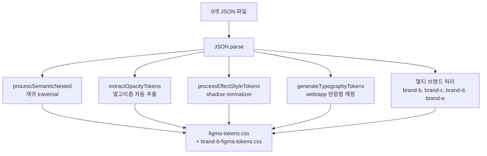

> **시리즈**
> (1) [공통 UI를 독립 npm 패키지로 분리하기](/posts/design-system-part1-package-split/)
> (2) [Figma 디자인 토큰을 단일 진실 소스로 만들기](/posts/design-system-part2-token-design/)
> (3) **JSON → CSS Variables → Tailwind v4 변환 스크립트 해부** ← 현재 글
> (4) 48개 컴포넌트를 CVA + Semantic 토큰으로 통일하기
> (5a) Figma 영역을 코드로 옮기는 실전 자동화
> (5b) 아직 빈 구멍 — 무엇이 부족하고 어떻게 메울 것인가
> (6) AI 에이전트로 패키지 개발 자동화하기
> (7) 소비자 측 검증 — 자체 ESLint 룰 만들기
> (8) 회고: AI 페어로 디자인 시스템 만든 1년

지금부터는 코드 이야기다. `packages/src/scripts/generate-figma-tokens.js`라는 한 파일이 1,265줄이다. 이 한 파일이 9개의 JSON을 받아 28,000줄짜리 CSS를 만든다. 단순 직렬화가 아니라 **재귀 traversal, 알고리즘 기반 자동 추출, 반응형 매핑 테이블**까지 다 들어있다.

이 편에선 핵심 함수 5개를 차례로 들여다본다. 코드는 핵심 부분만 발췌하고, 전체 흐름과 *왜 그렇게 짰는지*에 집중한다.

---

## 1. 큰 그림 — 함수 5개의 책임 분할



| 함수 | 라인 | 책임 | 특이점 |
|---|---|---|---|
| `processSemanticNested` | 116 | semantic 객체 재귀 탐색 | hex8 보존 (opacity 포함) |
| `processGradientNested` | 157 | gradient 토큰 추출 | Tailwind 매핑 불가 → CSS Variable만 |
| `processEffectStyleTokens` | 184 | shadow/blur 추출 | Figma 중복 length 제거 normalizer |
| `extractOpacityTokens` | 665 | 모든 객체 재귀, `opacity` 속성 수집 | 0.16 → `--color-atomic-opacity-16` |
| `generateTypographyTokens` | 776 | web/app textStyles 합치기 | 미디어쿼리 자동 생성 |

이 5개가 각자 한 가지 일만 하고, 마지막에 `generateCSS()`가 합쳐서 파일로 쓴다. 책임 분리가 깔끔해서 새 토큰 타입 추가가 어렵지 않다.

---

## 2. `processSemanticNested` — 중첩 객체를 평탄화하는 재귀

Figma JSON에서 semantic 구조는 끔찍하게 중첩돼 있다.

```json
{
  "semantic": {
    "label": {
      "normal":      { "hex": "#171719", "opacity": 1, "hex8": "#171719ff" },
      "alternative": { "hex": "#383940", "opacity": 0.6, "hex8": "#38394099" },
      "neutral":     { "hex": "#383940", "opacity": 0.88, "hex8": "#383940e0" }
    },
    "background": {
      "normal": {
        "normal":      { "hex": "#FFFFFF", ... },
        "alternative": { "hex": "#F5F5F5", ... }
      }
    }
  }
}
```

깊이가 정해져 있지 않다. `label.normal`은 2단, `background.normal.normal`은 3단. 새 토큰이 추가될 때마다 깊이가 또 달라질 수 있다. 그래서 재귀로 풀어야 한다.

```js
function processSemanticNested(obj, parentPath, atomic, semanticVars, semanticTheme) {
  Object.entries(obj).forEach(([key, value]) => {
    const currentPath = parentPath ? `${parentPath}-${key}` : key;

    if (value && typeof value === 'object') {
      // hex 값이 있으면 종착 — 토큰 생성
      if (value.hex) {
        const hexValue = value.hex8 || value.hex;  // opacity 보존
        semanticVars.push(`  --color-semantic-${currentPath}: ${hexValue};`);
        semanticTheme.push(`  --color-semantic-${currentPath}: var(--color-semantic-${currentPath});`);
      } else {
        // 중첩 객체면 재귀
        processSemanticNested(value, currentPath, atomic, semanticVars, semanticTheme);
      }
    }
  });
}
```

`packages/src/scripts/generate-figma-tokens.js:116`

핵심:
- **`value.hex` 유무로 종착 판단**: hex가 있으면 토큰, 없으면 더 들어간다
- **`hex8 || hex`**: opacity까지 보존된 hex8을 우선. 디자이너 의도 그대로 박제
- **`parentPath`로 경로 누적**: `label` → `label-normal`, `background` → `background-normal-normal`

결과:
```css
--color-semantic-label-normal: #171719ff;
--color-semantic-label-alternative: #38394099;
--color-semantic-background-normal-normal: #FFFFFFff;
```

> **Q.** 재귀로 풀면 깊이 제한 없이 처리는 되는데, 토큰 이름이 너무 길어지지 않나? 깊이 5단 가면 `--color-semantic-a-b-c-d-e-normal` 같은 게 나올 텐데.
>
> 그게 정확히 내가 처음 부딪힌 문제다. `background-normal-normal` 같은 어색한 이름을 보고서야 깊이 제한이 필요하다는 걸 깨달았다.
>
> 두 가지 길이 보였다. 명명 규약을 깊이 3단 이내로 제한하고 디자이너와 합의로 강제하는 길, 아니면 자동 평탄화 알고리즘으로 코드 단에서 처리하는 길. 자동화는 디자인 의도와 어긋날 위험이 있어서 결국 첫 번째 길로 갔다.
>
> `background-normal-normal`은 어색해도 유지 — 디자이너 의도가 "기본 배경의 기본 상태"라 의미가 명확하니까. 대신 새 토큰을 추가할 땐 3단을 넘기지 않도록 디자이너와 사전 협의한다.
{: .prompt-info }

---

## 3. `extractOpacityTokens` — 데이터에서 토큰을 자동 추출

이게 이 스크립트에서 가장 영리한 부분이다. **누구도 opacity 토큰을 따로 정의하지 않는다.** Figma JSON 어딘가에 `opacity: 0.16` 값이 등장하면, 그게 곧 토큰이 된다.

원리:

```js
function extractOpacityTokens(data) {
  const opacitySet = new Set();

  function traverse(obj) {
    if (obj && typeof obj === 'object') {
      if (typeof obj.opacity === 'number') {
        const opacityValue = obj.opacity === 1 ? 100 : Math.round(obj.opacity * 100);
        opacitySet.add(opacityValue);  // 중복 자동 제거
      }
      for (const value of Object.values(obj)) {
        if (typeof value === 'object') traverse(value);
      }
    }
  }

  traverse(data);

  const opacities = Array.from(opacitySet).sort((a, b) => a - b);
  return {
    opacityVars: opacities.map(o => `  --color-atomic-opacity-${o}: ${o};`),
    opacityTheme: opacities.map(o => `  --color-atomic-opacity-${o}: var(--color-atomic-opacity-${o});`),
  };
}
```

`packages/src/scripts/generate-figma-tokens.js:665`

흐름:
1. 모든 객체를 재귀로 순회
2. `opacity: 0.X` 키가 있으면 수집
3. 0~1 범위를 0~100 정수로 변환 (`0.16 → 16`)
4. Set에 넣어 중복 자동 제거
5. 정렬 후 토큰화

결과:
```css
--color-atomic-opacity-5:   5;
--color-atomic-opacity-8:   8;
--color-atomic-opacity-16:  16;
--color-atomic-opacity-24:  24;
--color-atomic-opacity-32:  32;
--color-atomic-opacity-52:  52;
--color-atomic-opacity-60:  60;
--color-atomic-opacity-88:  88;
--color-atomic-opacity-100: 100;
```

총 9개. **이 9개를 사람이 손으로 등록한 적은 한 번도 없다.** 디자이너가 Figma에서 88% opacity를 어딘가에 쓰는 순간, 그게 토큰이 된다. 안 쓰면 빠진다.

> **Q.** 자동 추출이 멋지긴 한데, 디자이너가 실수로 88.5% 같은 값을 한 번 쓰면 그것도 토큰이 되지 않나?
>
> 된다. 그게 이 알고리즘의 한계다. `Math.round(0.885 * 100) = 89` → `atomic-opacity-89` 토큰이 자동 생성된다. 의도하지 않은 토큰.
>
> 실제로 한 번 그런 일이 있었다. 디자이너가 마우스 클릭 실수로 53%를 만들었고, 어느 컴포넌트엔가 적용된 채로 export됐고, 다음 빌드에서 `atomic-opacity-53`이 생겼다. 사용처가 단 하나라 수상해서 확인했더니 실수였다.
>
> 보완할 방법은 몇 가지 있다. 허용 opacity 화이트리스트(5, 8, 16, 24, 32, 52, 60, 88, 100) 외엔 빌드 경고를 띄우는 방식이 가장 간단하고, 사용 빈도가 N 미만이면 토큰화 안 하는 임계값 방식, 새 opacity가 생기면 자동 PR로 디자이너 승인을 강제하는 방식도 있다. 우리는 아직 첫 번째를 도입 중이다. 자동화의 양날.
{: .prompt-info }

---

## 4. `generateTypographyTokens` — 미디어쿼리 자동 생성

타이포그래피는 색보다 까다롭다. 같은 "h1" 헤딩이 데스크톱과 모바일에서 다른 사이즈여야 하니까. 우리는 매핑 테이블로 풀었다.

```js
const WEB_TO_APP_TOKEN_MAP = {
  // H1 매핑 (40 → 32)
  'h1-bold-40': 'h1-bold-32',
  'h1-medium-40': 'h1-medium-32',
  // H2 (36 → 28)
  'h2-bold-36': 'h2-bold-28',
  // Body1 (18 → 16)
  'body1-normal-bold-18': 'body1-normal-bold-16',
  // Body2 (16 → 14)
  'body2-normal-bold-16': 'body2-normal-bold-14',
  // Caption1 — 같은 값 (12 → 12)
  'caption1-bold-12': 'caption1-bold-12',
  // 특이 케이스: web의 Regular → app에선 Bold로 매핑
  'h6-regular-20': 'h6-bold-18',
  // ... 총 30+ 매핑
};
```

`packages/src/scripts/generate-figma-tokens.js:42-92`

이 테이블을 사람이 손으로 적었다. 디자이너의 결정이라 자동화 못 한다. 대신 한 번 적어두면 스크립트가 다음 일을 한다:

```js
function generateTypographyTokens() {
  const webStyles = readJSON('web-textStyles.json').styles.textStyles;
  const appStyles = readJSON('app-textStyles.json').styles.textStyles;

  return webStyles.map(webStyle => {
    const webClassName = webStyle.name.replace(/\//g, '-');  // h1/bold/40 → h1-bold-40
    const appTokenKey = WEB_TO_APP_TOKEN_MAP[webClassName.toLowerCase()];
    const appStyle = appStyles.find(s => s.name === appTokenKey);

    if (appStyle) {
      // 양쪽 모두 있으면 반응형 클래스 생성
      return `
.${webClassName} {
  @media (max-width: 768px) {
    font-family: ${appStyle.fontFamily}, sans-serif;
    font-weight: ${mapWeight(appStyle.fontWeight)};
    font-size: ${parseInt(appStyle.fontSize)}px;
    /* ... */
  }
  @media (min-width: 769px) {
    font-family: ${webStyle.fontFamily}, sans-serif;
    font-weight: ${mapWeight(webStyle.fontWeight)};
    font-size: ${parseInt(webStyle.fontSize)}px;
    /* ... */
  }
}`;
    } else {
      // 매핑 없으면 웹 값만 사용
      return `.${webClassName} { /* ... web only ... */ }`;
    }
  });
}
```

결과:

```css
.h1-bold-40 {
  @media (max-width: 768px) {
    font-family: Pretendard, sans-serif;
    font-weight: 700;
    font-size: 32px;
    line-height: 1.45;
    letter-spacing: -0.02em;
  }
  @media (min-width: 769px) {
    font-family: Pretendard, sans-serif;
    font-weight: 700;
    font-size: 40px;
    line-height: 1.4;
    letter-spacing: -0.02em;
  }
}
```

마법은 **클래스명이 안 변한다는 것**이다. JSX에선 그냥 `className="h1-bold-40"` 한 번만 쓰면 두 사이즈가 미디어쿼리로 자동 분기된다. Tailwind의 `md:text-3xl` 같은 모디파이어 안 써도 된다.

> **Q.** 클래스명은 `h1-bold-40`인데 모바일에선 32px이 된다. 이름과 실제 값이 안 맞아 혼란스럽지 않나?
>
> 큰 함정 맞다. 도입 직전에 한참 토론했다.
>
> 두 입장이 충돌했다. A안은 *이름이 곧 데스크톱 값* — 디자이너가 "h1-40"이라 부르니 코드도 그대로 가는 명확한 매핑. B안은 *이름은 의미만* — `h1-bold-default` 같은 식으로 사이즈 숫자를 빼고 모바일·데스크톱 신경 안 쓰는 방향.
>
> 결국 A안으로 갔다. 디자이너가 Figma에서 `h1-bold-40`이라 부르는 토큰을 코드에서 같은 이름으로 검색할 수 있어야 한다는 게 컸다. 사이즈는 데스크톱 기준, 모바일은 "그에 따른 자동 조정"이라는 멘탈 모델이 자연스러웠다.
>
> 새 디자인 시스템을 만든다면 B안을 검토해볼 만하다. 다만 디자이너 측 명명 컨벤션을 같이 바꿔야 해서 비용이 크다.
{: .prompt-info }

---

## 5. `processEffectStyleTokens` — Figma의 box-shadow를 정상화

Figma가 export한 box-shadow는 종종 표준 CSS와 어긋난다. 중복된 length가 들어있거나, 쉼표 분리가 잘못돼 있다.

```css
/* Figma export */
box-shadow: 0px 1px 1px 0px 0px 1px 0px rgba(0,0,0,0.16);
/*          ↑─── length 7개! 표준은 최대 4개 (x, y, blur, spread) ───↑ */
```

normalizer가 이걸 정리한다:

```js
function normalizeShadowLayer(layer) {
  const colorMatch = layer.match(/(rgba?\([^)]+\)|#[0-9a-f]{3,8})/i);
  if (!colorMatch) return layer;

  const color = colorMatch[0];
  const beforeColor = layer.slice(0, colorMatch.index).trim();
  const tokens = beforeColor.split(/\s+/).filter(Boolean);

  // offset-x, offset-y, blur, spread까지만 유지 (Figma의 중복 length 제거)
  const normalizedLengths = tokens.slice(0, 4);

  return [...normalizedLengths, color].join(' ');
}
```

`packages/src/scripts/generate-figma-tokens.js:294`

결과:
```css
/* normalized */
--shadow-normal: 0px 1px 1px 0px rgba(0,0,0,0.16);
```

> **Q.** Figma export가 잘못된 거면 Figma 측 버그 같은데, 우회하는 게 옳은 방향인가?
>
> 부분적으로 맞다. 이상적이라면 Figma가 표준 CSS를 뱉어줘야 한다.
>
> 현실은 그렇지 않다. "Style to JSON" 플러그인은 서드파티라 우리가 통제 못 하고, 같은 토큰이 여러 레이어의 shadow를 합친 경우 Figma 내부에서 length가 중첩되는 게 정상 동작이다. 표준 CSS 파서가 이걸 그대로 받으면 invalid로 처리할 수 있다.
>
> 그래서 normalizer는 *방어적 보정 계층*으로 만들었다. 입력이 100% 정상이면 아무 일도 안 한다. 잘못된 입력이 와도 합리적으로 정리해서 표준 CSS로 내보낸다.
>
> 이 패턴은 백엔드에서도 흔하다. 외부 API 응답을 받을 때 내가 통제할 수 없는 입력은 일단 정규화한 뒤 내부 모델로 매핑하는 방식. *신뢰할 수 없는 입력에 대한 방어*라는 원칙은 영역을 안 가린다.
{: .prompt-info }

---

## 6. 멀티 브랜드 분기 — `generateColorTokens()` 안의 루프

마지막 조각. 9개 JSON을 다 처리한 뒤, 브랜드별 진입점을 따로 만든다.

```js
function generateColorTokens() {
  // 1. 공통 (common-tokens.json)
  const commonAtomic = processAtomic(readJSON('common-tokens.json'));

  // 2. brand A (color-brand-a-tokens.json) — 기본 진입점 (회사 메인 브랜드)
  const brandAAtomic = processAtomic(readJSON('color-brand-a-tokens.json'));
  const brandASemantic = processSemanticNested(readJSON('color-brand-a-tokens.json').semantic);

  // 3. 멀티 브랜드 (brand-b, brand-c, brand-d, brand-e)
  const THEME_FILES = [
    { name: 'brand-b', file: 'color-brand-b-tokens.json' },
    { name: 'brand-c', file: 'color-brand-c-tokens.json' },
    { name: 'brand-d',  file: 'color-brand-d-tokens.json' },
    { name: 'brand-e',    file: 'color-brand-e-tokens.json' },
  ];

  const brandData = THEME_FILES.map(({ name, file }) => ({
    name,
    atomic: processAtomic(readJSON(file)),
    semantic: processSemanticNested(readJSON(file).semantic, name),  // ← prefix
  }));

  // 4. 출력 — figma-tokens.css (공통 + brand A)
  writeOutput('figma-tokens.css', { commonAtomic, brandAAtomic, brandASemantic });

  // 5. 출력 — brand-b-figma-tokens.css (공통 + brand A + brand-b)
  const brand-b = brandData.find(b => b.name === 'brand-b');
  writeOutput('brand-b-figma-tokens.css', {
    commonAtomic, brandAAtomic, brandASemantic,
    brand-bAtomic: brand-b.atomic,
    brand-bSemantic: brand-b.semantic,  // semantic-brand-b-... prefix
  });
}
```

`packages/src/scripts/generate-figma-tokens.js:408`

핵심:
- **brand별 semantic은 prefix를 붙임**: `processSemanticNested(data, name)` — `name`이 parentPath의 시작이 돼 `semantic-brand-b-primary-normal` 형태
- **공통 토큰은 한 번만 처리**해서 모든 brand 출력에 재사용
- **출력 파일은 진입점 수만큼**: `figma-tokens.css`, `brand-b-figma-tokens.css`...

> **Q.** 1,265줄짜리 단일 파일이면 한 사람이 유지보수하기 어렵지 않나? 함수형 분해를 더 했으면 좋았을 텐데.
>
> 정직하게 말하면 이 스크립트는 단일 파일 vanilla Node다. 모듈 분할이 부족하다.
>
> 한 번 더 한다면 — `parsers/`에 JSON 종류별 파서, `generators/`에 출력 종류별 생성기(CSS Variables, @theme, Utility), `extractors/`에 알고리즘 추출 함수(opacity, shadow normalizer)를 분리하고, 메인 스크립트는 50줄 오케스트레이션만 두는 식.
>
> 안 한 이유는 *빨리 만들고 잘 동작하는 게 먼저*였기 때문. AI 페어로 짤 때 한 파일에 다 넣고 함수만 분리하는 게 가장 빠른 반복 속도를 줬다. 모듈로 쪼개면 import 경로 관리에 시간을 더 쓰게 됐다.
>
> 지금은 함수마다 책임이 분명하고 JSDoc 주석이 잘 붙어 있어 한 파일이라도 탐색이 어렵진 않다. 1,265줄 중 본문은 600줄 정도, 나머지는 주석과 빈 줄. 다음 큰 변경(예: 새 토큰 타입 추가)이 오면 모듈로 쪼갤 계획.
>
> 비용은 분명히 있다. 새 기여자가 들어오면 1,265줄을 한 번에 봐야 한다. 작은 팀이면 OK, 큰 팀이면 안 된다. 우리는 작아서 괜찮았다.
{: .prompt-info }

---

## 7. 출력의 최종 모양

전체 변환의 결과는 단 하나의 CSS 파일이다.

```css
/* figma-tokens.css (자동 생성, 약 22,000줄) */

:root {
  /* Part 1: 실제 값 정의 */
  --color-atomic-blue-70: #3b82f6ff;
  --color-atomic-coolNeutral-50: #747883ff;
  --color-atomic-opacity-16: 16;
  --color-semantic-label-normal: #171719ff;
  --color-semantic-label-neutral: #383940e0;
  --shadow-normal: 0px 1px 1px 0px rgba(0,0,0,0.16);
  --blur-normal: 5px;
}

@theme {
  /* Part 2: Tailwind v4 유틸리티 매핑 */
  --color-atomic-blue-70: var(--color-atomic-blue-70);
  --color-semantic-label-normal: var(--color-semantic-label-normal);
  --shadow-normal: var(--shadow-normal);
}

@layer utilities {
  /* Part 3: 유틸리티 클래스 */
  .shadow-normal { box-shadow: var(--shadow-normal); }
  .backdrop-blur-normal { backdrop-filter: blur(var(--blur-normal)); }

  /* 타이포그래피 (반응형) */
  .h1-bold-40 {
    @media (max-width: 768px) { font-size: 32px; /* ... */ }
    @media (min-width: 769px) { font-size: 40px; /* ... */ }
  }
}
```

3-Part 구조:
- **`:root`**: 실제 값 (`#3b82f6ff`)
- **`@theme`**: Tailwind 유틸리티 매핑 (`bg-atomic-blue-70`, `text-semantic-label-normal` 자동 생성)
- **`@layer utilities`**: 색 외의 유틸리티 (shadow, blur, typography)

소비자는 이 22,000줄을 직접 볼 일이 없다. Tailwind 빌드가 알아서 사용된 클래스만 추출해 dist에 박아주니까.

---

## 8. 다음 편 예고

토큰이 이렇게 만들어진다면, 그걸 **컴포넌트가 어떻게 소비하는지**가 다음 주제다. 48개 컴포넌트를 CVA(Class Variance Authority)와 Semantic 토큰만으로 통일한 패턴, Button 하나의 15개 compoundVariants를 어떻게 관리하는지, hardcoded hex가 단 하나도 들어가지 않는 정책을 어떻게 유지하는지.

---

**시리즈 이전 편**: [Figma 디자인 토큰을 단일 진실 소스로 만들기](/posts/design-system-part2-token-design/)
**시리즈 다음 편**: 48개 컴포넌트를 CVA + Semantic 토큰으로 통일하기 (작성 예정)
