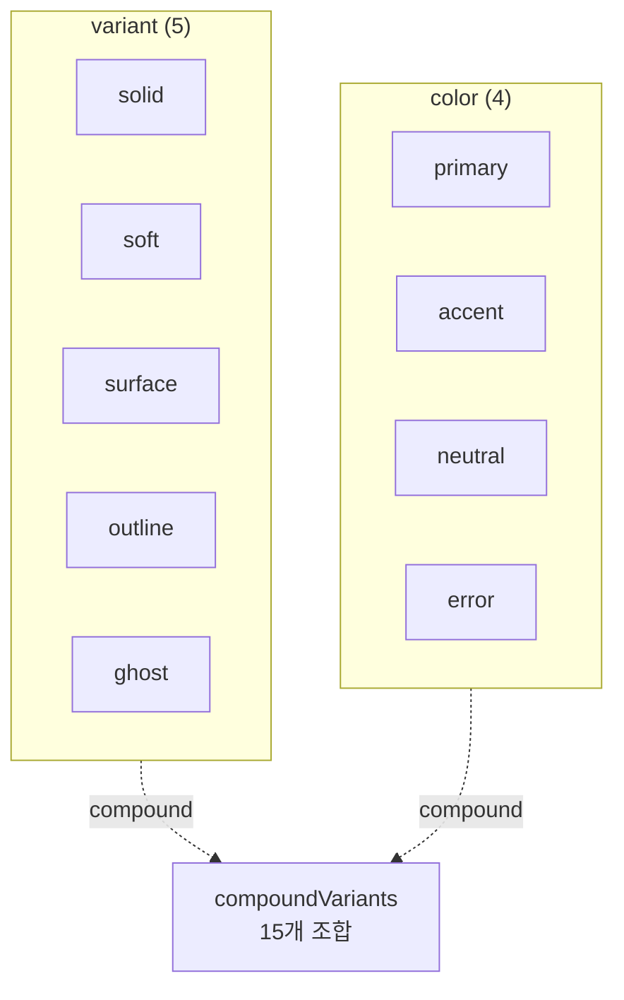
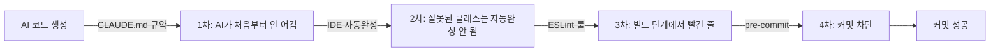
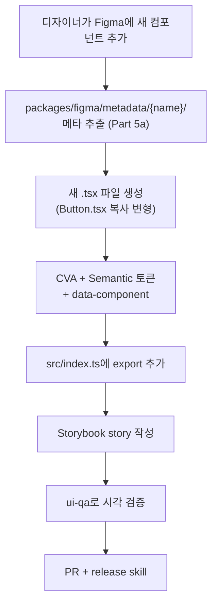

> **시리즈**
> (1) [공통 UI를 독립 npm 패키지로 분리하기](/posts/design-system-part1-package-split/)
> (2) [Figma 디자인 토큰을 단일 진실 소스로 만들기](/posts/design-system-part2-token-design/)
> (3) [JSON → CSS Variables → Tailwind v4 변환 스크립트 해부](/posts/design-system-part3-converter-script/)
> (4) **48개 컴포넌트를 CVA + Semantic 토큰으로 통일하기** ← 현재 글
> (5a) Figma 영역을 코드로 옮기는 실전 자동화
> (5b) 아직 빈 구멍 — 무엇이 부족하고 어떻게 메울 것인가
> (6) AI 에이전트로 패키지 개발 자동화하기
> (7) 소비자 측 검증 — 자체 ESLint 룰 만들기
> (8) 회고: AI 페어로 디자인 시스템 만든 1년

토큰이 만들어졌으면 그걸 쓰는 컴포넌트가 일관돼야 한다. 48개 컴포넌트가 각자 다른 패턴으로 색·variant·상태를 관리하면 결국 디자인 시스템이라는 단어가 무의미해진다. 이 편은 우리가 **모든 컴포넌트를 같은 패턴 — CVA + Semantic 토큰**으로 통일한 이야기다.

---

## 1. 48개 컴포넌트의 카테고리

<style>
.comp-grid { display: grid; grid-template-columns: repeat(auto-fit, minmax(220px, 1fr)); gap: 14px; max-width: 920px; margin: 2.5rem auto; font-family: inherit; }
.comp-grid .cat { padding: 1rem 1.1rem; border-radius: 10px; border: 1px solid; }
.comp-grid .cat-header { display: flex; justify-content: space-between; align-items: baseline; margin-bottom: 0.6rem; }
.comp-grid .cat-name { font-weight: 700; font-size: 0.92rem; letter-spacing: -0.01em; }
.comp-grid .cat-count { font-size: 0.72rem; color: #888; font-weight: 600; }
.comp-grid .chips { display: flex; flex-wrap: wrap; gap: 0.3rem; }
.comp-grid .chip { display: inline-block; padding: 0.22rem 0.55rem; border-radius: 4px; font-size: 0.76rem; font-family: 'SF Mono', Menlo, monospace; }
.comp-grid .chip.hot::after { content: '🔥'; margin-left: 0.25rem; font-size: 0.7rem; }
.comp-grid .total-badge { text-align: center; padding: 1rem; background: linear-gradient(135deg, rgba(59,130,246,0.1), rgba(168,85,247,0.1)); border: 1px solid rgba(59, 130, 246, 0.3); border-radius: 10px; grid-column: 1 / -1; font-size: 0.9rem; font-weight: 600; color: #2563eb; }

.comp-grid .c1 { background: rgba(59, 130, 246, 0.06); border-color: rgba(59, 130, 246, 0.25); }
.comp-grid .c1 .cat-name { color: #2563eb; }
.comp-grid .c1 .chip { background: rgba(59, 130, 246, 0.13); color: #1e3a8a; }

.comp-grid .c2 { background: rgba(34, 197, 94, 0.06); border-color: rgba(34, 197, 94, 0.25); }
.comp-grid .c2 .cat-name { color: #16a34a; }
.comp-grid .c2 .chip { background: rgba(34, 197, 94, 0.13); color: #14532d; }

.comp-grid .c3 { background: rgba(168, 85, 247, 0.06); border-color: rgba(168, 85, 247, 0.25); }
.comp-grid .c3 .cat-name { color: #9333ea; }
.comp-grid .c3 .chip { background: rgba(168, 85, 247, 0.13); color: #6b21a8; }

.comp-grid .c4 { background: rgba(245, 158, 11, 0.06); border-color: rgba(245, 158, 11, 0.25); }
.comp-grid .c4 .cat-name { color: #d97706; }
.comp-grid .c4 .chip { background: rgba(245, 158, 11, 0.15); color: #78350f; }

.comp-grid .c5 { background: rgba(239, 68, 68, 0.06); border-color: rgba(239, 68, 68, 0.25); }
.comp-grid .c5 .cat-name { color: #dc2626; }
.comp-grid .c5 .chip { background: rgba(239, 68, 68, 0.13); color: #7f1d1d; }

.comp-grid .c6 { background: rgba(20, 184, 166, 0.06); border-color: rgba(20, 184, 166, 0.25); }
.comp-grid .c6 .cat-name { color: #0d9488; }
.comp-grid .c6 .chip { background: rgba(20, 184, 166, 0.13); color: #134e4a; }

html[data-mode="dark"] .comp-grid .total-badge { color: #93c5fd; }
html[data-mode="dark"] .comp-grid .c1 .chip { background: rgba(59, 130, 246, 0.18); color: #bfdbfe; }
html[data-mode="dark"] .comp-grid .c2 .chip { background: rgba(34, 197, 94, 0.18); color: #bbf7d0; }
html[data-mode="dark"] .comp-grid .c3 .chip { background: rgba(168, 85, 247, 0.18); color: #e9d5ff; }
html[data-mode="dark"] .comp-grid .c4 .chip { background: rgba(245, 158, 11, 0.22); color: #fde68a; }
html[data-mode="dark"] .comp-grid .c5 .chip { background: rgba(239, 68, 68, 0.18); color: #fecaca; }
html[data-mode="dark"] .comp-grid .c6 .chip { background: rgba(20, 184, 166, 0.2); color: #99f6e4; }
</style>

<div class="comp-grid">
  <div class="cat c1">
    <div class="cat-header"><span class="cat-name">입력 폼</span><span class="cat-count">12개</span></div>
    <div class="chips">
      <span class="chip hot">Button</span>
      <span class="chip hot">IconButton</span>
      <span class="chip">TextField</span>
      <span class="chip">TextArea</span>
      <span class="chip">Checkbox</span>
      <span class="chip">CheckboxCard</span>
      <span class="chip">CheckboxGroup</span>
      <span class="chip">RadioCard</span>
      <span class="chip">RadioGroup</span>
      <span class="chip">Select</span>
      <span class="chip">Toggle</span>
      <span class="chip">SegmentedControl</span>
    </div>
  </div>

  <div class="cat c2">
    <div class="cat-header"><span class="cat-name">표시</span><span class="cat-count">10개</span></div>
    <div class="chips">
      <span class="chip hot">Badge</span>
      <span class="chip">Avatar</span>
      <span class="chip hot">Card</span>
      <span class="chip">Callout</span>
      <span class="chip">Item</span>
      <span class="chip">ContentUnit</span>
      <span class="chip">Progress</span>
      <span class="chip">Spinner</span>
      <span class="chip hot">Separator</span>
      <span class="chip">Table</span>
    </div>
  </div>

  <div class="cat c3">
    <div class="cat-header"><span class="cat-name">오버레이</span><span class="cat-count">10개</span></div>
    <div class="chips">
      <span class="chip">Modal</span>
      <span class="chip">AlertDialog</span>
      <span class="chip">ConfirmDialog</span>
      <span class="chip">Drawer</span>
      <span class="chip">MobileBottomModal</span>
      <span class="chip">Toast</span>
      <span class="chip">Tooltip</span>
      <span class="chip">HoverCard</span>
      <span class="chip">DropdownMenu</span>
      <span class="chip">DialogProvider</span>
    </div>
  </div>

  <div class="cat c4">
    <div class="cat-header"><span class="cat-name">네비게이션</span><span class="cat-count">3개</span></div>
    <div class="chips">
      <span class="chip">Tabs</span>
      <span class="chip">Pagination</span>
      <span class="chip">Scrollbar</span>
    </div>
  </div>

  <div class="cat c5">
    <div class="cat-header"><span class="cat-name">날짜와 시간</span><span class="cat-count">3개</span></div>
    <div class="chips">
      <span class="chip">DatePicker</span>
      <span class="chip">TimePicker</span>
      <span class="chip">MonthPicker</span>
    </div>
  </div>

  <div class="cat c6">
    <div class="cat-header"><span class="cat-name">레이아웃과 이미지</span><span class="cat-count">10개</span></div>
    <div class="chips">
      <span class="chip">Container</span>
      <span class="chip">ImagePreview</span>
      <span class="chip">MobileImagePreview</span>
      <span class="chip">BlankIcon</span>
    </div>
  </div>

  <div class="total-badge">총 48개 · 🔥 = apps/web에서 자주 import되는 컴포넌트</div>
</div>

`packages/src/components/` 아래 48개 `.tsx` 파일. 카테고리별로 폴더가 일관되지 않고 일부는 폴더(`DatePicker/`, `TextField/`), 일부는 단일 파일(`Button.tsx`). 이건 의도적인데, **하위 컴포넌트가 있는 것만 폴더로 분리**한다.

---

## 2. 공통 패턴 — CVA (Class Variance Authority)

**모든 컴포넌트는 CVA 패턴**을 따른다. 왜 shadcn 변형 패턴이나 styled-components가 아니라 CVA인가.

### 2-1. CVA가 풀어주는 문제

`Button` 하나만 봐도 의외로 복잡하다:
- variant: solid / soft / surface / outline / ghost (5개)
- size: small / medium / large / xlarge (4개)
- color: primary / accent / neutral / error (4개)
- state: default / disable / loading
- 추가로 `hover:`, `focus:`, `active:` 상태별 색 분기

순진하게 짜면 조건문 지옥이 된다:

```tsx
// ❌ 순진한 방식
function Button({ variant, size, color, ...rest }) {
  let className = 'inline-flex items-center';
  if (size === 'small') className += ' h-6 px-2';
  if (size === 'medium') className += ' h-8 px-3';
  // ...
  if (variant === 'solid' && color === 'primary') {
    className += ' bg-semantic-primary-normal text-white hover:opacity-90';
  } else if (variant === 'solid' && color === 'error') {
    className += ' bg-semantic-error-normal text-white hover:opacity-90';
  } else if (variant === 'outline' && color === 'primary') {
    // ... 끝없이
  }
}
```

CVA는 이 분기를 선언적 테이블로 바꿔준다.

### 2-2. Button.tsx의 실제 모습

```tsx
import { cva, VariantProps } from 'class-variance-authority';

const buttonVariants = cva(
  // base — 모든 variant 공통
  ['inline-flex items-center justify-center',
   'transition-all duration-200',
   'disabled:opacity-32 disabled:cursor-not-allowed'],
  {
    variants: {
      variant: { solid: '', soft: '', surface: '', outline: '', ghost: '' },
      size: {
        small:  ['h-6 px-2',  'gap-1', 'rounded-sm', 'caption1-medium-12'],
        medium: ['h-8 px-3',  'gap-1.5', 'rounded-md', 'body2-normal-medium-14'],
        large:  ['h-10 px-4', 'gap-2', 'rounded-lg', 'body2-normal-medium-16'],
        xlarge: ['h-12 px-5', 'gap-2.5', 'rounded-lg', 'body1-normal-medium-18'],
      },
      color: { primary: '', accent: '', neutral: '', error: '' },
    },
    compoundVariants: [
      // variant × color 조합 (15개)
      { variant: 'solid', color: 'primary',
        className: 'bg-semantic-primary-normal text-semantic-static-white hover:bg-semantic-primary-strong' },
      { variant: 'solid', color: 'accent',
        className: 'bg-semantic-accent-normal text-semantic-static-white hover:bg-semantic-accent-strong' },
      { variant: 'solid', color: 'neutral',
        className: 'bg-semantic-fill-neutral text-semantic-label-normal hover:bg-semantic-fill-strong' },
      { variant: 'solid', color: 'error',
        className: 'bg-semantic-status-negative text-semantic-static-white hover:opacity-90' },
      { variant: 'outline', color: 'primary',
        className: 'border border-semantic-primary-normal text-semantic-primary-normal hover:bg-semantic-primary-weak' },
      // ... 15개
    ],
    defaultVariants: { variant: 'solid', color: 'accent', size: 'medium' },
  }
);

interface ButtonProps
  extends React.ButtonHTMLAttributes<HTMLButtonElement>,
          VariantProps<typeof buttonVariants> {
  loading?: boolean;
}

export function Button({ variant, size, color, loading, className, children, ...rest }: ButtonProps) {
  return (
    <button
      data-component="Button"
      className={cn(buttonVariants({ variant, size, color }), className)}
      disabled={rest.disabled || loading}
      {...rest}
    >
      {loading ? <Spinner size="small" /> : children}
    </button>
  );
}
```

`packages/src/components/Button.tsx`

### 2-3. compoundVariants — variant × color 매트릭스

`compoundVariants`가 CVA의 진가다. variant 5개 × color 4개 = 20개 조합 중 의미 있는 15개를 명시한다.



각 조합이 **semantic 토큰을 어떻게 쓰는지** 한 줄로 명시된다. 새 디자이너가 들어와도 이 테이블만 보면 끝.

> **Q.** compoundVariants가 15개나 되는데 관리 가능한가? variant 늘어날수록 조합이 폭증할 텐데.
>
> 폭증한다. variant 5개 × color 4개 = 20개 조합. 거기에 size까지 더하면 80개. 다 명시하면 코드만 200줄 넘어간다.
>
> 안 막으려고 두 가지를 했다. 첫째, *의미 있는 조합만 명시*. variant × color 조합 20개 중 디자인 시스템에서 실제로 정의된 건 15개. 나머지 5개(예: `ghost + error`)는 디자이너가 "쓰지 마라" 합의해서 일부러 빈 채 두고 fallback color로 떨어진다. 둘째, *size는 compound에서 빠짐*. size별로 색이 바뀌는 일은 거의 없어서 size variant는 base 스타일에서만 처리.
>
> 결국 N×M 조합이 아니라 *실제로 필요한 N+M+k 조합*만 명시되는 식. 그래도 새 색 카테고리(예: warning) 추가하면 compound 5개가 한 번에 늘어난다. 이때 AI에게 "primary 패턴 따라서 warning 5개 추가" 위임하는 게 효율적이다.
{: .prompt-info }

> **Q.** CVA 대신 shadcn처럼 인라인 className에 조건부 분기 쓰는 패턴도 흔하다. CVA의 비용은?
>
> 비용은 두 가지다. 추가 의존성(작은 라이브러리지만 어쨌든 ~2KB 번들)과 학습 곡선(처음 보면 `cva(base, { variants, compoundVariants })` 구조가 직관적이지 않다).
>
> 그래도 CVA로 간 이유 — 첫째, 타입 안정성. `VariantProps<typeof buttonVariants>`로 props 타입을 자동 추론한다. shadcn 조건부 분기는 타입을 별도로 정의해야 한다. 둘째, compound 표현력. variant × color 같은 다차원 조합을 깔끔하게 선언할 수 있다. 인라인 분기로는 빠르게 지저분해진다. 셋째, AI와의 궁합. AI가 CVA 구조에 학습이 잘 돼있어서 "Button 패턴 따라 Modal 만들어줘" 한 줄에 일관된 코드가 나온다.
>
> 새 디자인 시스템이라면 CVA 강추. 작은 사이드 프로젝트면 shadcn 분기로도 충분.
{: .prompt-info }

---

## 3. 색은 무조건 Semantic 토큰 — 정책의 힘

Button 코드를 다시 보면, 색 클래스가 단 한 곳도 hex나 Tailwind 기본 컬러(`bg-blue-500`)가 아니다.

```tsx
'bg-semantic-primary-normal'      ✅
'text-semantic-static-white'      ✅
'border-semantic-line-normal'     ✅
'hover:bg-semantic-primary-strong' ✅

'bg-[#3B82F6]'                    ❌ 금지
'bg-blue-500'                     ❌ 금지 (Tailwind 기본)
'bg-atomic-blue-70'               ⚠️ 비추 (의도가 분명하면 OK)
```

이 정책은 **3중 방어**로 강제된다:



이 4단계가 Part 7에서 자세히 다룰 내용이다. 핵심만 말하면:
- **CLAUDE.md** (AI 규약): "절대 hex 쓰지 마라. semantic이 어울리지 않으면 atomic, atomic도 어울리지 않으면 디자이너에게 토큰 추가 요청"
- **ESLint 룰**: `no-tailwind-arbitrary-values` (`bg-[#xxx]` 차단), `no-undefined-design-token` (잘못된 토큰명 차단)
- **pre-commit hook**: 룰 위반이 한 줄이라도 있으면 커밋 거부

---

## 4. 타이포는 별도 클래스 — 색과 분리하는 이유

색은 Tailwind 유틸리티(`bg-*`, `text-*`)인데, 타이포는 클래스(`h1-bold-40`)다.

```tsx
// ✅ 우리 패턴
<h1 className="h1-bold-40 text-semantic-label-normal">제목</h1>

// ❌ Tailwind 기본 패턴
<h1 className="text-4xl font-bold text-gray-900">제목</h1>
```

왜 분리했나? 두 가지 이유.

### 4-1. 타이포는 복합 속성

타이포 한 토큰은 5개 속성의 묶음이다.

```
h1-bold-40 = {
  font-family: Pretendard,
  font-weight: 700,
  font-size: 40px,
  line-height: 1.4,
  letter-spacing: -0.02em,
}
```

Tailwind 유틸리티로 풀면 `text-[40px] font-bold leading-[1.4] tracking-[-0.02em] font-pretendard` — 다섯 줄. 게다가 모바일 분기까지 들어가면 두 배. **클래스 한 줄로 묶는 게 깔끔하다.**

### 4-2. 미디어쿼리를 클래스 안에 숨김

Part 3에서 본 것처럼 `.h1-bold-40` 안에 `@media (max-width: 768px)`가 들어있어서, JSX에선 `md:` 같은 모디파이어 없이 자동 분기된다.

---

## 5. `data-component` attribute — AI 검증의 접점

각 컴포넌트의 루트 엘리먼트에 `data-component="ComponentName"`을 박는다.

```tsx
<button data-component="Button" className={cn(buttonVariants(...))}>
<div data-component="Card" className={cn(cardVariants(...))}>
<span data-component="Badge" className={cn(badgeVariants(...))}>
```

용도는 두 가지.

### 5-1. AI 시각 QA의 식별자

Part 6에서 다룰 `ui-qa` 에이전트가 Chrome DevTools Protocol로 페이지를 검사할 때, **CSS 셀렉터 `[data-component="Button"]`** 으로 컴포넌트를 정확히 찾는다.

```js
// ui-qa 에이전트의 동작 (의사 코드)
const button = await page.$('[data-component="Button"]');
const computed = await button.computedStyle();
assert.equal(computed.backgroundColor, 'rgb(59, 130, 246)');  // bg-semantic-primary-normal
```

class 이름으로 찾으면 Tailwind가 빌드 시점에 hash해버려 깨질 수 있다. data attribute는 안전한 식별자.

### 5-2. 디버깅 편의

브라우저 개발자 도구에서 DOM을 볼 때, 어느 노드가 어느 컴포넌트인지 한눈에 보인다.

```html
<div class="flex items-center..." data-component="Card">
  <span class="..." data-component="Badge">NEW</span>
  <button class="..." data-component="Button">자세히</button>
</div>
```

> **Q.** data-component가 production 번들에 그대로 나간다. 보안이나 성능에 문제 없나?
>
> 성능 영향은 거의 0. HTML attribute 한 줄 추가일 뿐 JS 실행에 영향 없다. gzip 후 패키지 크기 +0.1% 수준.
>
> 보안 측면도 거의 문제 없다. 우리가 어떤 컴포넌트를 쓰는지 노출되긴 하지만, 어차피 React 코드는 클라이언트로 다 내려가서 컴포넌트 이름은 minified bundle에서도 추출 가능하다.
>
> 다만 명시적으로 보안이 중요한 컴포넌트(결제, 인증 같은)에는 일부러 안 박을 수도 있다. 식별 가능성을 줄이는 차원. 우리 라이브러리는 전부 박지만, 비즈니스 컴포넌트는 도메인 팀이 결정한다.
{: .prompt-info }

---

## 6. Storybook — 컴포넌트 쇼케이스 겸 검증판

`apps/storybook/`에 모든 컴포넌트의 story가 있다.

```
apps/storybook/src/stories/
├── Button.stories.tsx
├── Card.stories.tsx
├── Modal.stories.tsx
├── ...
└── design-agents/         ← AI 생성 영역
    ├── Button.stories.tsx
    ├── NewComponent.stories.tsx  ← Figma URL 입력 UI
    └── generated/                ← AI가 생성한 결과 저장소
```

세 가지 역할:

### 6-1. 시각 카탈로그

디자이너가 "Button 패턴 다 보여줘" 했을 때 storybook 링크 한 번이면 끝.

### 6-2. Variant 매트릭스 자동 생성

```tsx
// Button.stories.tsx
export const Matrix: Story = {
  render: () => (
    <div className="grid grid-cols-4 gap-4">
      {['solid', 'soft', 'surface', 'outline', 'ghost'].map(variant =>
        ['primary', 'accent', 'neutral', 'error'].map(color =>
          <Button key={`${variant}-${color}`} variant={variant} color={color}>
            {variant} / {color}
          </Button>
        )
      )}
    </div>
  )
};
```

5 × 4 = 20개 조합을 한 화면에 띄워서 디자이너가 시각 확인.

### 6-3. AI 시각 QA의 검증 페이지

ui-qa 에이전트가 Chrome으로 storybook URL(`localhost:6006`)에 접속해서 각 컴포넌트의 computed style을 검증한다. CI에 통합하면 머지 전에 자동 회귀 테스트.

> **Q.** Storybook이 무겁다는 인상이 있다. Vite 기반 Ladle 같은 가벼운 도구는 검토 안 했나?
>
> 검토했다. 셋이 후보였다.
>
> Ladle은 Vite 기반이라 시작 속도가 2~3배 빠르고 설정도 단순했다. 그런데 우리가 쓰는 Storybook v10 addon들(designs, a11y, interactions) 호환성이 부족했다. Histoire(Vue 진영이지만 React 지원)는 더 빠르긴 했지만 React 생태계 통합이 부족했다. Storybook v10 + Next.js는 무겁다 — 콜드 부팅 30~40초 — 하지만 addon 생태계, 디자인 시안 임베드, AI 통합용 자체 page builder가 모두 됐다.
>
> 결정적이었던 건 *Figma 임베드와 AI 워크플로우 통합*. `design-agents/` 폴더 안에 Figma URL을 입력받아 AI가 생성한 코드를 미리보기로 보여주는 자체 UI를 만들었는데(Part 5a), Storybook의 page builder를 활용한 거였다. Ladle이나 Histoire에선 어려웠다.
>
> 무거움을 받아들이고 AI 통합 가능한 쪽으로 갔다. 후자가 우리에겐 더 컸다.
{: .prompt-info }

---

## 7. 새 컴포넌트 추가 워크플로우

새 컴포넌트가 추가될 때의 표준 절차다.



핵심: **AI에게 "Button 패턴을 따라 X 컴포넌트 만들어줘"** 한 줄이면 1~7번 대부분 처리된다. 사람은 디자이너 의도와 어긋난 부분만 검토.

이게 왜 가능한가? CLAUDE.md에 다음이 박혀 있다:

```markdown
새 컴포넌트 추가 시 필수:
1. CVA 패턴 사용 (Button.tsx 참고)
2. 색은 semantic 토큰만, atomic은 예외적으로만
3. 타이포는 .h1-bold-40 같은 클래스
4. data-component attribute 필수
5. 새 토큰이 필요하면 디자이너에게 요청 (수동 hex 금지)
6. Storybook story 동시 작성
```

AI는 이 룰을 따라 코드를 생성한다. **AI를 길들이는 게 곧 컨벤션을 자동화하는 것**이다.

> **Q.** AI에게 패턴 복제 위임이 정말 안전한가? hallucination 위험은?
>
> 처음 몇 번은 안 안전했다. AI가 "Button 패턴 따라 Modal 만들어줘"에 *비슷한 듯 다른* CVA 구조를 짜오는 경우가 있었다. compoundVariants 키 순서가 달라지거나, defaultVariants가 빠지거나.
>
> 안전해진 건 *베이스 라인을 확실히 깐 뒤*였다. Button.tsx가 잘 짜여 있고 CLAUDE.md에 패턴이 박혀 있으니까 AI가 거기서 크게 벗어나지 않는다. *AI가 따라할 만한 모범 사례가 코드베이스에 분명히 있어야* 패턴 복제가 안전해진다는 걸 1년 운영하며 배웠다.
>
> 그래서 새 컴포넌트 위임 후 검증은 두 단계로 한다. 코드 diff 검토 — 사람이 한 번. ui-qa 시각 검증 — AI가 또 한 번. 두 단계가 모두 통과해야 머지.
{: .prompt-info }

---

## 8. 다음 편 예고

여기까지 토큰 → 컴포넌트의 흐름을 다뤘다. 그런데 **Figma 시안을 받았을 때, 그걸 어떻게 컴포넌트로 옮기는가** 는 아직 안 다뤘다. 시안 한 화면을 받고 "AI가 코드를 만들어주는" 흐름 — 그게 다음 편(5a)이다. figma-dev 에이전트, MCP의 4단계 전략, 자동 스냅샷 저장 훅까지.

---

**시리즈 이전 편**: [JSON → CSS Variables → Tailwind v4 변환 스크립트 해부](/posts/design-system-part3-converter-script/)
**시리즈 다음 편**: Figma 영역을 코드로 옮기는 실전 자동화 (작성 예정)
