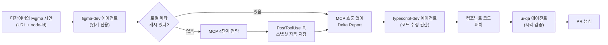
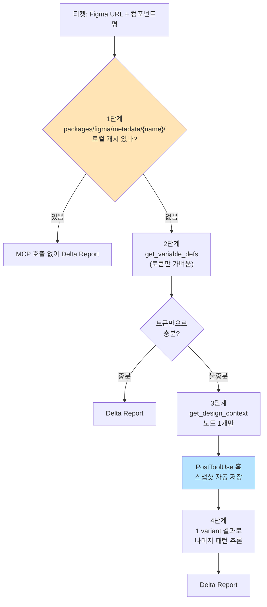

> **시리즈**
> (1) [공통 UI를 독립 npm 패키지로 분리하기](/posts/design-system-part1-package-split/)
> (2) [Figma 디자인 토큰을 단일 진실 소스로 만들기](/posts/design-system-part2-token-design/)
> (3) [JSON → CSS Variables → Tailwind v4 변환 스크립트 해부](/posts/design-system-part3-converter-script/)
> (4) [48개 컴포넌트를 CVA + Semantic 토큰으로 통일하기](/posts/design-system-part4-cva-components/)
> (5a) **Figma 영역을 코드로 옮기는 실전 자동화** ← 현재 글
> (5b) 아직 빈 구멍 — 무엇이 부족하고 어떻게 메울 것인가
> (6) AI 에이전트로 패키지 개발 자동화하기
> (7) 소비자 측 검증 — 자체 ESLint 룰 만들기
> (8) 회고: AI 페어로 디자인 시스템 만든 1년

여기까지의 글은 **토큰과 컴포넌트가 어떻게 *만들어지는지*** 였다면, 이번 편은 **매일매일 시안이 떨어졌을 때 그걸 어떻게 코드로 *옮기는가*** 다. 디자이너가 Figma 링크 한 줄을 던지고 "이거 화요일까지요" 했을 때, 그 한 줄이 PR이 되기까지의 전 과정.

검색하면 "Figma to Code"의 멋진 데모는 많지만, **현업에서 매일 굴리는 실전 자동화**는 의외로 사례가 드물다. 우리가 어떤 도구를 어떻게 묶었는지 정직하게 공개한다. 다음 편(5b)에서 이 시스템의 빈 구멍을 다 깐다.

---

## 1. 큰 그림 — Figma 한 영역 → PR 한 줄



핵심은 **에이전트를 역할별로 쪼갰다**는 점이다. 한 에이전트가 다 하면 권한 폭주에 실수가 난다.

| 에이전트 | 권한 | 책임 |
|---|---|---|
| `figma-dev` | 읽기 전용 (Read, Grep, MCP) | Figma 시안 분석, Delta Report 작성 |
| `typescript-dev` | 전체 (Read/Write/Edit/Bash) | 실제 코드 수정 |
| `ui-qa` | 읽기 전용 (Chrome CDP) | 변경 결과 시각 검증 |

> **Q.** 한 에이전트가 다 하면 안 되나? 분리 비용이 크지 않나?
>
> 분리 비용은 분명히 있다. 에이전트 간 정보 전달이 텍스트 요약이라 일부 컨텍스트가 손실된다.
>
> 그래도 분리한 이유는 세 가지. 권한 격리 — figma-dev가 코드를 직접 수정 못 하도록 강제하면 분석 단계에서 "이 코드 일단 고쳐봤어요"가 안 나온다. Delta Report라는 명확한 산출물만 남는다. 컨텍스트 절약 — figma-dev는 Figma MCP 응답으로 컨텍스트가 빠르게 차는데, 여기서 코드 수정까지 하면 대형 변경에서 token 한도에 걸린다. 재시도 용이 — typescript-dev가 잘못 짰을 때 figma-dev의 Delta Report는 그대로 두고 typescript-dev만 다시 호출하면 된다.
>
> 분산 시스템 설계의 *responsibility separation* 원칙과 똑같다. 백엔드에서 마이크로서비스를 권한별로 쪼개듯, AI 에이전트도 권한과 책임으로 쪼개야 변경에 안전하다.
{: .prompt-info }

---

## 2. figma-dev 에이전트의 **읽기 전용** 정책

`.claude/agents/figma-dev.md`의 핵심 선언:

```yaml
name: figma-dev
description: Figma 디자인 비교 및 토큰 매핑 전문 에이전트
tools: Read, Grep, Glob, Bash, mcp__figma__get_design_context,
       mcp__figma__get_variable_defs, TaskCreate, TaskUpdate, TaskList, SendMessage
model: sonnet
```

`Write`, `Edit` 도구가 **목록에 없다**. 의도적이다. 이 에이전트는 코드를 수정할 수 없다. 시안 분석과 Delta Report 작성만.

```markdown
## 코드 수정 금지

이 에이전트는 **Write/Edit 도구가 없습니다**.
분석 결과만 보고하고, 코드 수정은 typescript-dev 에이전트에 위임합니다.
```

이게 단순한 룰이 아니라 **시스템 레벨 강제**다. 권한 자체가 없으니 룰 위반이 불가능하다.

---

## 3. MCP 4단계 전략 — 토큰을 아끼는 점진적 조회

Figma MCP 응답은 무겁다. 한 컴포넌트 시안이 80KB 넘게 오기도 한다. 토큰을 아끼려면 점진적으로 조회해야 한다.



### 3-1. 로컬 메타데이터 우선

`packages/figma/metadata/{컴포넌트}/` 안에 이미 컴포넌트의 토큰 매핑과 spec이 있으면 MCP를 안 부른다.

예시 (`packages/figma/metadata/button/button-metadata.json`):
```json
{
  "component": "Button",
  "figmaUrl": "https://www.figma.com/design/...",
  "nodeId": "161:20746",
  "variants": {
    "variant": ["solid", "soft", "surface", "outline", "ghost"],
    "size": ["small", "medium", "large", "xlarge"],
    "color": ["accent", "neutral", "error"]
  },
  "sizes": {
    "small": { "height": "24px", "padding": "0 8px" }
  },
  "tokens": {
    "primary": "semantic/primary/normal",
    "background": "atomic/brandABlue/99"
  }
}
```

`packages/figma/metadata/button/button-metadata.json`

이 파일이 있으면 figma-dev는 그냥 이걸 읽고 코드와 비교한다. MCP 호출 0.

### 3-2. Variable Defs (가벼움)

캐시가 없으면 우선 토큰 목록만 가져온다.

```
mcp__figma__get_variable_defs(nodeId: "161:20746")
→ { "semantic/primary/normal": "#3740D6", "atomic/brandABlue/50": "#3740D6", ... }
```

응답 크기가 수십 줄 수준. 토큰명 비교만 필요한 경우 이걸로 끝.

### 3-3. Design Context (무거움, 최후)

토큰만으론 부족할 때만 무거운 호출.

```
mcp__figma__get_design_context(nodeId: "161:20746")
→ { 전체 노드 구조, 스타일, 자식 노드, ... } (80KB+)
```

**중요한 제약**: 노드 1개만 조회. 전체 페이지나 부모 프레임 조회 금지. 5개 variant가 있어도 1개만 부르고, 나머지는 패턴 추론.

### 3-4. 패턴 추론

1개 variant의 결과로 나머지 variant 스타일을 추론한다.

```
"solid + primary 결과를 봤으니,
 soft + primary는 같은 색 계열 + 다른 채도로 추론.
 outline + primary는 border만 색 + 배경 투명으로 추론."
```

추론이 틀리면 그때 추가 호출. 첫 시도부터 모든 variant를 부르는 건 토큰 낭비.

> **Q.** 패턴 추론은 결국 hallucination 위험이 있는 거 아닌가? 어떻게 검증하나?
>
> 맞다. 추론은 100% 정확하지 않다. 그래서 이중 검증을 깔았다.
>
> 첫째는 figma-dev가 Delta Report에 *추론한 부분*을 명시하는 것. "outline variant는 1개 variant 결과로 추론. 확인 필요" 같은 마크. 둘째는 ui-qa 에이전트가 실제 브라우저에서 렌더링한 결과를 디자인 시안과 비교하는 것. 추론한 결과로 만든 컴포넌트를 storybook에 띄워 검증한다.
>
> 검증 실패하면 figma-dev에게 "이 variant는 MCP 추가 호출로 다시 봐줘" 재요청. 토큰을 아끼는 건 첫 시도의 비용을 최적화하는 것일 뿐, 정확성은 뒤따라오는 검증으로 보장한다.
>
> 백엔드의 *eventual consistency*와 비슷한 패턴. 첫 응답은 추측이라도 후속 검증으로 일관성을 맞추는 구조.
{: .prompt-info }

---

## 4. PostToolUse 훅 — 스냅샷 자동 박제

비싼 MCP 호출 결과는 한 번 받으면 박제해야 한다. 같은 nodeId를 또 부르면 비용 낭비.

```yaml
# .claude/settings.json (소비자 측 워크스페이스)
hooks:
  PostToolUse:
    - matcher: mcp__figma__get_design_context
      hooks:
        - type: agent
          model: claude-haiku-4-5-20251001
          prompt: |
            Figma MCP 결과를 docs/figma-snapshots/ 에 저장하세요.
            파일명: {fileKey}_{nodeId}_{YYYYMMDD}.md (nodeId의 ':'는 '-'로 변환)
          timeout: 30
          statusMessage: "Figma 스냅샷 저장 중..."
```

`소비자 워크스페이스의 .claude/settings.json` 발췌

원리:
1. `mcp__figma__get_design_context`가 호출됨
2. 호출 직후 PostToolUse 훅이 트리거
3. **Haiku 모델**의 미니 에이전트가 결과를 받아 마크다운으로 저장
4. 다음번 같은 nodeId 호출 시 figma-dev가 이 파일을 먼저 확인 → 재호출 회피

```
docs/figma-snapshots/
├── hmGeC410jHlaHoiny5Fh9O_2208-48631_20260417.md  (45KB)
├── hmGeC410jHlaHoiny5Fh9O_2208-48861_20260417.md  (78KB)
├── I9dAfBL6k6e9vRk8UqJdgX_14083-135590_20260422.md
└── ...
```

파일명에 날짜가 들어가 있어서 "Figma가 바뀌었나"의 판단 기준도 된다. 한 달 지난 스냅샷은 stale로 보고 재호출.

> **Q.** Haiku 모델로 저장만 한다는 게 의외였다. 일반 코드(스크립트)로 안 한 이유는?
>
> 스크립트로도 가능했다. 에이전트를 택한 이유는 세 가지.
>
> 유연한 후처리. 단순 저장이 아니라 "결과를 읽어 의미 있는 요약을 만들고, 토큰 매핑 부분만 강조해서 저장"이 가능하다. 스크립트로 짜려면 결과 포맷 바뀔 때마다 코드 수정해야 한다. Claude Code 훅의 표준 — 훅을 "command" 또는 "agent" 타입으로 지원하는데, 우리 환경엔 후자가 자연스러웠다. 모델 분리 — Haiku 같은 가벼운 모델로 처리해서 메인 대화의 컨텍스트/토큰과 격리. 메인은 Sonnet, 후처리는 Haiku.
>
> 단점도 있다. Haiku 호출 자체가 약간의 토큰을 소비한다. 스크립트면 0. 다만 figma-dev MCP 호출 1회 비용 대비 무시할 수준.
{: .prompt-info }

---

## 5. Delta Report — 사람이 검토 가능한 출력

figma-dev의 결과물은 자유 텍스트가 아니라 **고정 포맷의 Delta Report**다.

```markdown
## Delta Report: Button

### 1. 비교 대상
- 컴포넌트: Button
- Figma 노드 ID: 161:20746
- 관련 코드 파일: packages/src/components/Button.tsx

### 2. 스타일 차이
| 속성 | Figma 스펙 | 현재 코드 | 파일 위치 |
|------|-----------|----------|----------|
| padding | 0 8px | 0 6px | Button.tsx:34 |
| height | 32px | 28px | Button.tsx:35 |

### 3. 토큰 매핑
| Figma | 코드 | 일치? |
| semantic/primary/normal | bg-semantic-primary-normal | ✅ |
| atomic/brandABlue/99 | bg-atomic-brandABlue-99 | ✅ |
| semantic/label/strong | text-semantic-label-normal | ❌ 잘못 매핑 |

### 4. Props 차이
| Prop | Figma variant | 코드 prop | 매핑 |
| variant | solid/soft/... | variant | ✅ |
| iconLeft | (없음) | iconLeft? | ⚠️ 코드에만 있음 |

### 5. 수정 포인트
- Button.tsx:34 → padding을 0 8px로 수정 (Tailwind: px-2)
- Button.tsx:35 → height를 32px로 수정 (Tailwind: h-8)
- Button.tsx:67 → text 토큰을 semantic-label-strong으로 수정
- iconLeft prop은 Figma에 없는데 코드엔 있음 → 디자이너 확인 필요
```

이 형식의 장점:
- **사람이 한 번에 검토 가능**: 표로 시각화돼 있어 30초 만에 차이점 파악
- **typescript-dev에 위임 명확**: "5번 항목 작업해줘" 한 줄로 다음 에이전트 트리거
- **PR에 그대로 첨부 가능**: 리뷰어가 "어디를 왜 고쳤는지" 즉시 이해
- **메타데이터 캐시 갱신 단서**: Delta Report가 자주 나오면 그 컴포넌트의 메타가 stale이라는 신호

---

## 6. Storybook 안의 또 다른 시도 — FigmaCodeGenerator

figma-dev가 *비교*에 초점이라면, `apps/storybook/src/lib/FigmaCodeGenerator.tsx`는 *처음 생성*에 초점이다. Storybook UI에서 Figma URL을 입력하면 AI가 JSX + HTML 변환 결과를 미리보기로 보여주고, 마음에 들면 `design-agents/generated/`에 박제한다.

다만 솔직히 이 도구는 *반은 됐고 반은 안 됐다*. 잘 동작한 건 단일 컴포넌트의 색·사이즈 조정 같은 작은 변경이고, 안 된 건 신규 화면 전체나 디자이너가 Storybook 셋업이 안 된 환경. 결국 *디자이너는 변경 사실만 알리고 개발자(또는 AI)가 Storybook에서 검증*하는 방향으로 정착됐다. 더 자세한 한계는 [다음 편 §7](/posts/design-system-part5b-gaps-and-roadmap/)에서 다룬다.

---

## 7. 실전 사이클 한 번 — 30분이 5분으로

티켓 하나 들어왔을 때의 실제 사이클:

```
[화요일 오전]
디자이너: "Button에 ghost variant 추가했어요. Figma 링크: ..."

[5분]
개발자: "/figma-dev로 분석" 명령
→ figma-dev가 packages/figma/metadata/button/ 확인 (캐시 stale)
→ get_variable_defs 호출 (1KB 응답)
→ Delta Report 생성:
   * ghost variant 추가, color × ghost 조합 4개 compound 필요
   * 토큰: semantic-fill-ghost (신규)

[1분]
개발자: "typescript-dev에 위임"
→ Button.tsx의 compoundVariants에 4줄 추가
→ Storybook story 자동 업데이트

[2분]
개발자: "ui-qa로 검증"
→ Chrome CDP로 storybook 페이지 열어 4개 variant 스크린샷
→ PASS/FAIL 리포트

[2분]
PR 생성 (release skill 또는 수동)

총 ~10분.
수동으로 했다면: 30~60분 (시안 분석 + 코드 작성 + 시각 확인 + PR)
```

> **Q.** "30분이 10분으로" 같은 효과 측정은 어떻게 했나? 정량 데이터인가 인상인가?
>
> 정직하게 — 현재는 인상 + 부분적 정량.
>
> 측정 중인 건 세 가지. Jira 티켓의 in-progress → done 시간 분포(평균 + p95 변화 추적), MCP 호출 토큰 소비(컴포넌트당 평균, 캐시 도입 전후 비교), PR 사이클 타임(생성 → 머지까지).
>
> 한계도 명확하다. 컴포넌트마다 복잡도가 달라 "평균"이 의미가 약하고, 사람의 학습 효과도 섞여 자동화 없이도 점점 빨라진다. 진짜 측정 지표는 "에이전트가 처음 짠 결과를 사람이 얼마나 수정했나"인데, 이걸 시스템적으로 잡기가 어렵다.
>
> 다음 편(5b)에서 이 측정 부재를 어떻게 보완할지 다룬다. *Before/After 성능 비교* 설계가 그 편의 핵심.
{: .prompt-info }

---

## 8. 다음 편 예고

여기까지가 **잘 굴러가는 부분**이었다. 다음 편(5b)은 **빈 구멍**을 다 깐다. 캐시 커버리지 44%가 비어있는 문제, 폴더 이름의 오타, 다크모드 미지원, FigmaCodeGenerator의 production 사용 불가 같은 이슈들. 그리고 그걸 어떻게 측정하고 메울지의 로드맵.

---

**시리즈 이전 편**: [48개 컴포넌트를 CVA + Semantic 토큰으로 통일하기](/posts/design-system-part4-cva-components/)
**시리즈 다음 편**: 아직 빈 구멍 — 무엇이 부족하고 어떻게 메울 것인가 (작성 예정)
