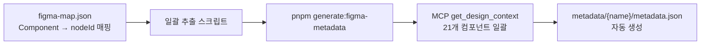
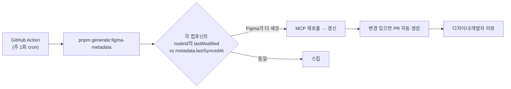
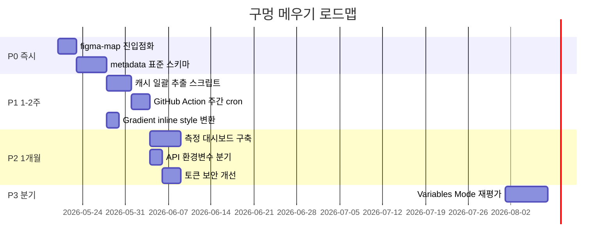

> **시리즈**
> (1) [공통 UI를 독립 npm 패키지로 분리하기](/posts/design-system-part1-package-split/)
> (2) [Figma 디자인 토큰을 단일 진실 소스로 만들기](/posts/design-system-part2-token-design/)
> (3) [JSON → CSS Variables → Tailwind v4 변환 스크립트 해부](/posts/design-system-part3-converter-script/)
> (4) [48개 컴포넌트를 CVA + Semantic 토큰으로 통일하기](/posts/design-system-part4-cva-components/)
> (5a) [Figma 영역을 코드로 옮기는 실전 자동화](/posts/design-system-part5a-figma-porting/)
> (5b) **아직 빈 구멍 — 무엇이 부족하고 어떻게 메울 것인가** ← 현재 글
> (6) AI 에이전트로 패키지 개발 자동화하기
> (7) 소비자 측 검증 — 자체 ESLint 룰 만들기
> (8) 회고: AI 페어로 디자인 시스템 만든 1년

지난 편이 "잘 굴러가는 자동화"를 다뤘다면, 이번 편은 **그 자동화의 구멍**을 정직하게 깐다. 코드를 들여다보면 의도와 현실 사이에 큰 간극이 있다. 포트폴리오 글에서 단점을 까는 게 두려울 수 있지만, **"문제를 발견하고 측정 가능한 개선 계획을 세울 수 있는 능력"** 이야말로 시니어 개발자의 신호다.

이 편은 8개 구멍을 매트릭스로 정리하고, 각각에 어떤 측정 지표로 보완 효과를 검증할지 설계한다.

---

## 1. 정직한 인벤토리 — 8개의 빈 구멍

코드베이스를 실측해서 찾은 문제들이다.

<style>
.gap-grid { display: grid; grid-template-columns: repeat(auto-fit, minmax(260px, 1fr)); gap: 14px; max-width: 920px; margin: 2.5rem auto; font-family: inherit; }
.gap-grid .gap-card { padding: 1rem 1.1rem; border-radius: 10px; border: 1px solid; position: relative; }
.gap-grid .gap-num { position: absolute; top: 0.85rem; right: 0.85rem; font-size: 0.72rem; font-weight: 800; color: #aaa; }
.gap-grid .gap-title { font-weight: 700; font-size: 0.93rem; margin-bottom: 0.4rem; padding-right: 1.5rem; letter-spacing: -0.01em; }
.gap-grid .gap-desc { font-size: 0.8rem; color: #666; line-height: 1.5; margin-bottom: 0.6rem; }
.gap-grid .gap-badges { display: flex; gap: 0.35rem; flex-wrap: wrap; }
.gap-grid .badge { display: inline-block; padding: 0.18rem 0.5rem; border-radius: 4px; font-size: 0.7rem; font-weight: 700; letter-spacing: 0.03em; text-transform: uppercase; }
.gap-grid .badge.impact-h { background: rgba(239, 68, 68, 0.15); color: #b91c1c; }
.gap-grid .badge.impact-m { background: rgba(245, 158, 11, 0.18); color: #b45309; }
.gap-grid .badge.impact-l { background: rgba(34, 197, 94, 0.15); color: #15803d; }
.gap-grid .badge.cost-h { background: rgba(120, 120, 120, 0.15); color: #555; }
.gap-grid .badge.cost-m { background: rgba(120, 120, 120, 0.12); color: #666; }
.gap-grid .badge.cost-l { background: rgba(120, 120, 120, 0.1); color: #777; }

.gap-grid .gap-card.high { background: rgba(239, 68, 68, 0.05); border-color: rgba(239, 68, 68, 0.3); }
.gap-grid .gap-card.medium { background: rgba(245, 158, 11, 0.05); border-color: rgba(245, 158, 11, 0.3); }
.gap-grid .gap-card.low { background: rgba(120, 120, 120, 0.04); border-color: rgba(120, 120, 120, 0.25); }

html[data-mode="dark"] .gap-grid .gap-desc { color: #aaa; }
html[data-mode="dark"] .gap-grid .gap-num { color: #777; }
html[data-mode="dark"] .gap-grid .badge.impact-h { background: rgba(239, 68, 68, 0.22); color: #fecaca; }
html[data-mode="dark"] .gap-grid .badge.impact-m { background: rgba(245, 158, 11, 0.22); color: #fde68a; }
html[data-mode="dark"] .gap-grid .badge.impact-l { background: rgba(34, 197, 94, 0.22); color: #bbf7d0; }
html[data-mode="dark"] .gap-grid .badge.cost-h,
html[data-mode="dark"] .gap-grid .badge.cost-m,
html[data-mode="dark"] .gap-grid .badge.cost-l { background: rgba(120, 120, 120, 0.2); color: #bbb; }
</style>

<div class="gap-grid">
  <div class="gap-card high">
    <div class="gap-num">#1</div>
    <div class="gap-title">캐시 미커버 44%</div>
    <div class="gap-desc">48개 컴포넌트 중 27개만 로컬 메타 존재. 21개(44%)는 매번 MCP 호출.</div>
    <div class="gap-badges"><span class="badge impact-h">임팩트 HIGH</span><span class="badge cost-m">비용 MID</span></div>
  </div>

  <div class="gap-card high">
    <div class="gap-num">#2</div>
    <div class="gap-title">명명 불일치와 오타</div>
    <div class="gap-desc">textfiled, seperator 같은 오타 폴더. Pascal↔kebab 변환 깨짐.</div>
    <div class="gap-badges"><span class="badge impact-m">임팩트 MID</span><span class="badge cost-l">비용 LOW</span></div>
  </div>

  <div class="gap-card medium">
    <div class="gap-num">#3</div>
    <div class="gap-title">파일 표준 부재</div>
    <div class="gap-desc">폴더마다 파일 구성이 제각각. button-metadata.json vs card.json vs avatar.json...</div>
    <div class="gap-badges"><span class="badge impact-m">임팩트 MID</span><span class="badge cost-m">비용 MID</span></div>
  </div>

  <div class="gap-card high">
    <div class="gap-num">#4</div>
    <div class="gap-title">자동 갱신 메커니즘 부재</div>
    <div class="gap-desc">모든 메타 mtime이 2026-05-08 동일. Figma가 바뀌어도 stale 데이터로 코드 생성.</div>
    <div class="gap-badges"><span class="badge impact-h">임팩트 HIGH</span><span class="badge cost-m">비용 MID</span></div>
  </div>

  <div class="gap-card medium">
    <div class="gap-num">#5</div>
    <div class="gap-title">Variables Mode 미지원</div>
    <div class="gap-desc">Figma MCP가 다크모드 Mode 못 가져옴. REST API는 Enterprise 전용이라 막힘.</div>
    <div class="gap-badges"><span class="badge impact-m">임팩트 MID</span><span class="badge cost-h">비용 HIGH</span></div>
  </div>

  <div class="gap-card low">
    <div class="gap-num">#6</div>
    <div class="gap-title">Gradient 처리 한계</div>
    <div class="gap-desc">FigmaCodeGenerator가 arbitrary value 출력 → ESLint 룰에 즉시 걸림.</div>
    <div class="gap-badges"><span class="badge impact-l">임팩트 LOW</span><span class="badge cost-m">비용 MID</span></div>
  </div>

  <div class="gap-card medium">
    <div class="gap-num">#7</div>
    <div class="gap-title">API Route 하드코딩</div>
    <div class="gap-desc">localhost:3020 박혀있어 production 배포 불가.</div>
    <div class="gap-badges"><span class="badge impact-m">임팩트 MID</span><span class="badge cost-l">비용 LOW</span></div>
  </div>

  <div class="gap-card low">
    <div class="gap-num">#8</div>
    <div class="gap-title">Figma 토큰 평문 저장</div>
    <div class="gap-desc">localStorage에 평문. 브라우저 개발자 도구로 노출.</div>
    <div class="gap-badges"><span class="badge impact-l">임팩트 LOW</span><span class="badge cost-l">비용 LOW</span></div>
  </div>
</div>

---

## 2. 구멍 ① — 캐시 커버리지 44% (가장 큰 임팩트)

### 현실

```
실제 컴포넌트:           48개 (packages/src/components/*.tsx)
메타데이터 폴더:         27개 (packages/figma/metadata/)
캐시 없는 컴포넌트:      21개 (44% 미커버)
```

캐시 없는 컴포넌트 예시:
```
AlertDialog, ConfirmDialog, Drawer, Modal, MobileBottomModal,
Pagination, Progress, Spinner, Toast, ImagePreview, MobileImagePreview,
MonthPicker, DialogProvider, BlankIcon, Container,
DropdownMenu, ScrollBar, SegmentedControl
```

### 임팩트

figma-dev 에이전트가 이 21개 컴포넌트를 분석할 때마다 **무조건 MCP 호출**. 캐시 우선 전략이 무력화됨. 한 컴포넌트당 평균 8K~80K 토큰 소비.

### 보완 방안



스크립트 골격:
```js
// scripts/generate-figma-metadata.js
const map = require('../packages/figma-map.json');

for (const [name, info] of Object.entries(map.components)) {
  if (!info.figmaNodeId) continue;  // 미매핑 스킵
  if (fs.existsSync(`metadata/${kebab(name)}/metadata.json`)) continue;

  const node = await figmaMcp.getDesignContext(info.figmaNodeId);
  const metadata = extractMetadata(node, info);
  fs.writeFileSync(`metadata/${kebab(name)}/metadata.json`, JSON.stringify(metadata, null, 2));
}
```

### 측정 지표

| 지표 | 측정 방법 | 보완 전 | 보완 후 목표 |
|---|---|---|---|
| 캐시 커버리지 | `(metadata 폴더 수 / 컴포넌트 수) × 100` | 56% | 100% |
| figma-dev 평균 MCP 토큰 | Claude usage log 집계 | ~25K/회 | ~5K/회 (-80%) |
| Delta Report 생성 시간 | figma-dev 시작 → Report 완료 | ~3분 | ~30초 |

> **Q.** 일괄 추출 스크립트도 결국 MCP를 21번 호출한다. 한 번에 비용을 다 치르는 거 아닌가?
>
> 맞다. 일회성 큰 호출 vs 지속적 소액 호출의 트레이드오프.
>
> 일괄 추출이 더 나은 이유 — 한 번 박제하면 이후 figma-dev가 21개 컴포넌트를 만져도 MCP 호출 0이 된다. 백그라운드 큰 작업이라 개발자가 기다리지 않고, metadata 파일이 git에 들어가면 "Figma 토큰이 언제 어떻게 변했나"가 commit history로 남는다.
>
> 캐시 워밍의 고전적 트레이드오프 그대로다. *읽기 빈도가 쓰기 빈도보다 훨씬 크다면* 캐시 워밍이 이득. 우리 케이스도 컴포넌트 메타데이터는 자주 읽고 가끔 변경되니 정석에 가깝다.
{: .prompt-info }

---

## 3. 구멍 ② — 명명 불일치 + 오타 (가장 황당한)

| 컴포넌트 파일 | 메타데이터 폴더 | 일치? |
|---|---|---|
| `TextField.tsx` | `textfiled/` | ❌ **오타!** |
| `Separator.tsx` | `seperator/` | ❌ **오타!** |
| `IconButton.tsx` | `icon-button/` | ⚠️ Pascal↔kebab |
| `Avatar.tsx` | `avatar/` | ⚠️ Pascal↔lower |

`textfiled`, `seperator` — 사람이 손으로 만든 폴더라 오타가 그대로. figma-dev가 `TextField`로 검색해도 매칭 실패.

### 보완

`figma-map.json`을 진입점화한다. 폴더 이름이 아니라 매핑 파일이 진실:

```json
{
  "components": {
    "TextField": {
      "metadataPath": "packages/figma/metadata/textfiled",  // 오타 그대로 보존
      "figmaNodeId": "..."
    },
    "Separator": {
      "metadataPath": "packages/figma/metadata/seperator",
      "figmaNodeId": "..."
    }
  }
}
```

figma-dev는 이 파일을 먼저 보고 정확한 경로로 접근. **사람의 실수를 코드 레벨에서 흡수**한다.

### 측정 지표

- **룩업 성공률**: figma-dev가 컴포넌트 메타 첫 시도에 찾는 비율. 현재 ~70% → 목표 100%
- **오타 폴더 수**: git history에서 mtime 기준 정리되는지 추적

> **Q.** 폴더 이름 오타를 그대로 두는 게 옳은가? 어차피 정리할 거면 한 번에 하는 게 낫지 않나?
>
> 두 길이 있다.
>
> *정리 길*은 이참에 폴더 이름을 다 정리하는 것. 깔끔하지만 git history가 깨지고 blame 추적이 어려워진다. 그 경로를 참조하는 테스트나 문서가 있으면 같이 수정해야 한다.
>
> *매핑 흡수 길*은 오타를 그대로 두고 figma-map.json이 정정해주는 것. 점진적 마이그레이션이라 히스토리는 보존되지만 영원히 어색한 폴더 이름이 남는다.
>
> B안을 택했고, 그 다음 자연스럽게 A안으로 가는 흐름이다. 먼저 figma-map.json을 진입점으로 만들어 시스템 동작을 정상화하고, 다음 분기에 새 메타 추출 스크립트가 *옳은* 폴더(`text-field/`, `separator/`)에 박제하고, 자연스럽게 오타 폴더가 안 쓰이게 되면 삭제 PR로 정리한다.
>
> 백엔드의 *strangler pattern*과 같은 발상. 한 번에 다 바꾸는 위험을 피하고 점진적으로 새 것이 옛 것을 대체하게 한다.
{: .prompt-info }

---

## 4. 구멍 ③ — 파일 형식 표준 부재

폴더마다 파일 구성이 제멋대로다.

```
button/   ├─ button-metadata.json
          ├─ button-metadata.md
          └─ specific-button-metat.json    ← "metat" 오타

card/     ├─ card.json (78KB)
          └─ card-delta.json (178KB)

badge/    ├─ badge.json
          ├─ badge-modified.json
          ├─ badge-delta.json
          └─ badge-delta-modified.json     ← 4개 버전 공존

avatar/   └─ avatar.json (단일)

select/   ├─ README.md
          ├─ analyze_select.py             ← 일회성 파이썬 스크립트
          ├─ comparison_report.md
          ├─ implementation_guide.md
          └─ select-color.json (0 bytes)   ← 빈 파일
```

figma-dev가 어느 파일을 진입점으로 읽어야 하는지 결정 못 함.

### 보완

폴더당 표준 인터페이스 정의:

```
metadata/{component-name}/
├── metadata.json          ← 진입점 (필수). 표준 스키마
├── snapshot.md            ← 마지막 MCP 응답 (선택)
└── analysis.md            ← 사람의 분석 노트 (선택)
```

`metadata.json` 표준 스키마:
```json
{
  "$schema": "../../../../schemas/component-metadata.json",
  "version": "1.0",
  "component": "Button",
  "figmaNodeId": "161:20746",
  "lastSyncedAt": "2026-05-19T10:00:00Z",
  "variants": { "variant": [...], "size": [...] },
  "tokens": { ... },
  "props": { ... }
}
```

`$schema`로 JSON 스키마 검증. 신규 메타데이터가 이 표준을 벗어나면 빌드 에러.

### 측정 지표

- **표준 준수율**: `metadata.json`이 진입점인 폴더 수 / 전체 폴더 수
- **figma-dev 첫 시도 진입 성공률**: 1차 파일 오픈에서 메타 인식 성공한 비율

---

## 5. 구멍 ④ — 자동 갱신 메커니즘 부재 (큰 임팩트)

모든 메타데이터 파일의 mtime이 동일하다. 2026-05-08 16:51에 일괄 박제됐고 이후 변경 없음.

Figma 디자인이 바뀌어도 메타데이터는 그대로. 에이전트가 캐시를 신뢰 → **stale 데이터로 잘못된 코드 생성**.

### 보완



핵심: **수동 동기화에 의존하지 않음.** 주 1회 자동으로 Figma 변경을 감지하고 PR로 올림. 사람은 리뷰만.

### 측정 지표

| 지표 | 측정 방법 | 보완 전 | 목표 |
|---|---|---|---|
| 메타데이터 stale 일수 | Figma 변경 → 메타 갱신까지 평균 일수 | ∞ (수동 안 하면 영원) | ≤7일 |
| stale 메타 비율 | Figma의 lastModified > 메타의 lastSyncedAt 비율 | 추정 70%+ | ≤10% |

> **Q.** 주 1회 cron이 너무 잦거나 너무 드문 거 아닌가? 어떻게 결정했나?
>
> 빈도 결정의 트레이드오프가 명확하다. 매일 같이 자주 돌리면 Figma 변경에 빠르게 반응하는 대신 디자이너가 작업 중인 임시 상태도 감지돼 PR 잡음이 늘어난다. 월 1회처럼 드물게 돌리면 안정적이지만 stale 위험이 커진다.
>
> *주 1회*가 우리한테 균형점이었다. 디자이너의 작업 주기가 보통 sprint(2주) 안에 마무리되니 주 1회면 한 sprint 안에 두 번 동기화 기회. PR 생성 빈도도 리뷰 부담이 적당한 수준.
>
> 운영해보고 조정할 변수. "주 1회로 시작 → PR 잡음 보고 조정"의 *initial values + production tuning* 패턴이다.
{: .prompt-info }

---

## 6. 구멍 ⑤ — Variables Mode(다크모드) 미지원

Figma MCP가 Variables의 Mode 기능을 못 가져온다. `docs/figma-snapshots/`에 다음 파일이 있다:

```
hmGeC410jHlaHoiny5Fh9O_2208-48630_variables_20260417.md  (2 bytes 빈 파일)
```

빈 파일. Variables Mode 응답이 누락된 흔적.

### 보완

선택지가 제한적이다.

| 옵션 | 가능성 | 비용 |
|---|---|---|
| Enterprise 플랜 + REST API | 가능 | 월간 큰 비용 |
| Figma Plugin 자체 제작 | 가능 | 개발 ~2주 |
| 다크모드 미지원 유지 | 현실적 | 사용자 가치 ↓ |

우리 결정: **다크모드 우선순위 검토 보류**. 사용자 데이터를 보니 다크모드 요구가 크지 않아서 ROI가 낮음. 6개월 후 재평가.

이걸 정직하게 인정하는 게 포트폴리오로서 가치 있다. 모든 기능을 다 지원하는 게 옳은 게 아니라, **우선순위를 정해서 의도적으로 안 하는 결정**도 능력.

---

## 7. 구멍 ⑥⑦⑧ — 작은 빚들

### 구멍 ⑥: Gradient → arbitrary value

FigmaCodeGenerator가 gradient를 만나면 `bg-gradient-to-r from-[#3740d6]` 같은 arbitrary value를 출력. 우리 ESLint 룰 `no-tailwind-arbitrary-values`에 즉시 걸린다.

**보완**: gradient는 className 대신 inline style로 변환:

```tsx
style={{ background: 'linear-gradient(to right, var(--color-atomic-blue-50), var(--color-atomic-purple-60))' }}
```


CSS Variables 참조로 토큰 호환 유지.

### 구멍 ⑦: API Route 하드코딩

`FigmaCodeGenerator.tsx`가 `http://localhost:3020/api/...`을 하드코딩. 프로덕션에선 작동 안 함.

**보완**: 환경변수 기반 분기:
```ts
const API_BASE = process.env.NEXT_PUBLIC_FIGMA_API_BASE ?? 'http://localhost:3020';
```

### 구멍 ⑧: Figma 토큰 평문 저장

localStorage에 평문으로 저장. 브라우저 개발자 도구에서 노출.

**보완**: 단기엔 sessionStorage + 만료, 중기엔 OAuth 또는 환경변수로 이관.

---

## 8. 통합 로드맵 — 우선순위 + 측정



### 측정 대시보드 — 한 페이지에 모으기

운영 시작 후 데이터를 모아야 의미 있다. 자동 수집 가능한 지표:

| 지표 | 데이터 출처 | 자동 수집? |
|---|---|---|
| 캐시 커버리지 | metadata 폴더 카운트 | ✅ `pnpm run audit:metadata` |
| MCP 토큰 소비 | Claude usage API | ⚠️ 수동 집계 |
| ESLint 위반 추이 | pre-commit log | ✅ pre-commit hook |
| 메타데이터 stale 일수 | Figma API + git log | ✅ 주간 cron |
| 컴포넌트 1개 생성 시간 | Jira ticket transition | ⚠️ Jira API 통합 필요 |
| ui-qa PASS/FAIL 비율 | ui-qa report 집계 | ✅ |

> **Q.** 측정 지표를 이렇게 많이 잡으면 결국 다 못 모으지 않나? 한두 개에 집중하는 게 낫지 않나?
>
> 그렇다. 처음부터 6개를 다 추적하려 들면 어느 하나도 제대로 안 된다. 내가 그러다가 한 번 실패했다.
>
> 권장하는 운영 흐름은 단계적이다. 첫 분기는 1~2개에 집중 — "캐시 커버리지"와 "ui-qa PASS 비율" 정도. 둘 다 자동 수집 가능 + 직관적이다. 나머지는 manual 샘플링으로 가는 게 낫다. 격주에 한 번 5개 PR을 골라 손으로 시간 측정. 자동화는 점진적으로 — 가장 자주 보는 1개를 자동 대시보드화한 다음 그 다음 2개를 추가하는 식.
>
> 측정의 함정은 *측정하기 시작하면 측정 자체가 일이 된다*는 점. 자동 수집 가능한 지표부터 시작해야 지속 가능하다.
{: .prompt-info }

---

## 9. 다음 편 예고

5a, 5b 두 편이 **Figma → 코드** 흐름을 다뤘다면, 다음 편(6)은 그 흐름을 지탱하는 **AI 자동화 인프라 전체**를 본다. `.claude/skills`, `.claude/agents`, hooks의 구조. 무엇을 어디에 둘지, 어떻게 묶을지의 설계 결정.

---

**시리즈 이전 편**: [Figma 영역을 코드로 옮기는 실전 자동화](/posts/design-system-part5a-figma-porting/)
**시리즈 다음 편**: AI 에이전트로 패키지 개발 자동화하기 (작성 예정)
