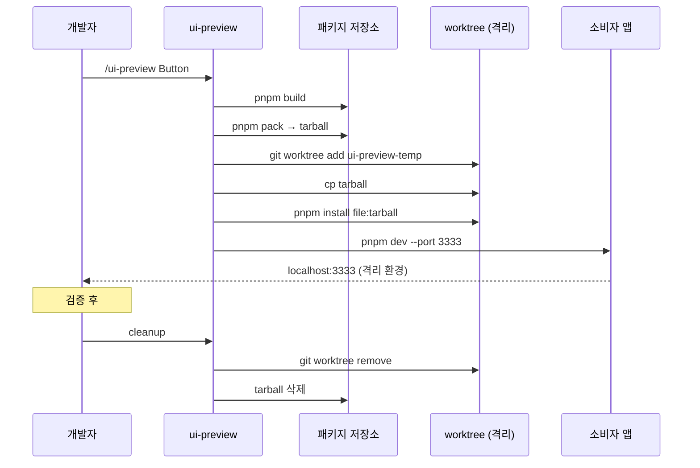
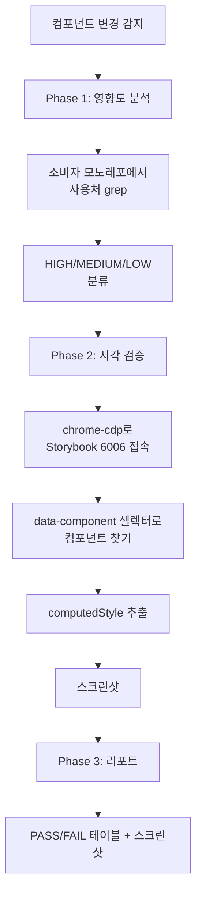

> **시리즈**
> (1) [공통 UI를 독립 npm 패키지로 분리하기](/posts/design-system-part1-package-split/)
> (2) [Figma 디자인 토큰을 단일 진실 소스로 만들기](/posts/design-system-part2-token-design/)
> (3) [JSON → CSS Variables → Tailwind v4 변환 스크립트 해부](/posts/design-system-part3-converter-script/)
> (4) [48개 컴포넌트를 CVA + Semantic 토큰으로 통일하기](/posts/design-system-part4-cva-components/)
> (5a) [Figma 영역을 코드로 옮기는 실전 자동화](/posts/design-system-part5a-figma-porting/)
> (5b) [아직 빈 구멍 — 무엇이 부족하고 어떻게 메울 것인가](/posts/design-system-part5b-gaps-and-roadmap/)
> (6) **AI 에이전트로 패키지 개발 자동화하기** ← 현재 글
> (7) 소비자 측 검증 — 자체 ESLint 룰 만들기
> (8) 회고: AI 페어로 디자인 시스템 만든 1년

`.claude/` 디렉토리. 이 안에 우리 패키지를 자동화하는 모든 AI 도구가 들어있다. 6편은 그 안의 구조 — skills, agents, hooks — 가 어떻게 묶여있는지를 본다. 단순히 "AI 썼어요"가 아니라, **어떤 작업을 어느 단위로 자동화했고, 왜 그 단위인지** 를 설계 관점에서 정리한다.

---

## 1. 전체 그림 — 패키지 vs 소비자 두 갈래

<style>
.ai-infra { display: grid; grid-template-columns: 1fr 1fr; gap: 20px; max-width: 920px; margin: 2.5rem auto; font-family: inherit; }
.ai-infra .col { padding: 1.2rem 1.3rem; border-radius: 12px; border: 1px solid; }
.ai-infra .col-label { font-size: 0.7rem; font-weight: 800; letter-spacing: 0.12em; text-transform: uppercase; margin-bottom: 0.3rem; }
.ai-infra .col-title { font-weight: 700; font-size: 1rem; margin-bottom: 1rem; letter-spacing: -0.02em; }
.ai-infra .group { margin-bottom: 0.9rem; }
.ai-infra .group:last-child { margin-bottom: 0; }
.ai-infra .group-label { font-size: 0.72rem; font-weight: 700; color: #888; letter-spacing: 0.05em; text-transform: uppercase; margin-bottom: 0.4rem; }
.ai-infra .item { display: flex; align-items: flex-start; gap: 0.5rem; padding: 0.5rem 0.7rem; border-radius: 6px; margin-bottom: 0.3rem; font-size: 0.83rem; }
.ai-infra .item-icon { flex-shrink: 0; font-weight: 700; font-size: 0.75rem; padding: 0.1rem 0.4rem; border-radius: 3px; letter-spacing: 0.04em; }
.ai-infra .item-name { font-family: 'SF Mono', Menlo, monospace; font-weight: 600; }
.ai-infra .item-desc { color: #777; font-size: 0.76rem; margin-top: 0.15rem; }
.ai-infra .item-body { flex: 1; min-width: 0; }
.ai-infra .bridge { text-align: center; margin: 0.3rem 0; font-size: 0.75rem; color: #999; font-style: italic; }

/* 패키지 측 — 주황 */
.ai-infra .pkg-side { background: rgba(245, 158, 11, 0.05); border-color: rgba(245, 158, 11, 0.3); }
.ai-infra .pkg-side .col-label { color: #d97706; }
.ai-infra .pkg-side .item { background: rgba(245, 158, 11, 0.06); }
.ai-infra .pkg-side .item-icon { background: rgba(245, 158, 11, 0.2); color: #92400e; }
.ai-infra .pkg-side .item-name { color: #78350f; }

/* 소비자 측 — 파랑 */
.ai-infra .cons-side { background: rgba(59, 130, 246, 0.05); border-color: rgba(59, 130, 246, 0.3); }
.ai-infra .cons-side .col-label { color: #2563eb; }
.ai-infra .cons-side .item { background: rgba(59, 130, 246, 0.06); }
.ai-infra .cons-side .item-icon { background: rgba(59, 130, 246, 0.2); color: #1e40af; }
.ai-infra .cons-side .item-name { color: #1e3a8a; }

html[data-mode="dark"] .ai-infra .item-desc { color: #999; }
html[data-mode="dark"] .ai-infra .group-label { color: #999; }
html[data-mode="dark"] .ai-infra .pkg-side .item { background: rgba(245, 158, 11, 0.1); }
html[data-mode="dark"] .ai-infra .pkg-side .item-icon { background: rgba(245, 158, 11, 0.25); color: #fcd34d; }
html[data-mode="dark"] .ai-infra .pkg-side .item-name { color: #fde68a; }
html[data-mode="dark"] .ai-infra .cons-side .item { background: rgba(59, 130, 246, 0.1); }
html[data-mode="dark"] .ai-infra .cons-side .item-icon { background: rgba(59, 130, 246, 0.25); color: #93c5fd; }
html[data-mode="dark"] .ai-infra .cons-side .item-name { color: #bfdbfe; }

@media (max-width: 720px) {
  .ai-infra { grid-template-columns: 1fr; }
}
</style>

<div class="ai-infra">
  <div class="col pkg-side">
    <div class="col-label">패키지 측</div>
    <div class="col-title">디자인 시스템 .claude/</div>

    <div class="group">
      <div class="group-label">Skills · 사용자 명시 호출</div>
      <div class="item">
        <span class="item-icon">SK</span>
        <div class="item-body"><div class="item-name">ui-preview</div><div class="item-desc">격리 worktree에서 안전한 미리보기</div></div>
      </div>
      <div class="item">
        <span class="item-icon">SK</span>
        <div class="item-body"><div class="item-name">release</div><div class="item-desc">버전 bump → PR → publish 자동화</div></div>
      </div>
      <div class="item">
        <span class="item-icon">SK</span>
        <div class="item-body"><div class="item-name">chrome-cdp</div><div class="item-desc">브라우저 자동화 베이스</div></div>
      </div>
    </div>

    <div class="group">
      <div class="group-label">Agents · 위임 가능</div>
      <div class="item">
        <span class="item-icon">AG</span>
        <div class="item-body"><div class="item-name">ui-qa</div><div class="item-desc">CDP 시각 회귀 검증</div></div>
      </div>
    </div>

    <div class="group">
      <div class="group-label">Hooks · 이벤트 기반</div>
      <div class="item">
        <span class="item-icon">HK</span>
        <div class="item-body"><div class="item-name">format-on-edit</div><div class="item-desc">Edit/Write 직후 Prettier 적용</div></div>
      </div>
    </div>
  </div>

  <div class="col cons-side">
    <div class="col-label">소비자 측</div>
    <div class="col-title">앱 모노레포 .claude/</div>

    <div class="group">
      <div class="group-label">Agents · 책임 분할</div>
      <div class="item">
        <span class="item-icon">AG</span>
        <div class="item-body"><div class="item-name">figma-dev</div><div class="item-desc">읽기 전용 · Delta Report 작성</div></div>
      </div>
      <div class="item">
        <span class="item-icon">AG</span>
        <div class="item-body"><div class="item-name">typescript-dev</div><div class="item-desc">코드 수정 권한 · figma-dev 결과 적용</div></div>
      </div>
      <div class="item">
        <span class="item-icon">AG</span>
        <div class="item-body"><div class="item-name">local-server</div><div class="item-desc">서버 실행 및 로그 모니터링</div></div>
      </div>
      <div class="item">
        <span class="item-icon">AG</span>
        <div class="item-body"><div class="item-name">browser-qa</div><div class="item-desc">Playwright E2E 테스트</div></div>
      </div>
      <div class="item">
        <span class="item-icon">AG</span>
        <div class="item-body"><div class="item-name">commons-sync</div><div class="item-desc">OpenAPI 타입 정합성 검증</div></div>
      </div>
    </div>

    <div class="group">
      <div class="group-label">Hooks · 이벤트 기반</div>
      <div class="item">
        <span class="item-icon">HK</span>
        <div class="item-body"><div class="item-name">PostToolUse(figma MCP)</div><div class="item-desc">Figma 응답 자동 스냅샷 저장</div></div>
      </div>
    </div>
  </div>
</div>

<div style="text-align: center; font-size: 0.8rem; color: #888; margin: -1rem 0 2rem; font-style: italic;">
  ↕ ui-preview는 tarball로 두 환경을 연결 · ui-qa는 소비자 측 storybook을 검증
</div>

**역할 분담:**
- **패키지 측**: 컴포넌트 개발·검증·배포 자동화 (생산자)
- **소비자 측**: Figma 시안 분석·코드 적용·통합 검증 (소비자)

같은 `.claude/` 구조지만 두 곳이 다른 책임을 가진다.

---

## 2. Skill vs Agent vs Hook — 무엇을 어디에

Claude Code의 자동화 단위는 세 가지다. 헷갈리기 쉬워서 한 줄로 정리한다.

| 단위 | 정의 | 트리거 | 예시 |
|---|---|---|---|
| **Skill** | 사용자가 명시적으로 호출하는 명령 | `/ui-preview`, `/release` | "이거 미리보기 해줘" |
| **Agent** | 메인 대화에서 위임하는 서브 작업자 | Task 도구 | "figma-dev로 분석해줘" |
| **Hook** | 특정 이벤트에 자동 실행 | PostToolUse, SessionStart | "MCP 호출 직후 자동 저장" |

> **Q.** Skill과 Agent가 비슷해 보인다. 같은 일을 둘 다로 만들 수 있는데 언제 뭘 쓰나?
>
> 핵심 차이는 *컨텍스트 위치*다.
>
> Skill은 메인 대화 안에서 실행돼서 같은 컨텍스트를 공유한다. 절차적인 작업 — 단계가 정해진 일 — 에 적합. release가 정해진 7단계라 skill로 만들었다.
>
> Agent는 별도 컨텍스트를 가진 서브 작업자라 메인과 격리된다. 탐색적·분석적 작업 — 어디까지 갈지 미정인 일 — 에 적합. figma-dev는 Figma를 얼마나 깊이 봐야 할지 미정이라 별도 컨텍스트로 토큰을 절약한다.
>
> 내 결정 트리는 단순하다. 단계가 명확히 정해져 있나? → Skill. 권한을 명시적으로 격리해야 하나? → Agent. 결과가 메인 대화로 돌아가야 하나? → Agent(분리된 컨텍스트의 요약만 돌아옴).
{: .prompt-info }

---

## 3. Skill ① — `ui-preview`: 격리 worktree로 안전한 미리보기

### 문제

패키지 변경을 소비자 앱에서 미리 보고 싶다. 그런데:
- 메인 워크스페이스에 그냥 install하면 다른 작업 환경 오염
- 시안과 다른 결과가 나오면 install을 되돌려야 함
- 다른 PR 작업과 충돌 가능

### 해결

ui-preview skill은 git worktree로 격리된 환경을 만든다.



핵심:
1. **tarball install**: 진짜 publish 안 하고도 npm package 동작 시뮬
2. **worktree 격리**: 메인 브랜치 안 건드림. `git worktree remove`로 즉시 정리
3. **포트 3333 분리**: 메인 dev 서버(3000)와 안 부딪힘

### 검증 후 정리

CLAUDE.md에 강제 체크리스트:

```markdown
## 커밋 전 체크리스트

1. *.tgz tarball 파일이 남아있지 않은가
2. ui-preview-temp worktree가 제거되었는가
3. apps/web/package.json이 로컬 tarball 경로로 변경된 채 남아있지 않은가
4. localhost:3333 프로세스가 종료되었는가
```

이걸 안 지키면 다음 커밋에 잔해가 섞여 들어간다. 그래서 AI 규약에 박았다.

> **Q.** format-on-edit hook이 모든 Edit/Write에 trigger되면 작업 흐름이 끊기지 않나? 큰 파일이면 더더욱.
>
> 처음엔 우려했다. 큰 파일을 한 번 수정할 때마다 Prettier가 돌면 응답이 답답할 거라고. 직접 굴려보니 그렇진 않았다.
>
> 이유는 세 가지. 첫째, Prettier 자체가 빠르다 — 1000줄 파일도 100ms 이하. 둘째, hook이 비동기 background로 돌게 설정했다. AI의 다음 응답을 기다리는 동안 포맷이 끝난다. 셋째, timeout을 10초로 박아둬서 *최악의 경우라도 작업이 멈추진 않는다*.
>
> 한 번 문제 됐던 케이스 — 임시 잘못된 코드를 Edit으로 넣었더니 Prettier가 parse error로 실패. hook이 timeout까지 기다렸다. 이건 *실패 무시* 정책으로 해결 — Prettier 실패해도 다음 작업 진행, 코드가 잘못된 채로 들어갈 수 있긴 하지만 어차피 다음 사이클에서 다시 포맷 시도하니까 누적되진 않는다.
{: .prompt-info }

---

## 4. Skill ② — `release`와 `chrome-cdp`

`release` skill은 [Part 1 §8](/posts/design-system-part1-package-split/#8-ai로-자동화한-릴리스--한-명령으로-끝-)에서 자세히 다뤘다. 핵심은 *"실수 가능 지점 제거"* — 버전 오타·태그 누락·문서 stale을 모두 자동 검증.

`chrome-cdp` skill은 Node 22+로 Chrome DevTools Protocol에 연결해 `list`(탭 목록), `nav`(이동), `shot`(스크린샷), `html`(DOM 쿼리), `eval`(JS 실행) 같은 명령을 제공한다. 단독으로 쓰진 않고 **다음 섹션의 ui-qa 에이전트가 호출해서 시각 검증을 수행**하는 베이스 도구.

---

## 5. Agent — `ui-qa`: CDP 기반 시각 회귀

### 동작 단계



### Phase 1: 영향도 분석

컴포넌트가 어디서 쓰이는지 grep으로 찾아 사용처별로 영향도 평가:

```markdown
## 영향도 분석: Button color 변경

| 사용처 | 사용 횟수 | 영향도 | 비고 |
|--------|----------|--------|------|
| apps/web/src/app/login/* | 8 | HIGH | 메인 CTA 변경 |
| apps/web/src/components/TicketCard | 24 | MEDIUM | 보조 액션 |
| apps/admin/src/pages/* | 15 | LOW | 관리 화면 |
```

> **Q.** 영향도 grep이 단순 텍스트 매칭이라 false positive 많지 않나? 주석에 컴포넌트명이 있어도 잡힐 텐데.
>
> 잡힌다. false positive 비율이 처음엔 30% 가까이 나왔다.
>
> 개선한 게 두 가지. 첫째, *import 문에서만 매칭*하도록 패턴을 좁혔다. `import { Button } from '@org/ui-package'` 패턴은 단순 텍스트가 아니라 import 위치 + 패키지 경로까지 검증. 주석은 자연스럽게 빠진다. 둘째, *AST 기반 검증으로 옮기는 중*. ts-morph로 실제 JSX 사용처를 찾으면 100% 정확해지지만 비용이 크다. 지금은 1단계만 적용.
>
> false positive가 0%가 아니어도 괜찮다고 봤다. 영향도 분석은 사람이 한 번 더 검토하는 단계 — *목록을 좁혀주는 도구*이지 *결정을 대신하는 도구*가 아니다.
{: .prompt-info }

### Phase 2: 시각 검증

chrome-cdp로 Storybook 페이지에 접속해서 각 variant의 실제 렌더 결과를 검증.

```js
// ui-qa가 내부적으로 실행하는 의사 코드
const variants = ['solid', 'soft', 'outline'];
const colors = ['primary', 'accent', 'error'];

for (const v of variants) {
  for (const c of colors) {
    await page.goto(`localhost:6006/?path=/story/button--${v}-${c}`);
    const el = await page.$(`[data-component="Button"]`);
    const computed = await el.computedStyle();

    assert.match(computed.backgroundColor, expectedColors[`${v}-${c}`]);
    await el.screenshot({ path: `reports/${v}-${c}.png` });
  }
}
```

### Phase 3: 리포트

```markdown
## ui-qa Report: Button color 변경

✅ PASS (12/15)
- solid + primary: bg-semantic-primary-normal → rgb(55, 64, 214) ✅
- solid + accent: bg-semantic-accent-normal → rgb(0, 174, 255) ✅
- ...

❌ FAIL (3/15)
- outline + error:
  - 기대: border-semantic-status-negative
  - 실제: border-atomic-red-70 (이전 토큰명 남아있음)
  - 파일: Button.tsx:78
```

> **Q.** Chromatic, Percy 같은 시각 회귀 SaaS 두고 왜 자체 ui-qa를?
>
> 검토했고 일부 적용해봤다. 결국 안 쓴 이유가 있다.
>
> Chromatic은 픽셀 diff 자동화가 강력했다. 다만 우리 Storybook이 v10 + Next.js라 호환성 이슈를 발견했고, 무료 플랜 한도도 우리 컴포넌트 수와 안 맞았다. Percy는 BrowserStack 통합이 좋지만 토큰 매핑 같은 *구조적* 검증은 못 한다 — 픽셀만 본다.
>
> 자체 ui-qa는 픽셀 diff + computedStyle 검증 + 영향도 분석을 한 번에 한다. "Button의 backgroundColor가 토큰 X와 일치하는가"를 검증할 수 있다. 유지보수 부담이 단점.
>
> 결정타는 *토큰 매핑 검증*이 핵심이라는 점. 픽셀 diff는 외부 도구가 잘하지만 "이 색이 토큰 X에서 왔는가"를 검증하려면 디자인 시스템 도메인 지식이 필요하다. SaaS로는 어려웠다.
>
> 백엔드도 비슷하다. 외부 모니터링 도구(Datadog 등)가 잘 풀어주는 영역이 있고, 도메인 특수 메트릭은 자체 구축해야 하는 영역이 있다.
{: .prompt-info }

---

## 6. Hook — `PostToolUse`로 부수 효과 자동화

Hook은 가장 비싸지 않으면서 효과가 큰 자동화다.

### 패키지 측: `format-on-edit`

```yaml
hooks:
  PostToolUse:
    - matcher: "Edit|Write"
      hooks:
        - type: command
          command: ".claude/scripts/format-on-edit.sh"
          timeout: 10
```

`.claude/settings.json`

Edit/Write 직후 Prettier로 포맷팅. **변경 후 자동 정리**라서 매번 `pnpm format` 명령을 사람이 칠 필요 없음.

### 소비자 측: `Figma 스냅샷 자동 저장`

이미 Part 5a에서 다뤘다. `mcp__figma__get_design_context` 호출 후 결과를 자동으로 마크다운 박제.

### Hook 설계 원칙

- **단일 책임**: 한 훅이 한 가지 일만
- **빠른 실행**: 10~30초 안에 끝나야 함 (안 그러면 사용자가 답답함)
- **실패 무시 가능**: 훅 실패가 본 작업을 막으면 안 됨

> **Q.** 훅이 실패하면 본 작업도 멈추는 게 안전하지 않나? 왜 무시해도 된다고 하나?
>
> 훅의 성격에 따라 다르다.
>
> 무시해도 안전한 훅 — `format-on-edit`는 포맷 실패해도 코드는 동작한다. 다음에 다시 포맷하면 된다. `Figma 스냅샷 저장`도 저장 실패해도 MCP 결과는 메인 대화에 이미 있다. 다음 호출 때 다시 저장한다.
>
> 차단해야 하는 훅 — `pre-commit lint`는 ESLint 실패 시 커밋 차단해야 잘못된 코드가 main에 못 들어간다. `pre-publish 빌드 검증`은 빌드 실패 시 publish를 차단해야 한다.
>
> 패턴은 단순하다. *사후 부수 효과형 훅*(format, save)은 실패 무시, *게이트형 훅*(lint, build)은 차단. 우리 PostToolUse 훅 두 개는 모두 전자다.
>
> 시스템 설계의 *side effect는 best-effort, main flow는 strict* 원칙. 부수 효과가 메인을 막으면 시스템 자체가 불안정해진다.
{: .prompt-info }

---

## 7. CLAUDE.md — AI의 행동 헌법

자동화 인프라가 다 있어도 AI가 그 의도와 어긋나면 무용지물. 그래서 **CLAUDE.md**가 있다.

```
패키지 측:
├── CLAUDE.md (루트)
│   ├── 컴포넌트 디자인 변경 후 필수 검증 절차
│   ├── 커밋 전 체크리스트 (tarball 정리, worktree 제거 등)
│   ├── 퍼블리싱 절차 7단계
│   └── 도구 표 (ui-preview, ui-qa, chrome-cdp)
└── packages/CLAUDE.md
    ├── 2,300줄의 디자인 시스템 규칙
    ├── Tailwind v4 아키텍처
    ├── Atomic/Semantic 토큰 사용 정책
    ├── 타이포그래피 클래스 사용 규칙
    └── 컴포넌트 개발 워크플로우

소비자 측:
├── CLAUDE.md (루트)
│   ├── 에이전트 권한 모드 규칙
│   ├── Figma MCP 스냅샷 사용 규칙
│   └── 로컬 서버 관리 규칙
└── apps/web/CLAUDE.md
    ├── UI 퍼블리싱 3원칙
    ├── 컴포넌트 재사용 탐색 순서
    ├── Tailwind v4 import 순서
    └── Figma MCP 규칙
```

### CLAUDE.md가 강력한 이유

AI에게 매번 "토큰 prefix 빼먹지 마"라고 안 말해도 된다. CLAUDE.md에 박혀 있으면 AI가 새 코드를 생성할 때마다 그걸 반영한다. **AI의 코드 출력을 룰로 통제**하는 가장 가벼운 방법.

### 우리의 CLAUDE.md 운영 원칙

1. **금지/필수만 명시**: "이렇게 하면 더 좋다" 같은 권고는 안 씀. AI가 회색지대에서 헷갈림.
2. **예시 코드 포함**: ❌ 잘못된 예 + ✅ 올바른 예를 함께. AI가 패턴 매칭으로 학습.
3. **최신 상태 유지**: 룰이 바뀌면 즉시 갱신. release skill이 CLAUDE.md 일관성도 검증.
4. **소비자에게도 동봉**: 패키지의 `files` 필드에 `CLAUDE.md` 포함 → 소비자가 install하면 룰까지 받음.

> **Q.** CLAUDE.md가 2,300줄이면 AI가 매번 다 읽기 부담스럽지 않나? context window는 어떻게 관리?
>
> 부담스럽다. context의 큰 덩어리를 차지한다. 한참 고민했던 부분이다.
>
> 두 가지로 풀고 있다. 첫째, *Claude Code가 CLAUDE.md를 자동으로 prefix에 박는다*. 매 요청마다 들어가긴 하지만 prompt caching이 되니까 실제 토큰 비용은 첫 호출 후 거의 0에 가깝다. 둘째, *섹션을 짧게 유지*. 2,300줄이라도 한 섹션은 30~50줄이고, 핵심 룰은 표 형태로 압축돼 있어 AI가 빠르게 스캔한다.
>
> 그래도 한계는 있다. CLAUDE.md가 3,000줄을 넘어가면 정말로 모델이 일부 룰을 누락하기 시작했다. 그 시점부터는 *작업 도메인별로 CLAUDE.md를 분할*하는 게 정답 — 패키지 루트와 packages/ 안을 따로 둔 이유다. AI는 작업 중인 디렉토리의 CLAUDE.md만 우선 참조한다.
{: .prompt-info }

---

## 8. 자동화 효과 — 정량 + 정성

### 정량 (측정 가능)

| 영역 | 자동화 전 | 자동화 후 |
|---|---|---|
| 컴포넌트 변경 검증 | 사람이 ~30분 | ui-qa 자동 ~3분 |
| 릴리스 절차 | 7단계 수동 ~15분 | /release 한 줄 ~3분 |
| Figma 시안 분석 | 사람이 ~20분 | figma-dev ~5분 |
| 패키지 미리보기 | install/uninstall 수작업 | /ui-preview 한 줄 |
| 코드 포맷팅 | 수동 prettier | format-on-edit 자동 |

### 정성 (사람의 체감)

- **결정 피로 감소**: "지금 ui-preview 해야 하나" 같은 잡음 결정이 없어짐. 룰이 정함.
- **실수 가능 지점 제거**: 버전 오타, tarball 잔해, 잘못된 토큰명 같은 작은 실수가 0에 가까워짐.
- **온보딩 가속**: 새 팀원이 들어와도 `.claude/`와 `CLAUDE.md`만 보면 컨벤션을 따라갈 수 있음.

---

## 9. 다음 편 예고

여기까지는 패키지 *내부* 자동화였다. 다음 편(7)은 **소비자 앱이 이 패키지를 잘못 쓰는 것을 어떻게 막는가** 다. IDE의 Tailwind 검증 한계, 자체 ESLint 룰 4종, CSS에서 자동 추출하는 토큰 화이트리스트까지. 디자인 시스템을 "잘 만드는 것"과 "잘 쓰게 하는 것"은 다른 문제다.

---

**시리즈 이전 편**: [아직 빈 구멍 — 무엇이 부족하고 어떻게 메울 것인가](/posts/design-system-part5b-gaps-and-roadmap/)
**시리즈 다음 편**: 소비자 측 검증 — 자체 ESLint 룰 만들기 (작성 예정)
