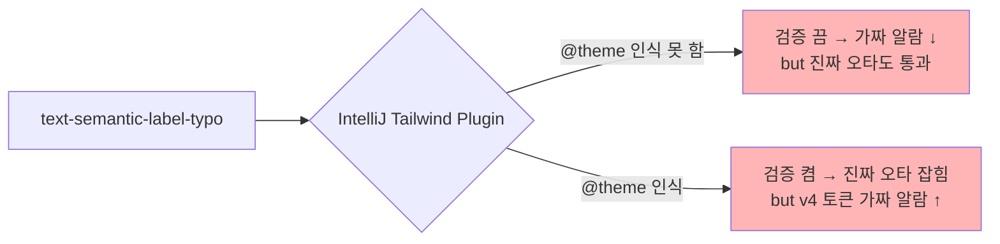

> **시리즈**
> (1) [공통 UI를 독립 npm 패키지로 분리하기](/posts/design-system-part1-package-split/)
> (2) [Figma 디자인 토큰을 단일 진실 소스로 만들기](/posts/design-system-part2-token-design/)
> (3) [JSON → CSS Variables → Tailwind v4 변환 스크립트 해부](/posts/design-system-part3-converter-script/)
> (4) [48개 컴포넌트를 CVA + Semantic 토큰으로 통일하기](/posts/design-system-part4-cva-components/)
> (5a) [Figma 영역을 코드로 옮기는 실전 자동화](/posts/design-system-part5a-figma-porting/)
> (5b) [아직 빈 구멍 — 무엇이 부족하고 어떻게 메울 것인가](/posts/design-system-part5b-gaps-and-roadmap/)
> (6) [AI 에이전트로 패키지 개발 자동화하기](/posts/design-system-part6-ai-agent-infra/)
> (7) **소비자 측 검증 — 자체 ESLint 룰 만들기** ← 현재 글
> (8) 회고: AI 페어로 디자인 시스템 만든 1년

디자인 시스템을 **잘 만드는 것**과 **잘 쓰게 하는 것**은 다른 문제다. 패키지에 토큰이 정확히 들어있어도, 소비자가 `text-[#383940]` 같은 하드코딩을 쓰면 무용지물. 6편이 패키지 *내부* 자동화였다면, 이 편은 **소비자 앱이 패키지를 잘못 쓰는 것을 막는 방어선** 이야기다.

핵심은 자체 ESLint 룰 4종이다. 그 중 마지막 룰 — **"존재하지 않는 토큰을 잡는 룰"** — 은 IDE가 못 해서 직접 만들어야 했다. 그 과정을 자세히 본다.

---

## 1. 왜 IDE만으로는 부족한가

이상적인 흐름:
1. 개발자가 `text-semantic-label-typo`(오타) 입력
2. IDE가 빨간 줄로 "이 토큰 없습니다" 경고
3. 자동완성으로 `text-semantic-label-normal` 제안

현실:



IntelliJ의 Tailwind 플러그인은 v4 `@theme` 인식이 "Under construction" 상태. 켜면 가짜 알람, 끄면 진짜 오타도 못 잡음. 둘 다 만족 못 함.

> **Q.** VSCode + Tailwind CSS IntelliSense는 v4 지원이 괜찮다던데, IDE만 바꾸면 되는 거 아닌가?
>
> 부분적으로 맞다. VSCode 확장 v0.12+ 이상에서 v4 `@theme`를 어느 정도 인식한다. 검토는 해봤다.
>
> 그래도 한계가 있었다. 첫째, IDE 종속 — 모든 팀원이 VSCode를 쓰는 게 아니다. IntelliJ/WebStorm 사용자는 검증을 못 받는다. 둘째, CI에서 못 잡음 — IDE 검증은 로컬에만 있어 git push 후 CI 단계에선 검증이 안 된다. 셋째, 공식 LSP의 한계 — 공식 `@tailwindcss/language-server`의 `lint` 항목엔 `invalidScreen`, `cssConflict` 같은 건 있는데 **`unknownClass`는 없다**. "존재하지 않는 클래스 검출"은 공식 LSP가 안 한다.
>
> 결국 *IDE 독립적인 검증층*이 필요했다. ESLint가 정답이었다.
{: .prompt-info }

---

## 2. 4종 ESLint 룰의 책임 분할

`apps/web/eslint.config.mjs`에 4종의 자체 룰이 inline으로 정의돼 있다.

| 룰 | 금지 패턴 | 이유 |
|---|---|---|
| `no-tailwind-arbitrary-values` | `bg-[#fff]`, `text-[14px]` | 디자인 토큰 강제 |
| `no-tailwind-opacity-modifier` | `bg-atomic-blue-70/50` | atomic-opacity-* 토큰 사용 |
| `no-bare-rounded` | `rounded` (단독) | `--radius: 10px` 충돌 |
| `no-undefined-design-token` | 존재하지 않는 토큰명 | CSS 자동 추출 화이트리스트 |

앞 3개는 단순 패턴 매칭이라 짧다. 4번째가 핵심 — **토큰 화이트리스트가 동적**이어야 한다.

---

## 3. 룰 ① — `no-tailwind-arbitrary-values`

가장 단순한 룰. `[...]` 패턴을 잡는다.

```js
const arbitraryValueRegex = /\b[\w-]+-\[([^\]]+)\]/g;

JSXAttribute(node) {
  if (node.name?.name !== 'className') return;
  const classString = extractString(node.value);

  for (const match of classString.matchAll(arbitraryValueRegex)) {
    const inner = match[1];

    // 허용: data-[state=open], aria-[hidden=true], [&_tr], max-h-[80vh] 등
    if (isAllowedPattern(inner)) continue;

    context.report({
      node,
      message: `Tailwind arbitrary value 금지. Figma 토큰 사용: ${match[0]}`,
    });
  }
}
```

허용 패턴은 정교하게 분리한다:
- Arbitrary variants: `data-[...]`, `aria-[...]`, `has-[...]`
- Viewport 단위: `max-h-[80vh]`, `w-[50vw]`, `left-[50%]`
- CSS 함수: `[calc(...)]`, `[var(...)]`, `[clamp(...)]`
- Grid 템플릿: `grid-cols-[0_1fr]`, `grid-rows-[auto_1fr]`

이 룰만 도입해도 하드코딩 hex가 sourceTree에서 사라진다.

---

## 4. 룰 ② — `no-tailwind-opacity-modifier`

```js
const opacityModifierRegex = /\b[\w-]+\/\d+\b/g;

// 패턴: text-semantic-label-alternative/60 (잘못)
// 정답: text-semantic-label-alternative (이미 hex8에 opacity 88% 박혀있음)
```

Tailwind의 `text-blue-500/50` 같은 opacity modifier는 디자인 토큰의 의도와 어긋난다. 우리 semantic 토큰은 이미 `hex8`(opacity 포함)로 정의돼 있어서 modifier를 또 붙이면 이중 적용된다.

대신 `atomic-opacity-*` 토큰을 사용하라고 안내.

---

## 5. 룰 ③ — `no-bare-rounded`

Tailwind v4의 `@theme`에서 `--radius: 10px`로 설정해두면 bare `rounded`가 10px가 된다. 의도와 어긋날 가능성이 높음.

```js
const bareRoundedRegex = /\brounded(?:-(t|b|l|r|tl|tr|bl|br|s|e|ss|se|es|ee))?\b(?!-)/g;

// ❌ rounded, rounded-t, rounded-bl
// ✅ rounded-sm, rounded-md, rounded-lg, rounded-10, rounded-full
```

`-sm`, `-md`, `-lg` 같은 사이즈 suffix를 강제해서 의도를 명시.

---

## 6. 룰 ④ — `no-undefined-design-token` (가장 깊은 룰)

이게 진짜 어려운 룰이다. 화이트리스트가 정적이면 토큰이 추가될 때마다 룰 코드를 수정해야 한다. **CSS에서 자동 추출**하는 구조로 만들어야 한다.

### 6-1. 무엇을 화이트리스트화할까

세 종류의 토큰이 있다:

```
1. 색 namespace:    atomic, semantic
2. semantic 카테고리: label, primary, background, line, interaction, fill, inverse
3. typography 패밀리: h, body, caption (h1~h6, body1~body3, caption1~caption2)
```

이걸 빌드 산출물(`node_modules/@org/ui-package/dist/index.css`)에서 자동 추출.

### 6-2. CSS 파싱 — 정규식으로 충분

ESLint 룰이 시작될 때 한 번만 CSS를 읽는다.

```js
import { readFileSync } from 'fs';
import { resolve as pathResolve } from 'path';

const designTokenWhitelist = (() => {
  const colorNamespaces = new Map();     // ns → Set of "ns-X-Y"
  const typographyClasses = new Set();   // "h1-bold-40", ...
  const typographyFamilies = new Set();  // "h", "body", "caption"
  const semanticCategories = new Set();  // "label", "primary", ...

  try {
    const cssPath = pathResolve(
      __dirname,
      '../../node_modules/@org/ui-package/dist/index.css'
    );
    const css = readFileSync(cssPath, 'utf-8');

    // 색 namespace 자동 추출: --color-{ns}-{rest}
    for (const m of css.matchAll(/--color-([a-zA-Z]+)-([a-zA-Z0-9][\w-]*)\s*:/g)) {
      const ns = m[1];          // "atomic" or "semantic"
      const rest = m[2];        // "blue-70" or "label-normal"

      if (!colorNamespaces.has(ns)) colorNamespaces.set(ns, new Set());
      colorNamespaces.get(ns).add(`${ns}-${rest}`);

      if (ns === 'semantic') {
        const firstSeg = rest.split('-')[0];  // "label"
        if (firstSeg) semanticCategories.add(firstSeg);
      }
    }

    // 타이포 클래스 자동 추출: .{base}{digit}-{rest}
    for (const m of css.matchAll(/\.([a-zA-Z]+\d+-[a-zA-Z0-9-]+)\s*\{/g)) {
      typographyClasses.add(m[1]);
      const famMatch = m[1].match(/^([a-zA-Z]+)\d+/);
      if (famMatch) typographyFamilies.add(famMatch[1]);
    }
  } catch (e) {
    // 패키지 미설치 시 검증 비활성
  }

  return { colorNamespaces, typographyClasses, typographyFamilies, semanticCategories };
})();
```

`apps/web/eslint.config.mjs`

추출된 데이터 예시:
```js
{
  colorNamespaces: Map {
    'atomic' => Set { 'atomic-blue-70', 'atomic-coolNeutral-50', ... },  // 140개
    'semantic' => Set { 'semantic-label-normal', 'semantic-primary-strong', ... },  // 42개
  },
  typographyClasses: Set { 'h1-bold-40', 'body2-normal-medium-16', 'caption1-bold-12', ... },  // 68개
  typographyFamilies: Set { 'h', 'body', 'caption' },
  semanticCategories: Set { 'label', 'primary', 'background', 'line', 'interaction', 'fill', 'inverse' },
}
```

### 6-3. 검증 로직 — 3단계 매칭

```js
const COLOR_UTIL_PREFIXES = [
  'bg', 'text', 'border', 'ring', 'fill', 'stroke',
  'outline', 'placeholder', 'caret', 'accent',
  'decoration', 'divide', 'from', 'via', 'to'
];

const validateClass = (cls) => {
  // 모디파이어 제거 (hover:, md: 등)
  const colonIdx = cls.lastIndexOf(':');
  const base = colonIdx >= 0 ? cls.slice(colonIdx + 1) : cls;
  if (!base || base.includes('[')) return null;

  // [1] 타이포 패밀리 매칭 — h7-bold-40 같은 범위 초과도 잡힘
  if (typographyFamilyRegex && typographyFamilyRegex.test(base)) {
    return typographyClasses.has(base) ? null : base;
  }

  // [2] 색 namespace 매칭 — bg-atomic-blue-999 같은 없는 shade
  for (const [ns, set] of colorNamespaces) {
    const re = new RegExp(`${ns}-[a-zA-Z0-9][\\w-]*`);
    const m = base.match(re);
    if (m) return set.has(m[0]) ? null : base;
  }

  // [3] "semantic prefix 누락" 감지 — text-label-neutral은 atomic도 semantic도 아님
  for (const prefix of COLOR_UTIL_PREFIXES) {
    if (base.startsWith(`${prefix}-`)) {
      const value = base.slice(prefix.length + 1);
      const firstSeg = value.split('-')[0];
      if (semanticCategories.has(firstSeg)) return base;  // semantic- prefix 누락
      break;
    }
  }

  return null;  // 우리 소유 아닌 클래스 (Tailwind 기본) → 통과
};
```

핵심 4가지 위반 케이스를 잡는다:

| 케이스 | 예시 | 어떻게 감지 |
|---|---|---|
| 없는 atomic shade | `bg-atomic-blue-999` | 화이트리스트 Set에 없음 |
| 없는 semantic 경로 | `text-semantic-nope-strong` | 화이트리스트 Set에 없음 |
| **prefix 누락** | `text-label-neutral` | `label`이 semantic 카테고리인데 `semantic-` 없음 |
| **범위 초과 타이포** | `h7-bold-40` | `h` 패밀리지만 화이트리스트에 없음 |

> **Q.** 화이트리스트가 정적 CSS 파일에서 추출된다. 패키지가 새 버전으로 install되면 ESLint가 자동으로 새 토큰을 알 수 있나?
>
> 알게 된다.
>
> 흐름은 단순하다. `pnpm install @org/ui-package@latest`로 `node_modules/@org/ui-package/dist/index.css`가 새 버전으로 교체되면, ESLint를 다시 실행할 때 `readFileSync`가 새 CSS를 읽고 화이트리스트가 자동 갱신된다.
>
> 단, 에디터에서 실시간 반영되려면 ESLint 서버 재시작이 필요하다. 일부 IDE는 자동 재시작하지만 IntelliJ는 종종 "Restart ESLint" 명령을 수동으로 눌러야 한다.
>
> 측면 효과가 진짜 가치다. *새 토큰 추가가 코드 push만으로 완결*된다. 룰 코드는 한 줄도 안 바뀐다. 디자이너가 새 카테고리 만들어도, 새 namespace 도입해도, 새 타이포 패밀리 추가해도 자동 인식.
{: .prompt-info }

---

## 7. 4가지 위반 케이스 — 실제 검증

테스트 파일로 검증한 결과:

```tsx
// 테스트 입력
<div className="text-atomic-blue-70">           {/* 유효 */}
<div className="bg-semantic-label-neutral">      {/* 유효 */}
<p className="h1-bold-40">                       {/* 유효 */}
<div className="text-label-neutral">             {/* ❌ prefix 누락 */}
<div className="bg-atomic-blue-999">             {/* ❌ 없는 shade */}
<div className="text-semantic-nope-strong">      {/* ❌ 없는 경로 */}
<p className="h7-bold-40">                       {/* ❌ 범위 초과 */}
<div className="flex p-4 items-center">          {/* 통과 (Tailwind 기본) */}
<div className="hover:text-atomic-blue-70">      {/* 통과 (modifier) */}
```

ESLint 결과:
```
test.tsx:8:12  error  text-label-neutral
test.tsx:9:12  error  bg-atomic-blue-999
test.tsx:10:12 error  text-semantic-nope-strong
test.tsx:11:10 error  h7-bold-40
✖ 4 problems (4 errors, 0 warnings)
```

4개 위반 케이스가 모두 잡혔다. **유지보수 비용 0** — CSS만 단일 진실 소스, 룰 코드는 동작 알고리즘만 담당.

> **Q.** ESLint 시작 시점에 CSS를 파싱하면 CI에서 매번 다시 읽지 않나? 캐싱은?
>
> 실제로 그렇다. ESLint 프로세스가 시작될 때마다 `readFileSync`가 한 번 돈다. CI에서 모든 PR마다 새 프로세스니까 매번 파싱.
>
> 다행히 비용이 거의 0이다. 28K줄 CSS 파일 정규식 5번 매칭이 1초도 안 걸린다. 룰 동작 자체는 화이트리스트가 Set/Map에 메모리 상주라 O(1).
>
> 그래도 더 빠르게 만들 수 있다. *빌드 타임에 화이트리스트 JSON을 미리 생성*하는 게 정석. `pnpm generate:figma`가 끝나면 `dist/valid-tokens.json`도 함께 만들고, ESLint 룰은 JSON만 읽는 식. PostCSS 파싱 부정확성도 사라지고 시작 시간도 더 짧아진다. 다음 마이그레이션 항목으로 잡혀 있다.
{: .prompt-info }

---

## 8. 다층 방어 — 한 군데가 뚫려도 다음이 막는다

ESLint 룰만 있다고 끝이 아니다. **다층 방어**로 묶어야 한다.

<style>
.defense-stack { max-width: 720px; margin: 2.5rem auto; font-family: inherit; }
.defense-stack .stack-row { display: grid; grid-template-columns: 56px 1fr 130px; gap: 14px; align-items: stretch; margin-bottom: 8px; }
.defense-stack .stack-num { display: flex; align-items: center; justify-content: center; font-size: 1.15rem; font-weight: 800; border-radius: 8px; letter-spacing: -0.02em; }
.defense-stack .stack-body { padding: 0.85rem 1.1rem; border-radius: 8px; border: 1px solid; display: flex; flex-direction: column; justify-content: center; }
.defense-stack .stack-tool { font-weight: 700; font-size: 0.95rem; margin-bottom: 0.18rem; }
.defense-stack .stack-resp { font-size: 0.82rem; color: #666; line-height: 1.4; }
.defense-stack .stack-when { display: flex; align-items: center; justify-content: center; padding: 0.4rem 0.6rem; border-radius: 8px; font-size: 0.75rem; font-weight: 600; text-align: center; letter-spacing: 0.02em; }
.defense-stack .arrow-row { text-align: center; color: #999; font-size: 0.85rem; padding: 2px 0 4px; }
.defense-stack .phase-label { text-align: center; font-size: 0.78rem; font-weight: 700; color: #888; letter-spacing: 0.08em; padding: 1rem 0 0.5rem; text-transform: uppercase; }

/* 사전 방어 (Layer 1-5) — 푸른 계열 */
.defense-stack .pre .stack-num { background: rgba(59, 130, 246, 0.12); color: #2563eb; }
.defense-stack .pre .stack-body { background: rgba(59, 130, 246, 0.05); border-color: rgba(59, 130, 246, 0.25); }
.defense-stack .pre .stack-when { background: rgba(59, 130, 246, 0.12); color: #1e40af; }

/* 사후 검증 (Layer 6) — 보라 계열 */
.defense-stack .post .stack-num { background: rgba(168, 85, 247, 0.12); color: #9333ea; }
.defense-stack .post .stack-body { background: rgba(168, 85, 247, 0.05); border-color: rgba(168, 85, 247, 0.25); }
.defense-stack .post .stack-when { background: rgba(168, 85, 247, 0.12); color: #6b21a8; }

/* 다크 모드 */
html[data-mode="dark"] .defense-stack .stack-resp { color: #aaa; }
html[data-mode="dark"] .defense-stack .pre .stack-num { background: rgba(59, 130, 246, 0.18); color: #93c5fd; }
html[data-mode="dark"] .defense-stack .pre .stack-body { background: rgba(59, 130, 246, 0.08); border-color: rgba(59, 130, 246, 0.3); }
html[data-mode="dark"] .defense-stack .pre .stack-when { background: rgba(59, 130, 246, 0.15); color: #bfdbfe; }
html[data-mode="dark"] .defense-stack .post .stack-num { background: rgba(168, 85, 247, 0.2); color: #d8b4fe; }
html[data-mode="dark"] .defense-stack .post .stack-body { background: rgba(168, 85, 247, 0.08); border-color: rgba(168, 85, 247, 0.3); }
html[data-mode="dark"] .defense-stack .post .stack-when { background: rgba(168, 85, 247, 0.15); color: #e9d5ff; }

@media (max-width: 640px) {
  .defense-stack .stack-row { grid-template-columns: 40px 1fr; }
  .defense-stack .stack-when { grid-column: 1 / 3; margin-top: 4px; }
}
</style>

<div class="defense-stack">
  <div class="phase-label">사전 방어 — 실수가 들어가는 것을 막는다</div>

  <div class="stack-row pre">
    <div class="stack-num">1</div>
    <div class="stack-body">
      <div class="stack-tool">CLAUDE.md</div>
      <div class="stack-resp">AI가 잘못된 코드를 <em>생성</em>하지 않게</div>
    </div>
    <div class="stack-when">코드 생성 시</div>
  </div>
  <div class="arrow-row">↓</div>

  <div class="stack-row pre">
    <div class="stack-num">2</div>
    <div class="stack-body">
      <div class="stack-tool">IDE 자동완성</div>
      <div class="stack-resp">사람이 잘못 <em>타이핑</em>하지 않게</div>
    </div>
    <div class="stack-when">타이핑 시</div>
  </div>
  <div class="arrow-row">↓</div>

  <div class="stack-row pre">
    <div class="stack-num">3</div>
    <div class="stack-body">
      <div class="stack-tool">ESLint 룰 4종</div>
      <div class="stack-resp">실수가 <em>코드</em>에 들어가지 않게 (빨간 줄)</div>
    </div>
    <div class="stack-when">저장 시</div>
  </div>
  <div class="arrow-row">↓</div>

  <div class="stack-row pre">
    <div class="stack-num">4</div>
    <div class="stack-body">
      <div class="stack-tool">pre-commit hook</div>
      <div class="stack-resp">실수가 <em>커밋</em>되지 않게</div>
    </div>
    <div class="stack-when">git commit 시</div>
  </div>
  <div class="arrow-row">↓</div>

  <div class="stack-row pre">
    <div class="stack-num">5</div>
    <div class="stack-body">
      <div class="stack-tool">CI</div>
      <div class="stack-resp">실수가 <em>머지</em>되지 않게</div>
    </div>
    <div class="stack-when">PR 단계</div>
  </div>

  <div class="phase-label">사후 검증 — 그래도 들어간 것을 잡는다</div>

  <div class="stack-row post">
    <div class="stack-num">6</div>
    <div class="stack-body">
      <div class="stack-tool">ui-qa 에이전트</div>
      <div class="stack-resp">머지된 코드의 <em>시각 회귀</em> 잡기</div>
    </div>
    <div class="stack-when">머지 후</div>
  </div>
</div>

각 층의 책임:

| 층 | 도구 | 책임 |
|---|---|---|
| 1 | CLAUDE.md | AI가 잘못된 코드를 *생성*하지 않게 |
| 2 | IDE 자동완성 | 사람이 잘못 *타이핑*하지 않게 |
| 3 | ESLint 룰 4종 | 실수가 *코드*에 들어가지 않게 |
| 4 | pre-commit hook | 실수가 *커밋*되지 않게 |
| 5 | CI | 실수가 *머지*되지 않게 |
| 6 | ui-qa | 머지된 코드의 *시각 회귀* 잡기 |

**1~5층은 사전 방어, 6층은 사후 검증.** 어느 한 층이 뚫려도 다음이 막는다. 6층 다 뚫리는 실수는 거의 0.

> **Q.** 6개 층을 다 유지하는 게 오버엔지니어링 아닌가? 작은 팀이면 무리 같은데.
>
> 작은 팀이면 6개 다 안 갖춰도 된다.
>
> 단계적 도입을 권한다. MVP(1~2명) 단계는 CLAUDE.md + ESLint 룰. 사람이 짧은 사이클로 검증. 성장(3~5명) 단계는 거기에 pre-commit hook + CI 추가. PR 단위 검증 자동화. 운영(5명+) 단계에 ui-qa 같은 시각 검증을 더해 머지 후 회귀를 방지.
>
> 핵심은 *가장 큰 위험부터 막는다*. 우리 케이스에선 디자인 토큰 일관성이 가장 큰 위험이라 1~3층을 1주차에 깔았다. 4~6층은 점진적으로.
>
> *defense in depth* 원칙. 보안에서 흔히 쓰이는 다층 방어는 디자인 시스템에도 그대로 적용된다. 한 층의 비용 vs 그 층이 막아주는 잠재 위험을 따져 단계적으로 쌓는다.
{: .prompt-info }

---

## 9. 면접관이 자주 묻는 후속 질문

이 시스템을 면접에서 발표하면 받게 될 만한 질문들과 답변 방향:

### Q1. "ESLint 룰을 직접 만든 비용 vs eslint-plugin-tailwindcss 같은 표준 도구의 비용은?"

**A**. eslint-plugin-tailwindcss를 시도했지만 v4 지원이 미흡. 우리 토큰 시스템(atomic/semantic prefix)을 인식 못 함. 직접 만드는 게 100~150줄로 작고, 우리 도메인에 정확히 맞춤. 다만 **표준 도구가 v4를 충분히 지원하면 마이그레이션 가능**한 형태로 룰을 작성. inline rule은 일종의 임시 자체 빌드.

### Q2. "CSS 파일 파싱을 정규식으로 했는데 PostCSS로 안 한 이유는?"

**A**. PostCSS는 정확하지만 ESLint 룰 초기화 시점에 동기 처리가 까다로움. 우리 CSS는 우리가 만든 거라 형식이 통제 가능하고, 정규식 5개로 충분. 만약 CSS가 외부에서 오는 거였으면 PostCSS 썼을 것.

### Q3. "ESLint 룰이 ON일 때 false positive (가짜 알람)는 없나?"

**A**. 디자인된 케이스에선 없음. 다만 한 케이스: `text-balance` 같은 신규 Tailwind 유틸리티가 추가되면 룰이 모르고 통과시킴 (우리 소유 prefix 패턴에 안 걸려서). 이건 false **negative**라 더 안전한 실수.

### Q4. "토큰이 늘어나면 화이트리스트도 커지는데 메모리/성능 영향은?"

**A**. 현재 ~250개 토큰. Set/Map 사용하므로 룩업 O(1). ESLint 시작 시 한 번 파싱하고 메모리에 상주. 영향 무시할 수준. 토큰이 1000개 넘어가면 PostCSS로 정확성 보강 고려.

### Q5. "이 시스템을 모듈로 재사용 가능하게 만들 계획은?"

**A**. 다음 단계로 `@org/eslint-plugin-design-system` 패키지화 계획. 다른 디자인 시스템 프로젝트에서 install 한 줄로 적용 가능하게. inline rule은 그 전 단계의 prototype.

> **Q.** ESLint inline rule은 v9 flat config에서만 동작한다. 옛 `.eslintrc.json` 쓰는 팀은 못 적용 아닌가?
>
> 못 적용한다. flat config(ESLint 9+) 환경 전용.
>
> 우리도 처음엔 옛 `.eslintrc.json`이었는데, 디자인 시스템 룰 도입 직전에 flat config로 마이그레이션했다. 비용이 컸지만 결과적으로 잘한 결정 — flat config는 `plugins: { 'local-rules': { rules: {...} } }` 형태로 inline rule 정의가 자연스럽다. 옛 config에선 별도 npm 패키지로 만들어 install해야 같은 일을 할 수 있다.
>
> 마이그레이션 비용은 *프로젝트 규모에 따라 다르다*. 작은 프로젝트는 하루, 복잡한 모노레포는 1~2주. 우리는 `eslint-config-next` 같은 기성 config 재활용으로 시간을 줄였다. 마이그레이션 가이드는 ESLint 공식 문서가 잘 정리해뒀다.
{: .prompt-info }

---

## 10. 다음 편 예고

여기까지가 **시스템 구축**의 이야기였다. 마지막 편(8)은 회고다. AI와 페어로 1년 디자인 시스템을 만든 경험에서 **AI가 잘한 것 vs 못한 것**, **사람이 결정해야 하는 것 vs 위임해도 되는 것**, 그리고 다시 시작한다면 무엇을 다르게 할지.

---

**시리즈 이전 편**: [AI 에이전트로 패키지 개발 자동화하기](/posts/design-system-part6-ai-agent-infra/)
**시리즈 다음 편**: 회고 — AI 페어로 디자인 시스템 만든 1년 (작성 예정)
